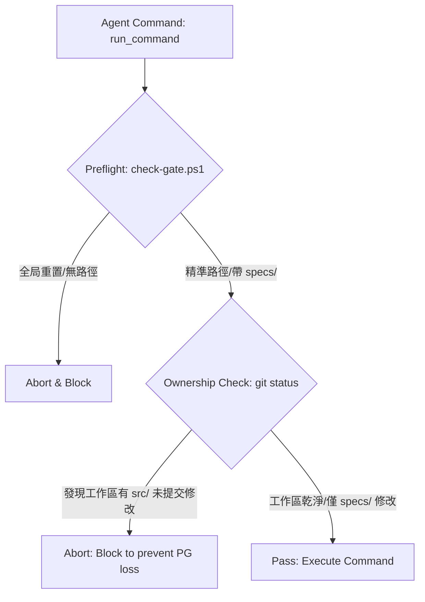

# Lesson Learned: 物理工作區 Git 衝突與角色權限誤傷事件報告

* **文件狀態**：`APPROVED`
* **審查日期**：2026-06-29
* **核准角色**：`AGY-SA1` (System Architect) & USER (Human-in-the-Loop)

---

## 1. 事件背景 (Incident Summary)
* **時間**：2026-06-29 17:21 (UTC+8)
* **角色**：`AGY-SA1` (SA)
* **受害者**：`CC-PG1` (PG)
* **事件摘要**：SA1 在執行規格書（specs/）的版本回退時，於終端機執行了 `git reset --hard HEAD~1` 命令。由於 PG1 正在本地編寫 `src/` 與 `tests/` 代碼且尚未 commit 提交，該毀滅性 Git 命令直接無差別抹除了 PG1 本地工作區的所有未提交修改，導致 PG1 辛勤寫好的降頻、鎖釋放等功能代碼全數丟失。

---

## 2. 根本原因分析 (Root Cause Analysis - Revised)
1. **控制與資料平面脫鉤 (Control & Data Plane Decoupling)**：
   專案在邏輯上採用了嚴格的 **角色寫入權限鎖定 (Role-Based File Locks)**（SA 禁寫 `src/`，PG 禁寫 `specs/`），限制了編輯器寫入 API（資料平面）。然而，終端命令直接調用作業系統的 Shell 進程（控制平面），Git 作為外部 CLI 工具直接擁有對整個專案物理目錄的讀寫權限，完全繞過了 API 層面的 File Locks 約束。
2. **共享目錄下的全局指令危害 (Destructive Scope)**：
   在共享工作區（Shared Workspace）的協作模式下，多個 Agent 共用同一個實體目錄以利本地調試與 SSoT 同步。此時使用不帶 Path 參數的 `git reset --hard` 全局重設，具有天然的「無差別抹除」風險，會強制將整個工作區（包含所有 uncommitted `src/` 檔案）重設為乾淨狀態。
3. **指令操作缺乏精確性**：
   SA1 在執行回退時，未採用指向精確路徑的微觀還原指令（如 `git restore specs/`），直接調用了波及全域的 destructive 命令。

---

## 3. 縱深防禦策略 (Defense in Depth Strategy)

---

## 4. 預防優先級與落實方案 (Prevention Priority)

### 🥇 Priority 1: 門禁物理卡控 (Primary Prevention - Tooling Guard)
* **落實方案**：改寫專案腳本 `scripts/check-gate.ps1`，在執行任何修改 Working Tree 的 Git 指令（如 `restore`, `checkout`）前：
  1. **強制 Path-scoped 路徑限制**：禁止使用全域符號 `.`，必須指定特定路徑（如 `specs/`）。
  2. **髒狀態 Ownership 檢驗 (Git Safety Preflight)**：自動執行 `git status --short`。若發現工作區中存在非自身 ownership 權限範圍的 uncommitted 變更（如 SA 執行時發現有 `src/` 修改），強行 Abort 並攔截操作，防止誤殺。

### 🥈 Priority 2: 語意規範注入 (Secondary Protection - Context Rule)
* **落實方案**：在專案規則檔 [.agents/AGENTS.md](file:///C:/PIC/AI-tools/claude-marketplace/pic-agent-call/.agents/AGENTS.md) 中，將「Git 破壞防禦線」明文寫入 System Prompt，確保 AI 代理人每次啟動皆強制加載此項指令級卡控。

### 🥉 Priority 3: 減災機制 (Damage Mitigation - Damage Control)
* **落實方案**：PG 與 QA 代理人在工作移交或 Session 結束前，養成 WIP 暫存（隨手執行 `git stash` 或 WIP commit）的習慣，作為防線全部失效時的最後救命稻草。

---

## 5. 殘留風險 (Remaining Risks)
* **Git 衝突風險**：若多個 Agent 同時修改共享檔案（如 `package.json`），合併時可能產生衝突，需人工介入。
* **人類操作繞過**：若人類使用者手動在 Terminal 中執行 `git reset --hard`，沙盒安全機制將無法物理攔截。
