# @pic-ai/pic-agent-call

<p align="center">
  <strong>Persistent coordination infrastructure for AI agents.</strong>
</p>

<p align="center">
  An MCP server for shared memory, cross-agent messaging, task handoff, and agent identity across AI tools, sessions, and execution environments.
</p>

<p align="center">
  <a href="#overview">Overview</a> ·
  <a href="#quick-start">Quick Start</a> ·
  <a href="#mcp-tools">MCP Tools</a> ·
  <a href="#agent-identity-and-statusline">Statusline</a> ·
  <a href="#deployment">Deployment</a>
</p>

---

## Overview

AI agents are increasingly specialized. One agent may define architecture, another may implement changes, and another may review the result. The agents may run in different terminals, IDEs, CLIs, containers, or model providers.

The challenge is no longer only model capability. It is coordination.

**pic-agent-call** provides a persistent, project-scoped coordination layer for AI agents:

- **Memory** — durable project knowledge stored in a shared knowledge graph;
- **Channel** — cross-agent messaging with claim and acknowledgement semantics;
- **Task Broker** — explicit task creation, assignment, claiming, completion, and failure;
- **Agent Identity** — stable identity, role, presence, unread state, and statusline integration.

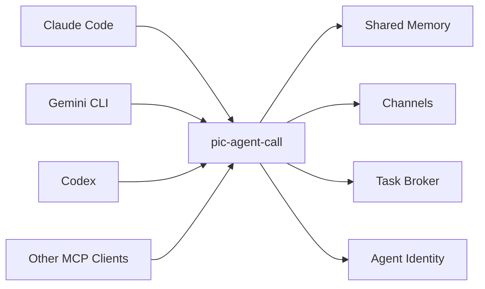

pic-agent-call is a coordination service, not another AI model. It does not replace Git, CI/CD, an IDE, or human decision authority.

---

## Why pic-agent-call?

Without a shared coordination layer, multi-agent workflows often rely on copied prompts, transient chat history, local notes, or undocumented assumptions.

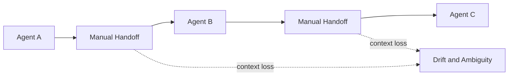

pic-agent-call makes coordination state explicit and durable:

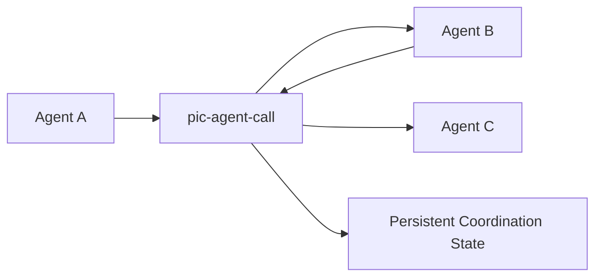

This enables:

- cross-session continuity;
- explicit task ownership;
- asynchronous communication;
- durable project decisions;
- role-aware handoffs;
- traceable workflow state;
- collaboration across different AI providers.

---

## Core Capabilities

| Capability | Purpose |
| --- | --- |
| Memory | Store and query durable project knowledge and observations |
| Channel | Send, claim, acknowledge, and route cross-agent messages |
| Task Broker | Create, assign, claim, complete, and fail coordinated work |
| Agent Identity | Register agent roles, track presence, and expose unread state |
| Statusline | Show active and attached roles with stable No Jitter ordering |

---

## Architecture

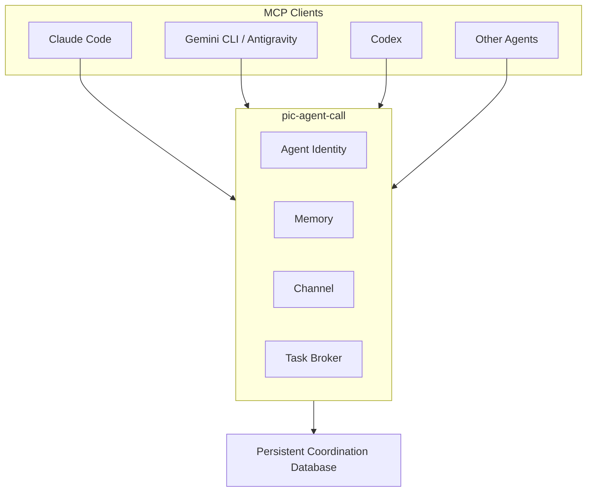

The system separates three responsibilities:

1. **Agent execution** remains in the model, CLI, IDE, container, or orchestration platform.
2. **Coordination state** is managed by pic-agent-call.
3. **Versioned project artifacts** remain in Git and other designated systems of record.

---

## Requirements

- **Node.js 22.0.0 or later**
- An MCP-compatible client

Node.js 22 or later is required because pic-agent-call uses the built-in `node:sqlite` module.

---

## Quick Start

### Option A — npm / npx

Install globally or in a project:

```bash
npm install @pic-ai/pic-agent-call
```

Run without installing:

```bash
npx @pic-ai/pic-agent-call
```

### Option B — Local repository

A local path is convenient when configuring multiple MCP clients against the same checkout.

```bash
git clone https://github.com/Vance-PIC/pic-agent-call.git
cd pic-agent-call
npm install
```

The MCP server entry point is:

```text
bin/server.mjs
```

---

## MCP Client Configuration

### Claude Code

Add pic-agent-call to the user-level Claude Code configuration in `~/.claude/settings.json`:

```json
{
  "mcpServers": {
    "pic-agent-call": {
      "command": "node",
      "args": ["YOUR_PATH/pic-agent-call/bin/server.mjs"]
    }
  }
}
```

Replace `YOUR_PATH` with the absolute path to the repository.

Windows paths should use forward slashes when possible:

```json
{
  "mcpServers": {
    "pic-agent-call": {
      "command": "node",
      "args": ["C:/projects/pic-agent-call/bin/server.mjs"]
    }
  }
}
```

A project-level `.mcp.json` may remain empty when the server is configured globally:

```json
{
  "mcpServers": {}
}
```

### Gemini CLI

Add the server to `~/.gemini/config/mcp_config.json`:

```json
{
  "mcpServers": {
    "pic-agent-call": {
      "command": "node",
      "args": ["YOUR_PATH/pic-agent-call/bin/server.mjs"]
    }
  }
}
```

### npx-based configuration

An MCP client may also launch the published package directly:

```json
{
  "mcpServers": {
    "pic-agent-call": {
      "command": "npx",
      "args": ["-y", "@pic-ai/pic-agent-call"]
    }
  }
}
```

Use a local checkout when you need a fixed source revision or access to repository-provided scripts and skills.

---

## Configuration

### Environment variables

| Variable | Description | Default |
| --- | --- | --- |
| `MEMORY_DB_PATH` | Path to the SQLite coordination database | `.memory/memory-graph.db`, resolved against the current project or user home |
| `AGENT_ID` | Optional default agent identifier used with agent registration | Not set |
| `PIC_TERM_KEY` | Optional terminal/window coordination key used by statusline integration | Derived by the runtime when available |

### Runtime settings

Runtime timing settings are expressed in minutes:

| Setting | Description | Default |
| --- | --- | --- |
| `agentTimeoutMin` | Time before an inactive agent is treated as offline | `1440` |
| `statusLineFreshnessMin` | Time before a statusline identity is shown as idle | `120` |
| `historyPurgeMin` | Retention period for offline agent history | `10080` |

These settings may be supplied through the project's supported settings files.

### Database path resolution

The database path is resolved in this order:

```text
MEMORY_DB_PATH
    ↓
settings.local.json
    ↓
<current-working-directory>/.memory
    ↓
~/.memory
```

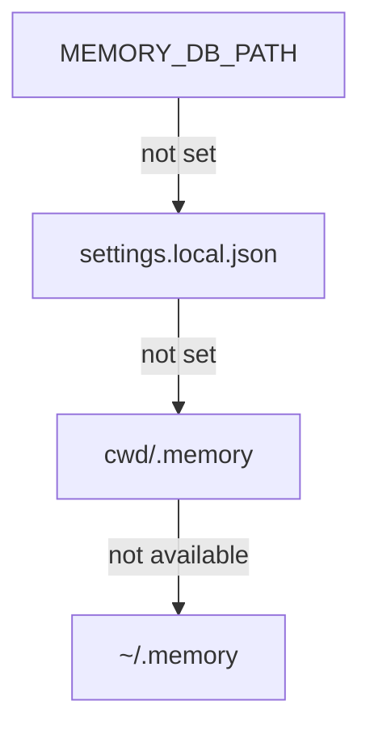

For shared or containerized deployments, set `MEMORY_DB_PATH` explicitly and mount persistent storage at that location.

---

# MCP Tools

pic-agent-call exposes **20 MCP tools** across four capability groups.

## Memory — Custom

| Tool | Description |
| --- | --- |
| `add-observation` | Add an observation to a named memory entity. Creates the entity when it does not exist and updates the JSON snapshot. |
| `query-entity` | Return the complete record for an entity, including properties, relations, and observation history. |
| `stats` | Return database statistics, including entity, relation, and observation counts and the resolved database path. |

## Memory — Official-Compatible

These tools follow the official MCP memory-server schema and can be used as compatible replacements in existing workflows.

| Tool | Description |
| --- | --- |
| `create_entities` | Create multiple knowledge entities. Existing entities with the same name are ignored. |
| `add_observations` | Add observations to existing entities. The operation fails for entities that do not exist. |
| `create_relations` | Create directed relations between entities. Missing entities may be represented by temporary nodes. |
| `read_graph` | Export the complete knowledge graph, including entities, observations, and relations. |
| `search_nodes` | Search entity names, entity types, and observation content. |

## Task Broker

| Tool | Description |
| --- | --- |
| `create_task` | Create a task with idempotency protection for the same `feature` and `payload`. |
| `list_pending_tasks` | List pending tasks and release claimed tasks that have exceeded the claim timeout. |
| `claim_task` | Atomically claim a task so that only one agent can acquire it. |
| `complete_task` | Complete a claimed task and persist its result. |
| `fail_task` | Mark a claimed task as failed and record the reason. |
| `get_task` | Return the complete record for one task. |

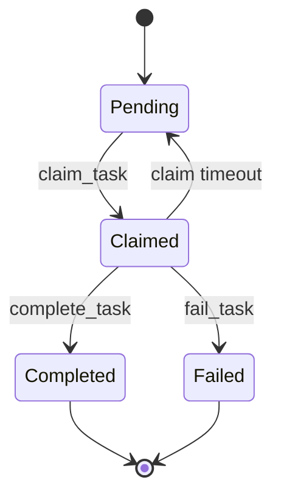

The default claimed-task timeout is 30 minutes.

## Channel

| Tool | Description |
| --- | --- |
| `channel_send` | Send a message to a specific agent, wildcard receiver, pool, or `all`. |
| `channel_list_unread` | List unread messages for a receiver and release expired in-progress claims. |
| `channel_claim` | Atomically move a message from `UNREAD` to `IN_PROGRESS`. |
| `channel_ack` | Acknowledge a claimed message and move it to `READ`. Only the claimant may acknowledge it. |

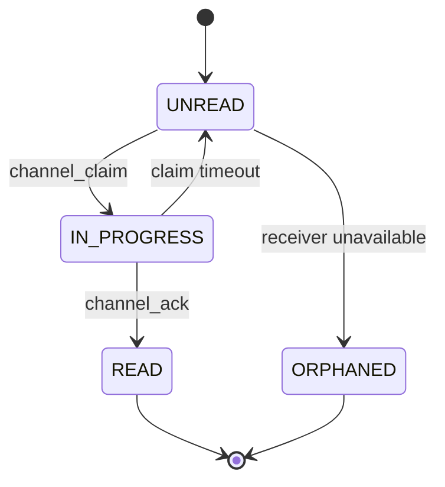

The default in-progress channel timeout is 15 minutes.

## Agent Identity

| Tool | Description |
| --- | --- |
| `register_agent` | Register or update the current agent identity and role. Supports multiple roles, forced takeover, Windows Terminal binding, and custom timeout values. |
| `agent_status` | Return the current identity, role state, and unread-message count. |

---

## Agent Identity Model

Every participating agent should register before creating or claiming coordinated work.

Example:

```json
{
  "agent_id": "CC-SA1",
  "role": "SA"
}
```

### Presence states

| State | Meaning |
| --- | --- |
| `active` | Primary role for the terminal or execution context |
| `attached` | Registered secondary role in the same context |
| `offline` | Known role that is no longer active in the context |

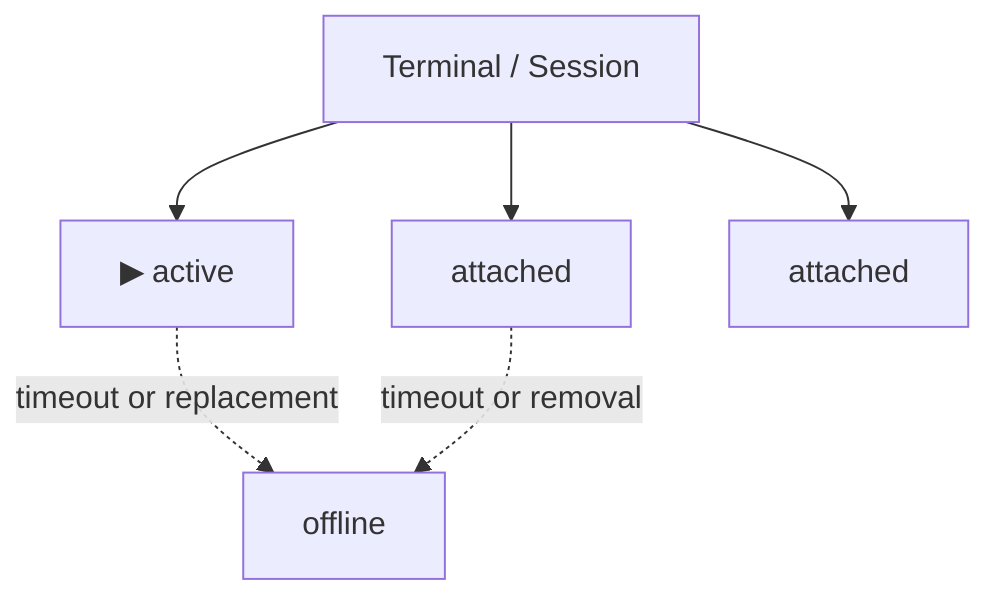

Only the active role may read and claim channel work. Attached roles remain visible but are blocked from read and claim operations.

### Session ID resolution

The current session identifier is resolved in this order:

```text
CLAUDE_CODE_SESSION_ID
    ↓
ANTIGRAVITY_CONVERSATION_ID
    ↓
AGENT_SESSION_ID
    ↓
hostname-pid
```

### Multiple roles

`register_agent` supports comma-separated roles when one session needs several registered identities.

A forced registration may transfer the active role and mark stale roles from the same session as offline.

---

## Recommended Session Protocol

A practical startup sequence is:

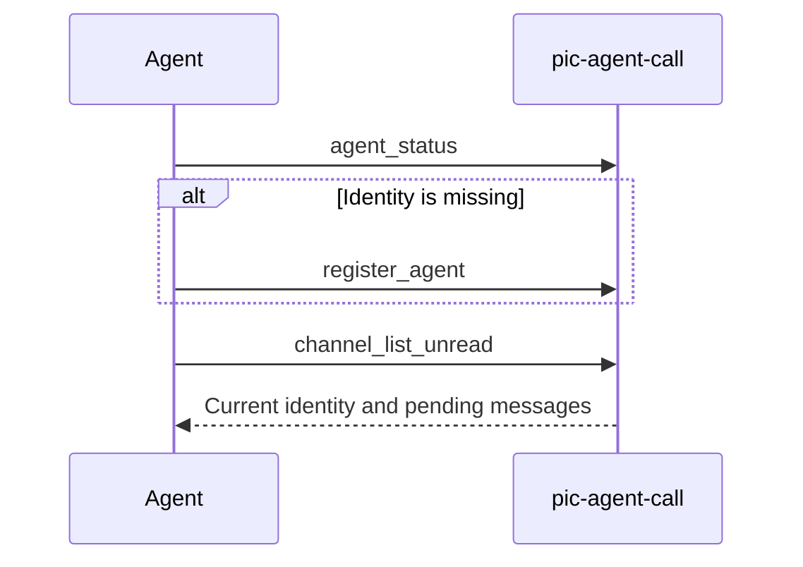

Before performing coordinated write actions:

1. call `agent_status`;
2. check the unread-message count;
3. process or acknowledge pending coordination messages;
4. continue only when the active identity and ownership are clear.

This prevents an agent from acting on stale context while a newer instruction is waiting.

---

# Agent Identity and Statusline

The statusline exposes the current agent identities and unread-message state directly in the terminal UI.

A single-role display may look like:

```text
▶🟢0·CC-SA1
```

A role with unread messages may look like:

```text
▶🔴3·CC-SA1
```

### Status indicators

| Indicator | Meaning |
| --- | --- |
| `▶` | Current active role |
| `🟢` | Online with no unread messages |
| `🔴` | Online with unread messages |
| `🟡` | Idle beyond `statusLineFreshnessMin` |
| No arrow | Attached role |

---

## No Jitter Ordering

Statusline roles are ordered by their original registration time:

```text
created_at ASC
```

The order remains stable when the active role changes. Only the `▶` marker moves.

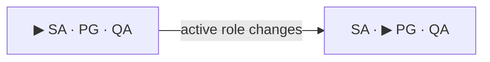

This prevents the statusline from visually reordering or "jittering" whenever the primary role changes.

Attached roles remain visible in the same position but cannot read or claim messages.

---

## Statusline Script

The repository includes:

```text
bin/agent-statusline.mjs
```

The script:

1. resolves the current session ID;
2. reads the current agent identity;
3. reads unread channel state;
4. applies active, attached, idle, and unread indicators;
5. outputs a compact status segment;
6. exits successfully without interrupting the parent statusline.

The database path follows the same resolution rules as the MCP server.

---

## Claude Code Statusline Setup

### Prerequisites

Before enabling the statusline:

- pic-agent-call must be configured and loaded as an MCP server;
- the current session must have successfully called `register_agent`;
- the statusline command must be able to resolve the same database path as the MCP server.

### Configuration

Add a `statusLine` command to `~/.claude/settings.json`:

```json
{
  "statusLine": "bash bin/statusline.sh seg_brain"
}
```

When Claude Code starts from another directory, use an absolute path.

Example for Windows:

```json
{
  "statusLine": "bash \"C:/projects/pic-agent-call/bin/statusline.sh\" seg_brain"
}
```

### Important settings warning

Claude Code may silently ignore an entire settings file when `.claude/settings.local.json` contains malformed JSON or invalid `Bash(...)` permission rules.

When the statusline does not appear:

1. validate `settings.json`;
2. validate `settings.local.json`;
3. check quoting and backslashes in Windows paths;
4. confirm that the MCP server is enabled;
5. confirm that `register_agent` has already succeeded;
6. confirm that the statusline and server resolve the same database.

---

## Antigravity / Gemini Statusline Setup

Antigravity can invoke a command-based statusline through its settings.

Configure either:

```text
~/.gemini/settings.json
```

or the higher-priority CLI-specific file:

```text
~/.gemini/antigravity-cli/settings.json
```

Example:

```json
{
  "statusLine": {
    "enabled": true,
    "type": "command",
    "command": "node C:\\Users\\<your_username>\\.gemini\\hooks\\statusline-quota.mjs"
  }
}
```

A custom hook may call the repository's message-statusline helper and combine the result with quota or model information.

Add the hook script to:

```text
~/.gemini/trusted_hooks.json
```

before enabling it.

---

## setup-statusline Skill

The repository includes a Claude Code skill for guided installation:

```text
skills/setup-statusline.md
```

Install it with:

```bash
cp skills/setup-statusline.md ~/.claude/skills/setup-statusline.md
```

Then run:

```text
/setup-statusline
```

The skill guides the user through:

- prerequisite validation;
- `settings.json` configuration;
- terminal-key verification;
- output testing;
- malformed-settings troubleshooting;
- statusline recovery guidance.

---

# Multi-Agent Workflow Example

The following example assigns an implementation task to another agent.

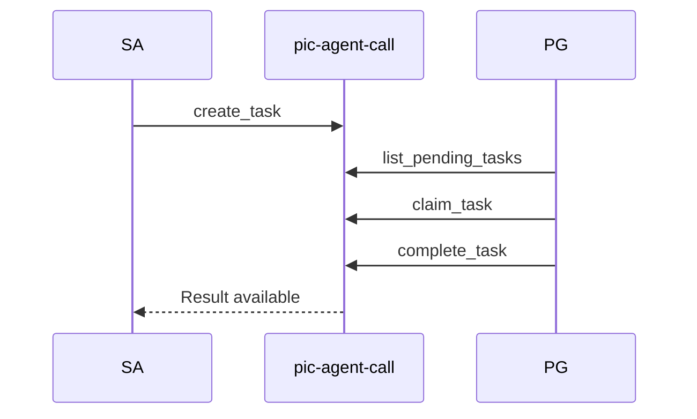

### Step 1 — Create a task

```text
create_task(
  feature="auth-feature",
  assign_to="CC-PG1",
  payload='{"action":"implement login endpoint"}'
)
```

### Step 2 — Discover and claim the task

```text
list_pending_tasks(assign_to="CC-PG1")

claim_task(
  task_id="...",
  agent_id="CC-PG1"
)
```

### Step 3 — Complete the task

```text
complete_task(
  task_id="...",
  result='{"status":"done","pr":"#42"}'
)
```

A complete cross-platform relay example is available in:

```text
skills/agent-call.md
```

---

## Source-of-Truth Boundaries

pic-agent-call coordinates work but does not replace the authoritative systems for project artifacts.

| Information | Source of truth |
| --- | --- |
| Source code | Git |
| Versioned specifications | Git |
| Build and test results | CI/CD |
| Product and approval decisions | Authorized human owner |
| Agent identity and presence | pic-agent-call |
| Cross-agent messages | pic-agent-call |
| Task ownership and handoff | pic-agent-call |
| Shared coordination memory | pic-agent-call |

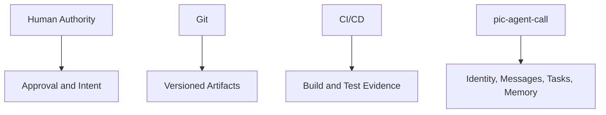

---

# Deployment

pic-agent-call can be used as a local MCP process or as shared coordination infrastructure.

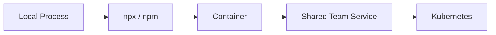

## Local Process

Use a local process when:

- one user controls all participating clients;
- the database is stored on the local machine;
- the clients share access to the same filesystem path.

Set `MEMORY_DB_PATH` when the clients may start from different working directories.

## Container Deployment

A containerized deployment should provide:

- Node.js 22 or later;
- the pic-agent-call package or repository;
- a persistent volume for the coordination database;
- an explicit `MEMORY_DB_PATH`;
- private network access;
- structured logs;
- graceful shutdown.

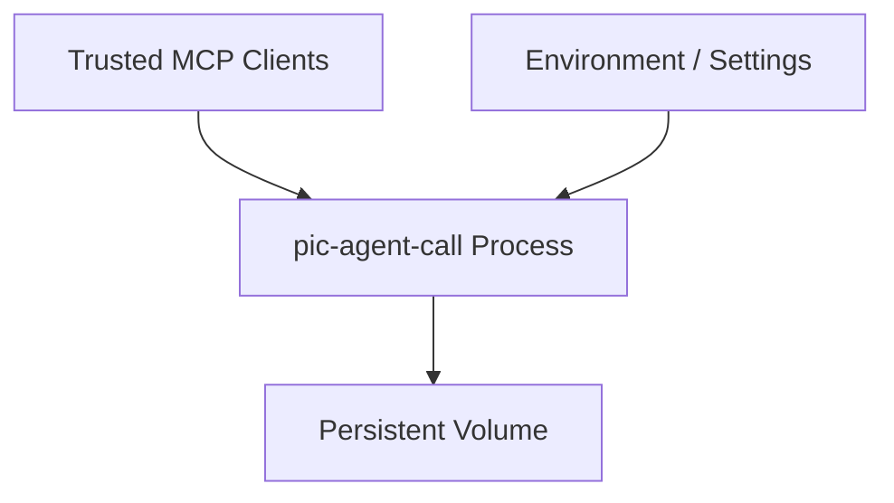

Do not store the SQLite database only in the container's writable layer.

## Kubernetes Deployment

A Kubernetes deployment should preserve the coordination database independently of Pod lifecycle.

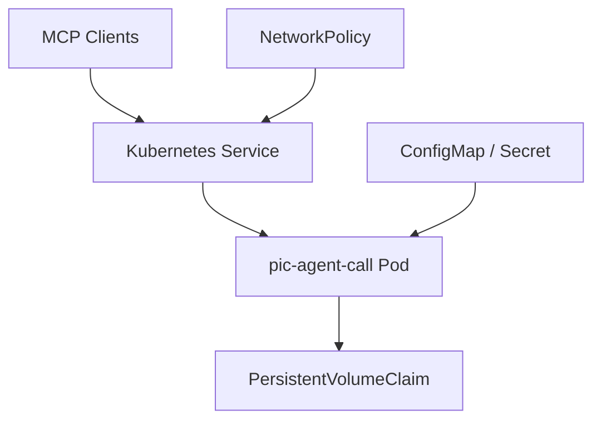

Operational recommendations:

- use persistent storage;
- set `MEMORY_DB_PATH` explicitly;
- keep the service private by default;
- separate sensitive configuration from project memory;
- define liveness and readiness behavior;
- back up and restore the coordination database;
- use controlled upgrades and rollbacks;
- verify concurrency guarantees before increasing replica count.

A container or Pod being replaceable does not make the coordination store stateless.

---

## Security

The coordination database may contain project decisions, task ownership, agent identities, and review context.

Recommended controls:

- allow access only from trusted MCP clients;
- use private networking where possible;
- protect database files and backups;
- avoid storing credentials or secrets as memory observations;
- apply least-privilege filesystem permissions;
- define retention and backup policies;
- review logs before sharing them externally.

---

## Development

Run the test suite with:

```bash
npm test
```

The repository includes unit tests and P5 functional acceptance tests. Generated evidence is written to the `evidence/` directory.

---

## Project

- **GitHub:** https://github.com/Vance-PIC/pic-agent-call
- **npm:** https://www.npmjs.com/package/@pic-ai/pic-agent-call

---

## License

MIT
