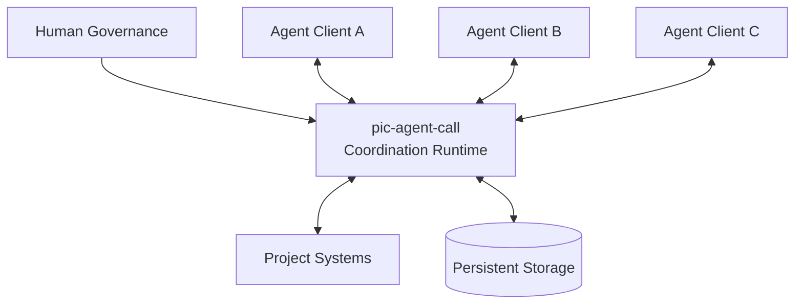
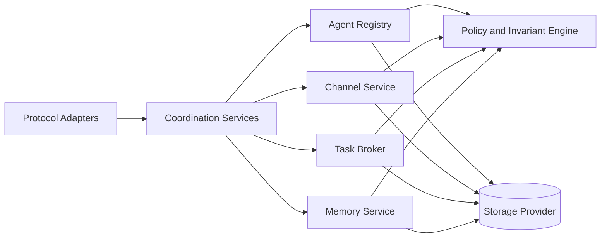
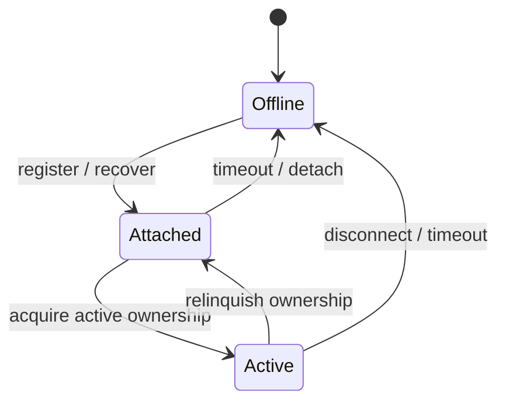
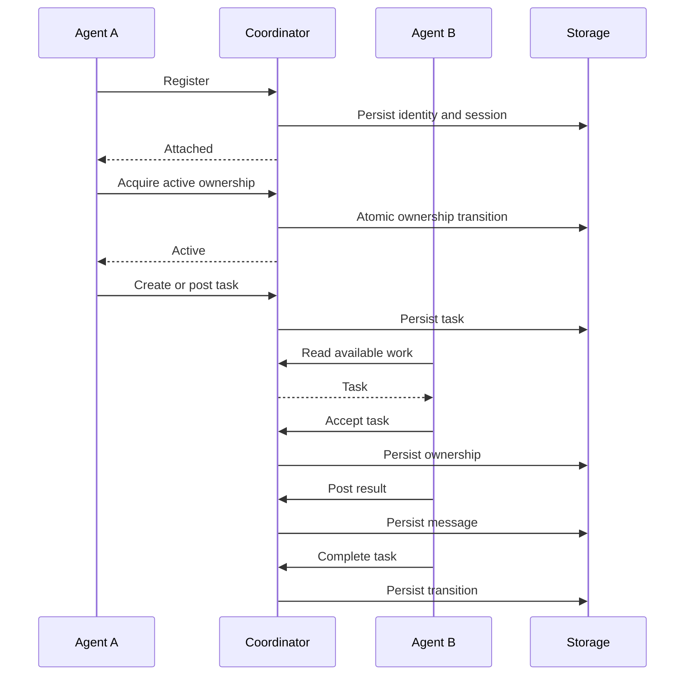
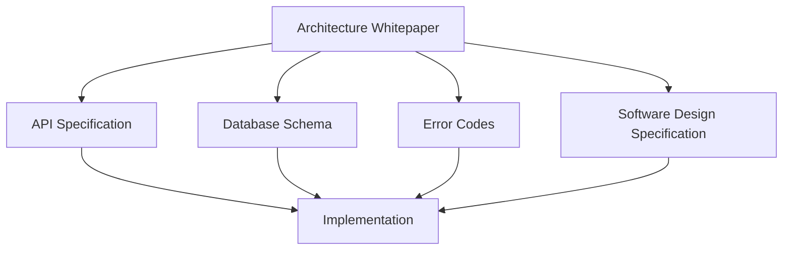
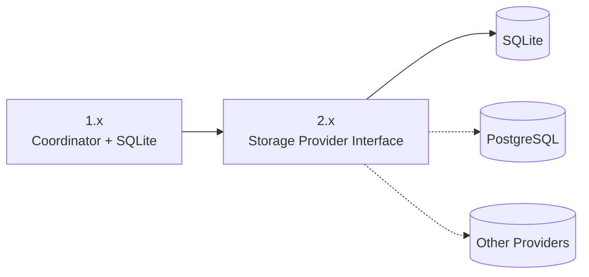

# pic-agent-call

> An Agent Coordination Runtime for independent AI agents.

pic-agent-call provides a shared coordination layer for AI agents operating across different tools, terminals, sessions, and model providers.

It gives agents persistent identity, shared project memory, communication channels, durable task coordination, and lifecycle awareness without forcing them into the same process, platform, or LLM ecosystem.

pic-agent-call is not an agent framework and does not replace model execution. It coordinates independent agents while preserving explicit ownership, recoverability, and human governance.

---

## Why pic-agent-call Exists

Modern AI agents are commonly isolated by:

- terminal or process;
- provider or client;
- session history;
- account or execution environment;
- local context that other agents cannot inspect.

This creates recurring coordination failures:

- agents do not know who is active;
- responsibilities exist only in natural-language prompts;
- task ownership becomes ambiguous;
- project memory is fragmented across sessions;
- context is lost after interruption;
- humans must manually relay state between tools;
- multiple agents may collide in the same workspace.

pic-agent-call introduces a durable coordination runtime between agent execution and project systems.

---

## What It Provides

### Persistent Agent Identity

Agent identity survives individual sessions, terminal restarts, and model-provider changes.

An agent is not treated as a connection or chat session. The runtime can distinguish the stable participant from each temporary execution occurrence.

### Agent Lifecycle and Presence

Agents have explicit lifecycle state:

- `active` — owns the primary execution role for a terminal context;
- `attached` — present but not the active owner;
- `offline` — not currently considered present.

The runtime prevents ambiguous active ownership in the same terminal context.

### Communication Channels

Agents can exchange durable, project-scoped messages through channels.

Channels provide communication history, direct or shared coordination, correlation between calls and replies, and task-specific discussion.

### Durable Task Coordination

Tasks are explicit coordination objects rather than responsibilities inferred from conversation.

The runtime records task state, ownership, assignment, acceptance, completion, release, and abort semantics.

### Shared Project Memory

Project knowledge can survive individual model sessions.

Memory is explicitly written, scoped, retrieved, and governed. It is not equivalent to raw conversation history or a provider-specific context window.

### Session and Workspace Awareness

The runtime distinguishes:

- agent identity;
- execution session;
- terminal context;
- project workspace.

This separation enables recovery, controlled handoff, and workspace collision awareness.

### Human Governance

pic-agent-call coordinates agents without replacing human authority.

Critical decisions, approvals, aborts, and conflict resolution can remain human-controlled.

---

## Architectural Position

pic-agent-call is best understood as a **control plane for AI-agent coordination**.

It is not:

- an LLM gateway;
- an agent framework;
- a general-purpose message broker;
- a workflow engine;
- a vector database;
- a replacement for Git;
- a replacement for project-management software.

It may integrate with those systems, but its responsibility remains narrow:

> Maintain identity, presence, ownership, communication, task state, and shared coordination memory.

---

## Core Architectural Principles

1. **Identity first**  
   Every coordinated action is attributable to an agent, human, or system actor.

2. **Coordination over communication**  
   Messages alone do not establish responsibility or ownership.

3. **Persistence over context**  
   Durable project state must not depend on a single model session.

4. **Explicit ownership over inference**  
   Responsibilities and transitions are represented as inspectable state.

5. **Human governance over autonomous consensus**  
   Agents do not silently override privileged human decisions.

6. **Loose coupling**  
   Agents may collaborate across tools, models, accounts, and processes.

7. **Storage replaceability**  
   Coordination semantics remain stable even when the persistence provider changes.

8. **Recovery by design**  
   Process loss and disconnection are expected operating conditions.

---

## High-Level Architecture

### Coordinator

The Coordinator is the central enforcement point for coordination semantics.

It validates project scope, resolves agent identity, governs lifecycle transitions, enforces active ownership, routes channel operations, manages task state, mediates memory access, and persists coordination state.

### Agent Registry

The Agent Registry manages:

- stable identities;
- sessions;
- presence;
- terminal association;
- active ownership;
- lifecycle history.

### Channel Service

The Channel Service stores and retrieves durable project communication.

### Task Broker

The Task Broker manages explicit responsibility, assignment, acceptance, state transition, completion, and recovery.

### Memory Service

The Memory Service preserves durable project knowledge beyond the lifetime of any individual model session.

### Storage Provider

The persistence layer stores coordination state and enforces critical invariants.

SQLite is the reference persistence engine for pic-agent-call 1.x. The architecture is designed so that SQLite becomes one provider rather than a permanent architectural dependency.

---

## Agent Lifecycle

The baseline lifecycle is intentionally small:

| State | Meaning |
|---|---|
| `active` | Primary owner of an exclusive terminal context |
| `attached` | Present and participating without active ownership |
| `offline` | Identity remains durable, but the agent is not currently present |

Offline does not delete identity, task history, channel history, or memory.

---

## Coordination Model

A typical coordination flow is:

Critical ownership transitions must be atomic and deterministic.

---

## Architecture Source of Truth

The Architecture Whitepaper is the project's highest-level technical authority.

- [Architecture Whitepaper — English](docs/architecture/architecture.en.md)
- [架構白皮書 — 繁體中文](docs/architecture/architecture.zh-TW.md)

The documentation hierarchy is:

Lower-level specifications may refine the architecture but must not contradict it.

---

## Documentation

| Document | Purpose |
|---|---|
| `README.md` | Project overview and entry point |
| `README.zh-TW.md` | Traditional Chinese project overview |
| `docs/architecture/architecture.en.md` | Architecture Source of Truth |
| `docs/architecture/architecture.zh-TW.md` | Traditional Chinese Architecture Whitepaper |
| `api-spec.md` | External API contract |
| `db-schema.md` | Persistence model and constraints |
| `error-codes.md` | Runtime error semantics |
| `SDD-Spec.md` | Software design and implementation contract |

---

## Architectural Invariants

A compatible implementation must preserve these invariants:

1. Identity is independent of connection and session.
2. Project scope is the primary isolation boundary.
3. At most one active agent owns an exclusive terminal context.
4. Attached agents may participate without claiming active ownership.
5. Offline status does not delete durable state.
6. Tasks represent explicit ownership.
7. Channels represent communication, not ownership.
8. Memory represents durable project knowledge, not raw model context.
9. Critical state transitions are persisted before success is acknowledged.
10. Human-governed decisions cannot be silently overridden.
11. Storage technology may change; coordination semantics may not.

---

## Version Direction

### pic-agent-call 1.x

The 1.x architecture prioritizes:

- local operability;
- correctness;
- low deployment complexity;
- a single Coordinator;
- SQLite-backed persistence;
- clear coordination semantics.

### pic-agent-call 2.x Direction

The planned architectural direction is:

> **Decouple coordination from storage.**

SQLite will remain a supported provider while the Coordinator evolves toward a storage-provider boundary.

This evolution must not change the meaning of identity, lifecycle, task ownership, channels, memory, or project isolation.

---

## Project Status

pic-agent-call is under active development.

The architecture is being stabilized around the 1.x coordination model before broader storage abstraction and distributed deployment are introduced.

Use the specifications in this repository as the authoritative contract for implemented behavior. Where an implementation and specification differ, the discrepancy should be treated as a defect or an unresolved specification change.

---

## Contributing

Contributions should preserve the architectural boundaries defined by the Whitepaper.

Before proposing a change, verify that it does not:

- bind identity to a temporary session;
- introduce multiple active owners in one terminal context;
- make task ownership implicit;
- use model context as the only durable state;
- bypass project isolation;
- acknowledge unpersisted state changes;
- embed storage-specific behavior into domain semantics;
- remove human authority from privileged decisions;
- introduce non-deterministic conflict handling.

Architecture-affecting changes should include clear rationale, compatibility impact, and migration considerations.

---

## License

See the repository license file for licensing terms.
