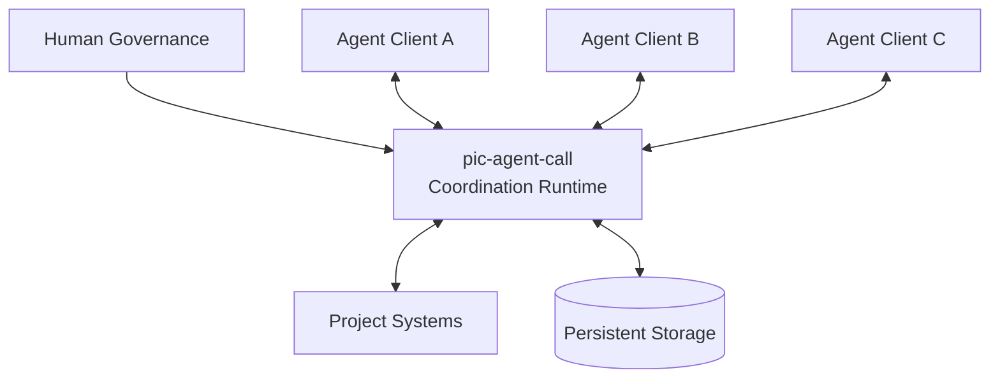
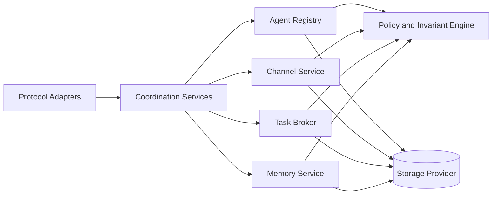
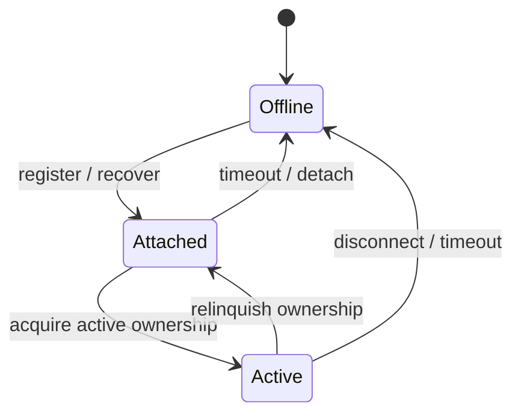
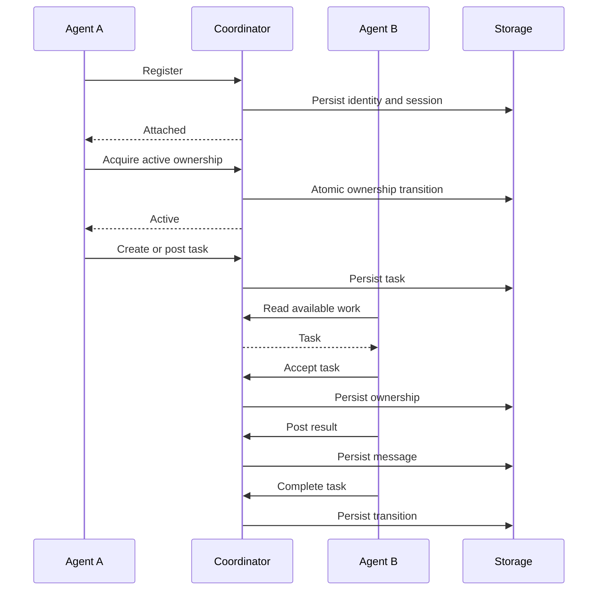
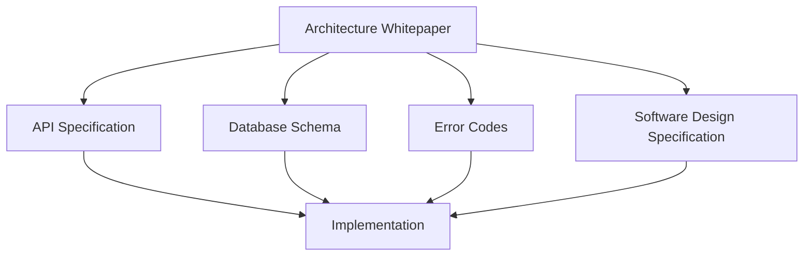
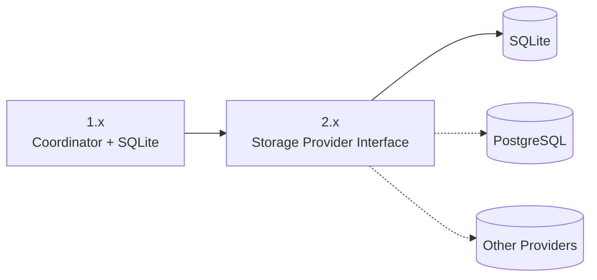

# pic-agent-call

> 用於協調獨立 AI Agent 的 Agent Coordination Runtime。

pic-agent-call 為執行於不同工具、Terminal、Session 與 Model Provider 的 AI Agent 提供共用 Coordination Layer。

它提供 Persistent Agent Identity、明確的 Terminal Targeting、Shared Project Memory、Communication Channel、Durable Task Coordination 與 Lifecycle Awareness，而不要求所有 Agent 使用同一個 Process、Platform 或 LLM Ecosystem。

pic-agent-call 不是 Agent Framework，也不取代 Model Execution。它的責任是協調獨立 Agent，同時保留 Explicit Ownership、Recoverability 與 Human Governance。

---

## 為什麼需要 pic-agent-call

現代 AI Agent 通常受到以下邊界隔離：

- Terminal 或 Process；
- Provider 或 Client；
- Session History；
- Account 或 Execution Environment；
- 其他 Agent 無法取得的 Local Context。

這會反覆造成 Coordination Failure：

- Agent 不知道目前有哪些其他 Agent 存在；
- Responsibility 只存在於自然語言 Prompt；
- Task Ownership 模糊；
- Project Memory 分散於不同 Session；
- 中斷後 Context 遺失；
- Human 必須在工具之間人工轉送 State；
- 多個 Agent 可能在相同 Workspace 發生 Collision。

pic-agent-call 在 Agent Execution 與 Project System 之間加入 Durable Coordination Runtime。

---

## 提供的核心能力

### Persistent Agent Identity

Agent Identity 可跨越單一 Session、Terminal Restart 與 Model-provider Change。

Agent 不會被視為一條 Connection 或 Chat Session。Runtime 能區分 Stable Participant 與每一次 Temporary Execution Occurrence。

目前 1.x 規格使用明確的 `target` 定位相關 Identity Set。`target` 可多態解析為 `agent_id`、`term_key` 或 `session_id`，其中 `term_key` 是狀態查詢、註冊、Channel 未讀查詢與註銷操作優先使用的 Terminal Window Isolation Key。

### Agent Lifecycle 與 Presence

Agent 具有明確 Lifecycle State：

- `active`：擁有某個 Terminal Context 的 Primary Execution Role；
- `attached`：目前存在，但不是 Active Owner；
- `offline`：目前不被視為在線。

Runtime 會避免同一個 Terminal Context 出現模糊的 Active Ownership。

`register_agent` API 必須傳入 `target`；`unregister_agent` 則透過同一套 Target-resolution Model，將特定 Agent、Terminal Window 或 Session 標記為 Offline。

### Communication Channel

Agent 可以透過 Channel 交換 Durable、Project-scoped Message。

Channel 提供 Communication History、Direct 或 Shared Coordination、Call 與 Reply 的 Correlation、Task-specific Discussion、`any` 先搶先得信箱、角色池 (例如 `PG?`) 與平台池 (例如 `CC?`) 信箱，以及對 Active Agent 的 `all` Broadcast Fan-out（並自動執行發送者自排除）。

未讀查詢必須傳入明確 `target`。若 Caller 同時指定 `receiver`，Runtime 必須確認該 Receiver 屬於由該 Target 解析出的 Active Identity 名單，才能回傳訊息。

### Durable Task Coordination

Task 是明確的 Coordination Object，而不是從 Conversation 推斷出的 Responsibility。

Runtime 記錄 Task State、Ownership、Assignment、Acceptance、Completion、Release 與 Abort Semantics。

Task Claim 授權依據 Claiming `agent_id` 目前是否為 `active` 或 `attached`，而不是隱式 Session Lookup。

### Shared Project Memory

Project Knowledge 可以跨越單一 Model Session 持續存在。

Memory 會被明確寫入、設定 Scope、讀取與治理。它不等同於 Raw Conversation History，也不等同於 Provider-specific Context Window。

### Session 與 Workspace Awareness

Runtime 明確區分：

- Agent Identity；
- Execution Session；
- Terminal Context；
- Project Workspace。

這項分離支援 Recovery、Controlled Handoff 與 Workspace Collision Awareness。

目前 Runtime 將隱式 Session Discovery 視為多視窗操作下的不安全來源。Status、Registration、Unread Listing 與 Unregister Flow 都必須由 Caller 傳入明確 `target`。

### Human Governance

pic-agent-call 協調 Agent，但不取代 Human Authority。

Critical Decision、Approval、Abort 與 Conflict Resolution 可以保留為 Human-controlled Operation。

---

## 架構定位

pic-agent-call 最適合被理解為 **AI Agent Coordination Control Plane**。

它不是：

- LLM Gateway；
- Agent Framework；
- General-purpose Message Broker；
- Workflow Engine；
- Vector Database；
- Git 的替代品；
- Project Management Software 的替代品。

它可以與上述系統整合，但核心責任維持明確且有限：

> 維護 Identity、Presence、Ownership、Communication、Task State 與 Shared Coordination Memory。

---

## 核心架構原則

1. **Identity First**  
   每一項 Coordinated Action 都可歸因於 Agent、Human 或 System Actor。

2. **Coordination over Communication**  
   Message 本身不會自動建立 Responsibility 或 Ownership。

3. **Persistence over Context**  
   Durable Project State 不得依賴單一 Model Session。

4. **Explicit Ownership over Inference**  
   Responsibility 與 Transition 必須被表示為可檢視 State。

5. **Human Governance over Autonomous Consensus**  
   Agent 不得靜默覆寫 Privileged Human Decision。

6. **Loose Coupling**  
   Agent 可以跨工具、Model、Account 與 Process 協作。

7. **Storage Replaceability**  
   Persistence Provider 可以改變，但 Coordination Semantics 必須維持穩定。

8. **Recovery by Design**  
   Process Loss 與 Disconnection 是預期中的 Operating Condition。

---

## High-Level Architecture

### Coordinator

Coordinator 是 Coordination Semantics 的中央 Enforcement Point。

它負責驗證 Project Scope、解析 Agent Identity、治理 Lifecycle Transition、強制 Active Ownership、路由 Channel Operation、管理 Task State、調節 Memory Access，並持久化 Coordination State。

### Agent Registry

Agent Registry 管理：

- Stable Identity；
- Session；
- Presence；
- Terminal Association；
- Active Ownership；
- Lifecycle History。

### Channel Service

Channel Service 儲存並讀取 Durable Project Communication。

### Task Broker

Task Broker 管理 Explicit Responsibility、Assignment、Acceptance、State Transition、Completion 與 Recovery。

### Memory Service

Memory Service 保存需跨越單一 Model Session 的 Durable Project Knowledge。

### Storage Provider

Persistence Layer 儲存 Coordination State，並強制 Critical Invariant。

SQLite 是 pic-agent-call 1.x 的 Reference Persistence Engine。架構設計會讓 SQLite 成為其中一個 Provider，而不是永久 Architecture Dependency。

---

## Agent Lifecycle

Baseline Lifecycle 維持刻意精簡：

| State | 意義 |
|---|---|
| `active` | Exclusive Terminal Context 的 Primary Owner |
| `attached` | 目前存在並參與協作，但不擁有 Active Ownership |
| `offline` | Identity 仍持久存在，但 Agent 目前不在線 |

Offline 不會刪除 Identity、Task History、Channel History 或 Memory。

---

## Coordination Model

典型 Coordination Flow 如下：

Critical Ownership Transition 必須具有 Atomicity 與 Deterministic Outcome。

---

## Architecture Source of Truth

Architecture Whitepaper 是本 Project 最高層級的 Technical Authority。

- [Architecture Whitepaper — English](docs/architecture/architecture.en.md)
- [架構白皮書 — 繁體中文](docs/architecture/architecture.zh-TW.md)

文件階層如下：

低層 Specification 可以細化 Architecture，但不得與其矛盾。

---

## 文件

| 文件 | 目的 |
|---|---|
| `README.md` | Project Overview 與主要入口 |
| `README.zh-TW.md` | 繁體中文 Project Overview |
| `docs/architecture/architecture.en.md` | Architecture Source of Truth |
| `docs/architecture/architecture.zh-TW.md` | 繁體中文 Architecture Whitepaper |
| `api-spec.md` | External API Contract |
| `db-schema.md` | Persistence Model 與 Constraint |
| `error-codes.md` | Runtime Error Semantics |
| `SDD-Spec.md` | Software Design 與 Implementation Contract |
| `specs/multitenant_isolation/requirements.md` | v1.2.2 Target-based Multi-window Isolation Requirements |

---

## Architecture Invariants

相容實作必須保留以下 Invariant：

1. Identity 與 Connection、Session 分離。
2. Project Scope 是主要 Isolation Boundary。
3. 每個 Exclusive Terminal Context 最多只能有一個 Active Agent。
4. Attached Agent 可以參與協作，但不主張 Active Ownership。
5. Offline Status 不會刪除 Durable State。
6. Task 表示 Explicit Ownership。
7. Channel 表示 Communication，而非 Ownership。
8. Memory 表示 Durable Project Knowledge，而非 Raw Model Context。
9. Critical State Transition 必須持久化後才能回覆成功。
10. Human-governed Decision 不得被靜默覆寫。
11. Storage Technology 可以改變，Coordination Semantics 不可改變。
12. Status、Registration、Unread-listing 與 Unregister Operation 必須使用明確的 Target-based Identity Resolution。
13. Channel 與 Task Authorization 不得依賴模糊的背景 Session Discovery。

---

## 版本方向

### pic-agent-call 1.x

1.x Architecture 優先考量：

- Local Operability；
- Correctness；
- Low Deployment Complexity；
- Single Coordinator；
- SQLite-backed Persistence；
- Clear Coordination Semantics。

### pic-agent-call 2.x Direction

目前規劃的 Architecture Direction 是：

> **Decouple coordination from storage.**

SQLite 會持續作為 Supported Provider，而 Coordinator 將演進為具 Storage-provider Boundary 的架構。

此演進不得改變 Identity、Lifecycle、Task Ownership、Channel、Memory 或 Project Isolation 的語意。

---

## Project Status

pic-agent-call 目前持續開發中。

在進行更廣泛的 Storage Abstraction 與 Distributed Deployment 前，Project 會先穩定 1.x Coordination Model。

Repository 中的 Specification 是已實作行為的 Authoritative Contract。若 Implementation 與 Specification 不一致，應將其視為 Defect 或尚未解決的 Specification Change。

---

## Contributing

Contribution 必須保留 Architecture Whitepaper 定義的 Boundary。

提出變更前，請確認它不會：

- 將 Agent Identity 綁定至 Temporary Session；
- 在同一 Terminal Context 中導入 Multiple Active Owner；
- 讓 Task Ownership 變成 Implicit；
- 只使用 Model Context 保存 Durable State；
- 繞過 Project Isolation；
- 在 State 尚未持久化時回覆成功；
- 將 Storage-specific Behavior 寫入 Domain Semantics；
- 從 Privileged Decision 中移除 Human Authority；
- 導入 Non-deterministic Conflict Handling。

Architecture-affecting Change 應包含明確 Rationale、Compatibility Impact 與 Migration Consideration。

---

## License

授權條款請參閱 Repository 中的 License File。
