# The Architecture of pic-agent-call

**Status:** Release Candidate  
**Document Type:** Architecture Whitepaper  
**Authority:** Architecture Source of Truth  
**Language:** English  
**Intended Path:** `docs/architecture/architecture.en.md`

---

## Abstract

This document defines the architecture of **pic-agent-call**, an agent coordination runtime for independent AI agents operating across tools, terminals, sessions, and model providers.

pic-agent-call exists because modern AI agents are usually isolated by process, session, vendor, or execution surface. They may produce useful work individually, yet they lack a shared coordination substrate. Identity is often ephemeral. Memory is fragmented. Ownership is implicit. Tasks are exchanged through unstructured prompts. Recovery depends on reconstructing context manually. These limitations become severe when multiple agents cooperate on the same project.

pic-agent-call introduces a coordination layer that provides persistent agent identity, explicit lifecycle state, shared project memory, communication channels, and durable task coordination. The runtime does not attempt to replace the agents, control their internal reasoning, or prescribe a single development methodology. Instead, it defines a common operational substrate through which independently executed agents can discover one another, exchange structured work, preserve continuity, and coordinate under human governance.

This document is normative for architecture. API definitions, database schemas, error codes, and implementation specifications MUST conform to the architectural contracts described here. Where lower-level documents conflict with this whitepaper, the conflict MUST be resolved in favor of this document unless this document is formally revised.

The key architectural position is:

> pic-agent-call is not merely a messaging server, memory server, or MCP utility. It is a coordination runtime for persistent, identity-bearing AI agents.

---

## Status of This Document

This whitepaper defines the architectural baseline for pic-agent-call 1.x and establishes the evolution constraints for later versions.

The key words **MUST**, **MUST NOT**, **REQUIRED**, **SHALL**, **SHALL NOT**, **SHOULD**, **SHOULD NOT**, **RECOMMENDED**, **MAY**, and **OPTIONAL** are to be interpreted as normative requirement levels.

This document deliberately avoids implementation-level prescriptions unless an implementation choice is architecturally significant.

---

## Table of Contents

1. Introduction  
2. Scope and Non-Goals  
3. Problem Statement  
4. Architectural Position  
5. Architecture Philosophy  
6. Design Principles  
7. System Context  
8. Architectural Layers  
9. Core Domain Model  
10. Agent Identity Model  
11. Agent Lifecycle and Presence  
12. Coordinator Architecture  
13. Channel Architecture  
14. Task Coordination Model  
15. Memory Architecture  
16. Session, Terminal, and Workspace Model  
17. Persistence Architecture  
18. Consistency and Concurrency  
19. Failure Model and Recovery  
20. Security and Trust Boundaries  
21. Observability  
22. Deployment Architecture  
23. Scalability and Evolution  
24. Architectural Trade-offs  
25. Conformance Rules  
26. Glossary  
27. References

---

# 1. Introduction

AI agents increasingly participate in software delivery, research, operations, analysis, and other long-running workflows. In practice, these agents are often launched independently from command-line tools, integrated development environments, desktop applications, web clients, or automation systems. Each execution environment may maintain its own session history, local context, and model-specific state.

This fragmentation creates a coordination problem.

An agent may know what it is doing but not know what another agent has already decided. A task may be transferred without a durable ownership record. A session may terminate and lose the operational state required for recovery. A human operator may need to act as the manual bridge between tools. Even when agents share a repository, Git only captures committed artifacts; it does not represent active presence, current responsibility, task handoff, coordination intent, or shared operational memory.

pic-agent-call addresses this problem by introducing a runtime that coordinates agents without absorbing their execution.

The runtime provides a shared control plane for:

- persistent agent identity;
- registration and presence;
- active versus attached participation;
- communication through channels;
- durable task assignment and status;
- project-scoped shared memory;
- session continuity;
- workspace and terminal association;
- recovery after process or connection loss.

The architecture is intentionally independent of any particular large language model, agent framework, command-line client, or user interface.

## 1.1 Purpose

The purpose of this document is to define:

- the architectural responsibilities of pic-agent-call;
- the boundaries between coordination, execution, and persistence;
- the core domain concepts and their relationships;
- the required semantics of identity, lifecycle, memory, channels, and tasks;
- the failure and recovery model;
- the constraints under which implementations may evolve.

## 1.2 Audience

This document is intended for:

- maintainers of pic-agent-call;
- implementers of compatible clients or servers;
- architects integrating pic-agent-call into agent workflows;
- reviewers evaluating design changes;
- operators deploying the runtime;
- contributors authoring API, schema, or implementation specifications.

## 1.3 Architectural Authority

The document hierarchy is:

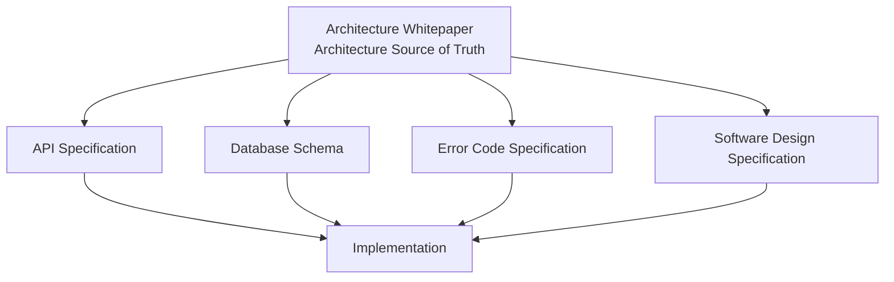
```mermaid
flowchart TD
    W[Architecture Whitepaper<br/>Architecture Source of Truth]
    A[API Specification]
    D[Database Schema]
    E[Error Code Specification]
    S[Software Design Specification]
    I[Implementation]

    W --> A
    W --> D
    W --> E
    W --> S
    A --> I
    D --> I
    E --> I
    S --> I
```

Lower-level documents MAY refine the architecture but MUST NOT contradict it.

---

# 2. Scope and Non-Goals

## 2.1 In Scope

pic-agent-call defines an architectural substrate for agent coordination. It includes:

- agent identity registration;
- presence and lifecycle state;
- association with a terminal, workspace, project, or execution context;
- structured inter-agent communication;
- task creation, assignment, progress, completion, and abort semantics;
- shared memory and durable coordination state;
- recovery of coordination state after disconnection or restart;
- human-governed control over critical transitions.

## 2.2 Out of Scope

pic-agent-call does not define:

- how an agent reasons;
- how prompts are constructed;
- how source code is generated;
- how model inference is performed;
- how Git branches or commits are managed;
- how a specific development methodology is enforced;
- how autonomous consensus is achieved;
- how agents are rewarded, ranked, or evaluated;
- how arbitrary distributed transactions are implemented.

## 2.3 Non-Goals

The runtime is not intended to be:

- a general-purpose message broker;
- a replacement for Git;
- a replacement for a project management platform;
- a distributed workflow engine;
- an agent framework;
- an LLM gateway;
- a vector database;
- a fully autonomous multi-agent society.

It MAY integrate with such systems, but it MUST preserve a narrow and explicit coordination boundary.

---

# 3. Problem Statement

## 3.1 Session Isolation

Most agents operate within isolated sessions. A session typically includes conversation history, temporary state, and tool-specific metadata. When a session ends, its operational context may become unavailable or difficult to reconstruct.

A coordination architecture MUST therefore distinguish between:

- ephemeral execution context;
- persistent identity;
- durable project state;
- recoverable task ownership.

## 3.2 Platform Fragmentation

Different agents may run in:

- independent terminal windows;
- different CLI products;
- IDE extensions;
- browser sessions;
- remote environments;
- separate user accounts;
- different LLM providers.

A collaboration model tied to one platform cannot coordinate the complete system.

## 3.3 Identity Ambiguity

Without persistent identity, the runtime cannot answer:

- Which agent owns this task?
- Is this the same agent returning after a restart?
- Which agent is active in this terminal?
- Is a second registration a legitimate attachment or a duplicate active owner?
- Which memory or message should be visible to whom?

## 3.4 Implicit Ownership

When ownership exists only in natural-language conversation, it becomes ambiguous and non-verifiable. Multiple agents may act on the same responsibility, producing conflicts or duplicated effort.

Ownership MUST therefore be represented as explicit coordination state.

## 3.5 Context Discontinuity

LLM context windows are not durable memory systems. Even when a provider supports session history, the history is usually scoped to that provider or client. Project continuity requires memory independent of any single model session.

## 3.6 Human Coordination Burden

In the absence of a shared runtime, the human operator becomes the routing layer. The operator copies decisions, reconciles task state, repeats constraints, and resolves conflicts manually.

pic-agent-call reduces this burden while preserving human authority.

---

# 4. Architectural Position

pic-agent-call occupies the coordination layer between human governance, agent execution environments, and persistent project state.

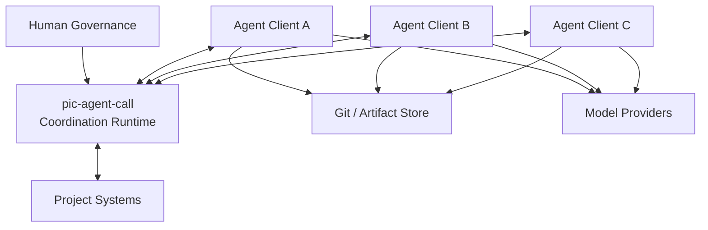
```mermaid
flowchart TB
    H[Human Governance]
    C[pic-agent-call<br/>Coordination Runtime]
    A1[Agent Client A]
    A2[Agent Client B]
    A3[Agent Client C]
    G[Git / Artifact Store]
    P[Project Systems]
    M[Model Providers]

    H --> C
    A1 <--> C
    A2 <--> C
    A3 <--> C
    A1 --> M
    A2 --> M
    A3 --> M
    A1 --> G
    A2 --> G
    A3 --> G
    C <--> P
```

The runtime coordinates agents but does not execute their internal work.

## 4.1 Control Plane, Not Execution Plane

pic-agent-call is a control-plane service.

It records and governs:

- who is present;
- who is active;
- who owns a task;
- what coordination messages exist;
- what shared memory is authoritative;
- what lifecycle transitions occurred.

It does not perform the agent's domain work.

## 4.2 Coordination Runtime

The term **runtime** is used because pic-agent-call maintains active operational state over time. It is more than a static registry or document store. It continuously mediates identity, presence, ownership, and collaboration semantics.

## 4.3 Protocol Independence

The architecture is independent of transport. An implementation MAY expose MCP, HTTP, local IPC, or other interfaces, provided all architectural semantics remain equivalent.

---

# 5. Architecture Philosophy

## 5.1 Coordination over Communication

Communication is the transfer of information. Coordination is the alignment of participants, ownership, state, and timing.

A message alone does not establish:

- authority;
- responsibility;
- durable acceptance;
- completion;
- recoverability.

Therefore, channels are necessary but insufficient. Tasks, identity, and lifecycle state form the coordination model.

## 5.2 Identity over Connection

A network connection is temporary. An identity is durable.

The architecture MUST NOT equate a connection with an agent. An agent may disconnect and return. Multiple sessions may attach to the same logical identity under controlled semantics. Identity MUST survive transport loss.

## 5.3 Persistence over Context

Context is model-local and ephemeral. Coordination memory is project-scoped and durable.

The runtime MUST treat model context as an execution concern and persistent memory as a coordination concern.

## 5.4 Explicit Ownership over Implicit State

Responsibilities MUST be represented explicitly when they affect coordination. The system SHOULD prefer durable assignment and state transition over inference from conversation.

## 5.5 Human Governance over Autonomous Consensus

Critical decisions remain under human authority unless a project explicitly delegates them.

The runtime MUST NOT invent autonomous consensus mechanisms that can override human decisions. Human approval, abort, or conflict resolution MAY be required by higher-level workflows.

## 5.6 Loose Coupling over Shared Process

Agents SHOULD be able to collaborate without running in the same process, model provider, account, or execution tool.

## 5.7 Recovery over Perfect Continuity

Failures are expected. The architecture favors durable recovery semantics over assumptions of uninterrupted connection.

---

# 6. Design Principles

## 6.1 Identity First

Every coordinated action MUST be attributable to an agent identity or a human/system actor.

## 6.2 Project Scope

Coordination state MUST be scoped to a project or equivalent logical boundary. Cross-project leakage MUST NOT occur.

## 6.3 Single Active Ownership per Terminal Context

Within a terminal or equivalent exclusive execution context, the runtime MUST enforce at most one active agent.

Additional agents MAY be attached but MUST NOT simultaneously claim the same active role.

## 6.4 Durable Tasks

Task state SHOULD survive agent restarts and coordinator restarts.

## 6.5 Shared Memory Is Explicit

Shared memory MUST be deliberately written and retrieved. The runtime MUST NOT assume that an agent's private model context is shared.

## 6.6 Small Surface Area

The runtime SHOULD expose only primitives required for coordination. Domain-specific workflow policy SHOULD remain outside the core unless it is universally required.

## 6.7 Backward Compatibility

Minor-version evolution SHOULD preserve the semantics of identity, state, tasks, memory, and channels.

## 6.8 Storage Replaceability

Persistence semantics are architectural. The physical storage engine is not.

The architecture MUST allow storage implementations to evolve without changing the coordination model.

## 6.9 Observable State

Lifecycle and task transitions SHOULD be inspectable. Hidden state SHOULD be minimized.

## 6.10 Deterministic Conflict Handling

Conflicting transitions MUST produce deterministic outcomes rather than undefined behavior.

---

# 7. System Context

## 7.1 Actors

The system recognizes the following actor categories:

- **Human Operator** — governs the workflow and may make privileged decisions.
- **Agent Client** — executes agent behavior and invokes coordination operations.
- **Coordinator** — enforces architectural rules and orchestrates state transitions.
- **Storage Provider** — persists coordination state.
- **External Project System** — optional repository, issue tracker, artifact store, or automation service.

## 7.2 Context Diagram

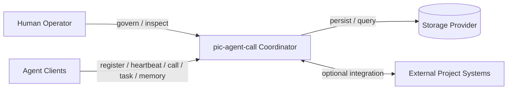
```mermaid
flowchart LR
    U[Human Operator]
    AC[Agent Clients]
    PC[pic-agent-call Coordinator]
    SP[(Storage Provider)]
    ES[External Project Systems]

    U -->|govern / inspect| PC
    AC -->|register / heartbeat / call / task / memory| PC
    PC -->|persist / query| SP
    PC <-->|optional integration| ES
```

## 7.3 System Boundary

The coordinator is authoritative for coordination state only.

It MUST NOT claim authority over:

- source repository truth;
- external issue-tracker truth;
- model-internal state;
- operating-system process state beyond observed registration and heartbeat;
- business-domain decisions not represented in coordination records.

---

# 8. Architectural Layers

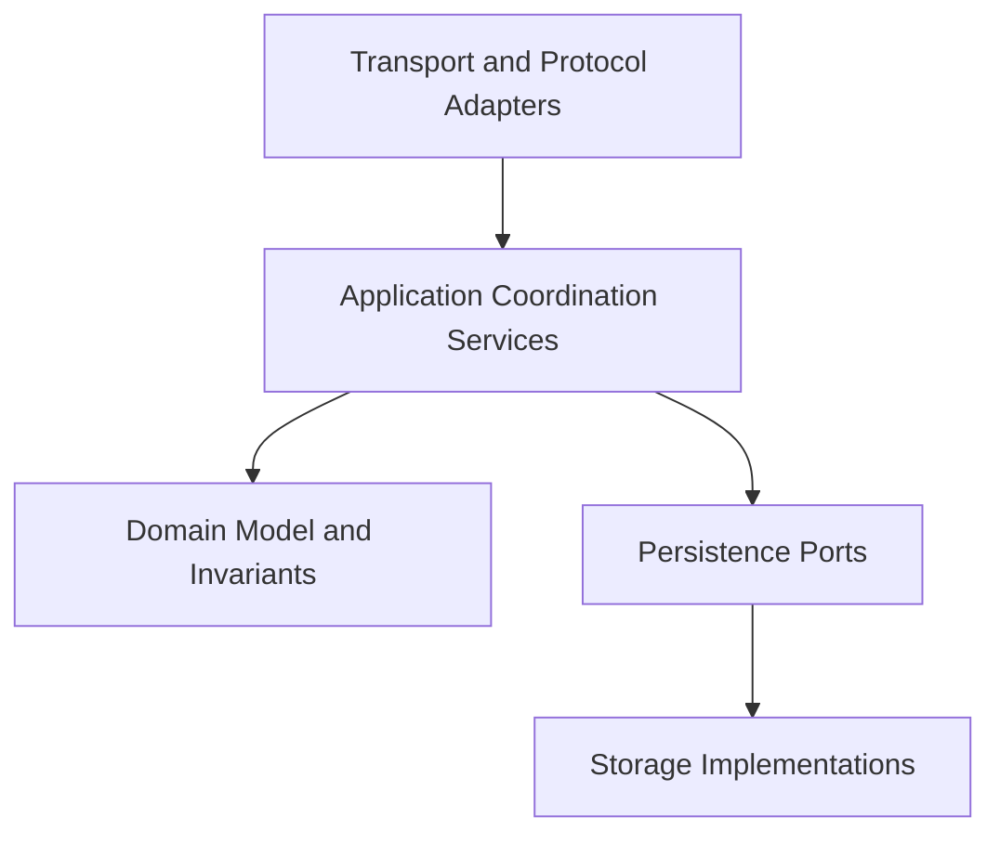
```mermaid
flowchart TB
    T[Transport and Protocol Adapters]
    A[Application Coordination Services]
    D[Domain Model and Invariants]
    P[Persistence Ports]
    I[Storage Implementations]

    T --> A
    A --> D
    A --> P
    P --> I
```

## 8.1 Transport Layer

The transport layer translates external operations into application commands and queries. It MUST NOT contain core lifecycle or ownership rules.

## 8.2 Application Layer

The application layer coordinates use cases such as:

- register an agent;
- renew a heartbeat;
- promote or demote an agent;
- post a channel message;
- create or assign a task;
- read or write memory;
- recover state.

## 8.3 Domain Layer

The domain layer defines invariants, including:

- valid lifecycle states;
- valid transitions;
- uniqueness of active ownership;
- task ownership rules;
- project isolation;
- memory visibility.

## 8.4 Persistence Ports

Persistence ports define the capabilities required from storage without binding the domain model to one database.

## 8.5 Storage Implementations

A storage implementation MAY use SQLite, PostgreSQL, another database, or a compatible persistent system.

---

# 9. Core Domain Model

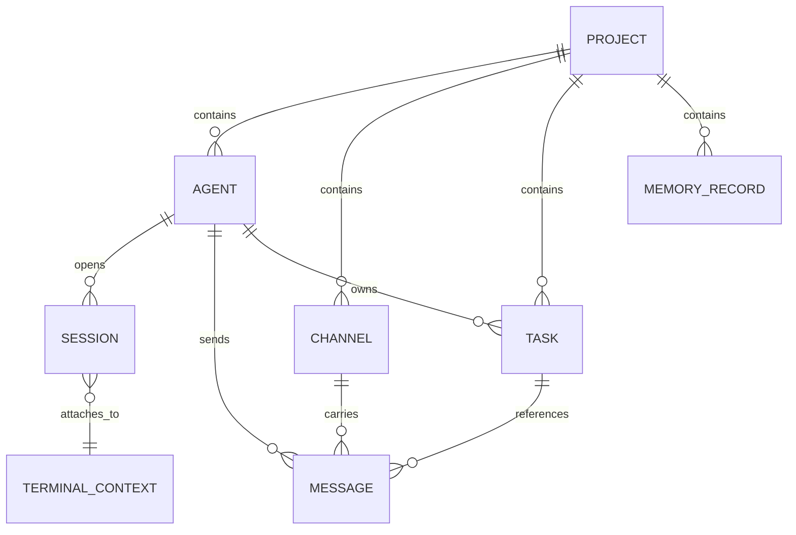
```mermaid
erDiagram
    PROJECT ||--o{ AGENT : contains
    PROJECT ||--o{ CHANNEL : contains
    PROJECT ||--o{ TASK : contains
    PROJECT ||--o{ MEMORY_RECORD : contains
    AGENT ||--o{ SESSION : opens
    AGENT ||--o{ MESSAGE : sends
    AGENT ||--o{ TASK : owns
    CHANNEL ||--o{ MESSAGE : carries
    TASK ||--o{ MESSAGE : references
    SESSION }o--|| TERMINAL_CONTEXT : attaches_to
```

## 9.1 Project

A Project is the primary isolation boundary for coordination state.

A Project MUST have a stable identifier. Agents, channels, tasks, and memory records MUST belong to exactly one project unless a future extension explicitly defines a broader scope.

## 9.2 Agent

An Agent is a persistent coordination identity representing an independently executing AI participant.

An Agent is not equivalent to:

- a model;
- a terminal process;
- a chat session;
- a user account;
- a network connection.

## 9.3 Session

A Session represents an execution occurrence of an agent. Sessions are ephemeral relative to agent identity.

## 9.4 Terminal Context

A Terminal Context identifies the execution surface in which active ownership may be exclusive. It may correspond to a terminal window, IDE context, process group, or other implementation-defined execution slot.

## 9.5 Channel

A Channel is a project-scoped communication stream.

## 9.6 Message

A Message is an immutable communication record once accepted. Corrections SHOULD be represented as new messages rather than mutation of historical content.

## 9.7 Task

A Task is a durable unit of coordinated responsibility.

## 9.8 Memory Record

A Memory Record is durable project knowledge intended for retrieval beyond the lifetime of a single model session.

---

# 10. Agent Identity Model

## 10.1 Identity Properties

An agent identity MUST be:

- unique within its scope;
- stable across reconnects;
- independent of model provider;
- independent of session identifier;
- attributable in audit history.

## 10.2 Identity versus Role

An identity answers **who** the agent is.

A role answers **what responsibility** the agent currently performs.

Roles MAY change without changing identity. For example, one identity may operate as an architect in one project and a reviewer in another.

## 10.3 Identity versus Display Name

Display names are human-readable labels and MAY change. They MUST NOT be treated as unique identifiers.

## 10.4 Registration

Registration establishes or reattaches an agent identity to the coordinator.

In the v1.2.2 coordination contract, registration MUST include an explicit `target`. The target identifies the caller's positioning boundary and is resolved polymorphically by the coordinator. The supported resolution order is:

1. `agent_id`;
2. `term_key`;
3. `session_id`.

For terminal-based clients, `term_key` is the preferred isolation key. It represents the physical or logical terminal window and prevents separate windows from being collapsed into the same session by ambiguous fallback discovery.

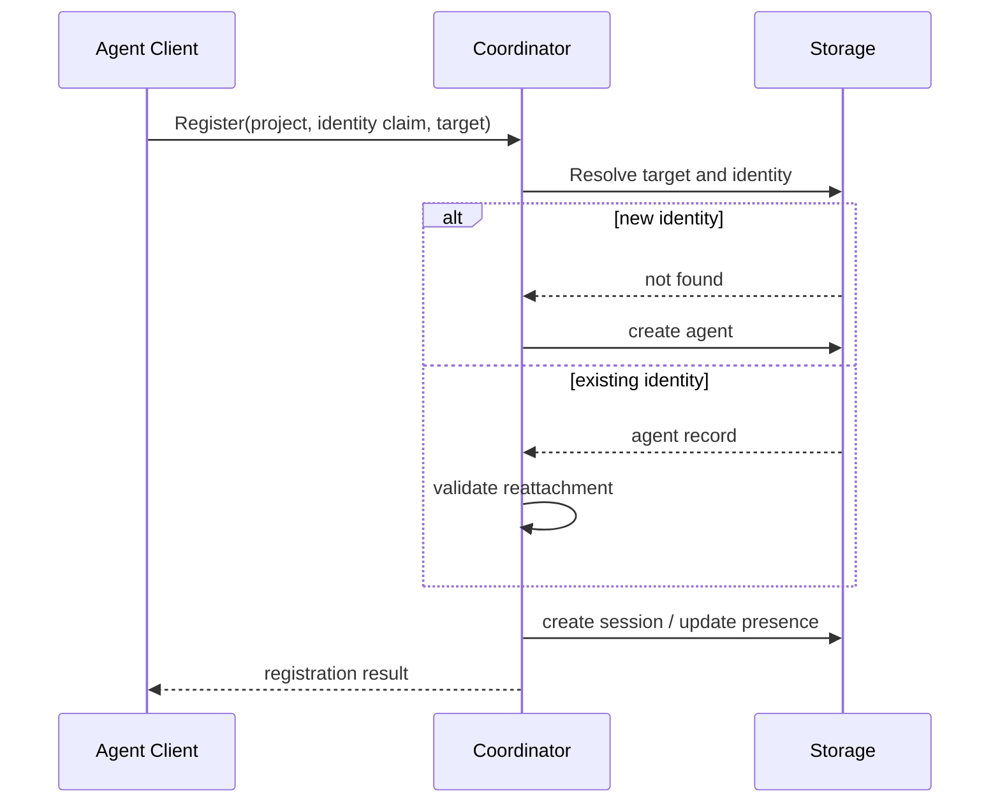
```mermaid
sequenceDiagram
    participant C as Agent Client
    participant R as Coordinator
    participant S as Storage

    C->>R: Register(project, identity claim, target)
    R->>S: Resolve target and identity
    alt new identity
        S-->>R: not found
        R->>S: create agent
    else existing identity
        S-->>R: agent record
        R->>R: validate reattachment
    end
    R->>S: create session / update presence
    R-->>C: registration result
```

Registration MUST reject an empty target. Forced registration MUST scope cleanup to the same resolved terminal boundary and MUST NOT mark unrelated roles in another terminal window offline merely because a session identifier collides.

## 10.4.1 Unregistration

The coordinator MUST support explicit unregistration. An unregister command receives a required `target` and resolves it using the same polymorphic rules:

- if `target` matches an agent identity, that identity is marked `offline`;
- if `target` matches a terminal key, all active or attached identities in that terminal context are marked `offline`;
- if `target` matches a session identifier, all active or attached identities in that session are marked `offline`.

Unregistration changes presence only. It MUST NOT delete identity, task history, channel history, or memory records.

## 10.5 Duplicate Identity

A duplicate registration MUST be evaluated against:

- project;
- stable identity;
- current lifecycle state;
- terminal context;
- existing active ownership;
- freshness of heartbeat.

The system MUST NOT blindly create a second identity merely because a new session appears.

## 10.6 Identity Claims

The method by which a client proves identity is transport- and deployment-dependent. In trusted local deployments, identity claims MAY be implicit. In remote or multi-user deployments, authentication SHOULD bind the client to the claimed identity.

---

# 11. Agent Lifecycle and Presence

## 11.1 Lifecycle States

The baseline lifecycle states are:

- **active** — the agent currently owns the primary execution role for a terminal context;
- **attached** — the agent is connected or registered but does not hold primary active ownership;
- **offline** — the agent is not currently considered present.

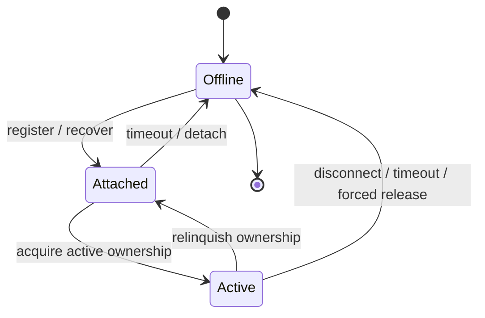
```mermaid
stateDiagram-v2
    [*] --> Offline
    Offline --> Attached : register / recover
    Attached --> Active : acquire active ownership
    Active --> Attached : relinquish ownership
    Attached --> Offline : timeout / detach
    Active --> Offline : disconnect / timeout / forced release
    Offline --> [*]
```

## 11.2 Active

An active agent is the primary participant for an exclusive terminal context.

The coordinator MUST enforce uniqueness of active ownership within the relevant terminal key or equivalent boundary.

In implementations that expose `term_key`, storage MUST enforce at most one `active` identity per non-empty terminal key. Additional identities in the same terminal context MAY be `attached`.

## 11.3 Attached

An attached agent is present and may:

- receive or inspect coordination state;
- participate in channels;
- accept tasks if permitted;
- prepare to take active ownership.

Attached does not imply inactivity. It means the identity does not own the exclusive active slot.

## 11.4 Offline

Offline represents absence from the coordinator's current presence view. Offline MUST NOT delete identity, history, memory, or tasks.

## 11.5 Heartbeat and Lease

Presence is maintained through heartbeat or equivalent lease renewal.

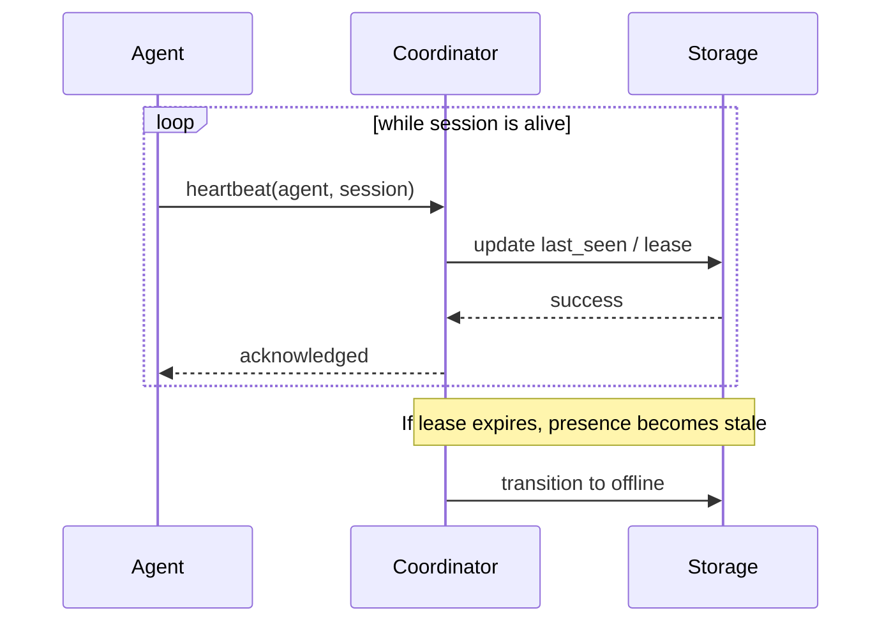
```mermaid
sequenceDiagram
    participant A as Agent
    participant C as Coordinator
    participant S as Storage

    loop while session is alive
        A->>C: heartbeat(agent, session)
        C->>S: update last_seen / lease
        S-->>C: success
        C-->>A: acknowledged
    end

    Note over C,S: If lease expires, presence becomes stale
    C->>S: transition to offline
```

## 11.6 Timeout

Timeout is a failure-detection mechanism, not proof that the agent process terminated. The coordinator SHOULD treat timeout as loss of liveness and release active ownership according to configured policy.

## 11.7 Promotion and Demotion

Promotion to active MUST be atomic with respect to the uniqueness invariant.

Demotion SHOULD preserve the session as attached when the client remains connected.

---

# 12. Coordinator Architecture

The Coordinator is the central enforcement point for coordination semantics.

## 12.1 Responsibilities

The Coordinator MUST:

- validate project scope;
- resolve agent identity;
- enforce lifecycle transitions;
- enforce active ownership uniqueness;
- route channel operations;
- manage task state transitions;
- mediate memory access;
- persist coordination state;
- expose deterministic errors;
- support recovery after restart.

## 12.2 Non-Responsibilities

The Coordinator MUST NOT:

- execute LLM inference;
- decide the quality of agent work;
- modify project source code;
- infer task completion from repository changes without an explicit integration;
- replace human approval semantics;
- manage arbitrary external workflows.

## 12.3 Internal Components

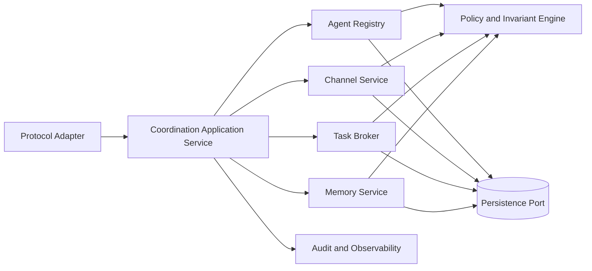
```mermaid
flowchart LR
    API[Protocol Adapter]
    APP[Coordination Application Service]
    REG[Agent Registry]
    CH[Channel Service]
    TB[Task Broker]
    MEM[Memory Service]
    POL[Policy and Invariant Engine]
    OBS[Audit and Observability]
    STORE[(Persistence Port)]

    API --> APP
    APP --> REG
    APP --> CH
    APP --> TB
    APP --> MEM
    REG --> POL
    CH --> POL
    TB --> POL
    MEM --> POL
    REG --> STORE
    CH --> STORE
    TB --> STORE
    MEM --> STORE
    APP --> OBS
```

## 12.4 Agent Registry

The Agent Registry manages:

- identities;
- sessions;
- presence;
- terminal association;
- active ownership;
- lifecycle history.

## 12.5 Channel Service

The Channel Service accepts, stores, and retrieves project-scoped messages.

## 12.6 Task Broker

The Task Broker manages durable units of responsibility and their state transitions.

## 12.7 Memory Service

The Memory Service stores project knowledge that must survive agent and session boundaries.

## 12.8 Policy and Invariant Engine

Policies MAY be implemented as code, constraints, transactions, or a combination. Invariants MUST be enforced consistently regardless of access path.

---

# 13. Channel Architecture

## 13.1 Purpose

Channels provide durable, structured communication among project participants.

A channel is not equivalent to a task queue. It carries communication; it does not by itself establish task ownership.

## 13.2 Message Properties

A message SHOULD include:

- immutable identifier;
- project identifier;
- channel identifier;
- sender identity;
- timestamp;
- content;
- optional recipient or audience;
- optional task reference;
- optional correlation identifier;
- optional message type.

## 13.3 Delivery Semantics

The baseline architecture assumes durable storage and query-based retrieval.

Delivery MAY be implemented through:

- polling;
- request/response reads;
- notifications;
- event streams;
- push transports.

Transport changes MUST NOT alter message history semantics.

## 13.4 Ordering

Messages SHOULD have a stable project- or channel-local ordering key. Wall-clock timestamps alone SHOULD NOT be treated as sufficient ordering under concurrent writes.

## 13.5 Immutability

Accepted messages SHOULD be immutable. Deletion, if supported, SHOULD be exceptional and auditable.

## 13.6 Direct and Shared Communication

A channel MAY represent:

- project-wide communication;
- role-specific communication;
- direct agent-to-agent communication;
- task-specific discussion;
- system events.

## 13.6.1 Target-Scoped Reads and Mailboxes

Unread channel reads MUST be scoped by an explicit `target`. The coordinator resolves the target to the caller's active or attached identities before returning messages.

If a read request specifies a concrete `receiver`, the coordinator MUST verify that the receiver is one of the identities or role mailboxes reachable from the resolved target. Otherwise the request MUST fail with an authorization error.

The 1.x channel model supports two shared mailbox forms:

- `any` — a single unread message that may be claimed by the first authorized active or attached agent;
- `all` — a broadcast request that is materialized as separate unread messages for currently active recipients, excluding the sender where specified.

Channel claim and acknowledgement authorization MUST validate the provided `agent_id` directly against current presence state. A valid claimant is an identity whose status is `active` or `attached`; the coordinator MUST NOT depend on background session discovery for this decision.

## 13.7 Call and Reply

A call is a message that requests a response or action. A reply references the originating call through a correlation identifier.

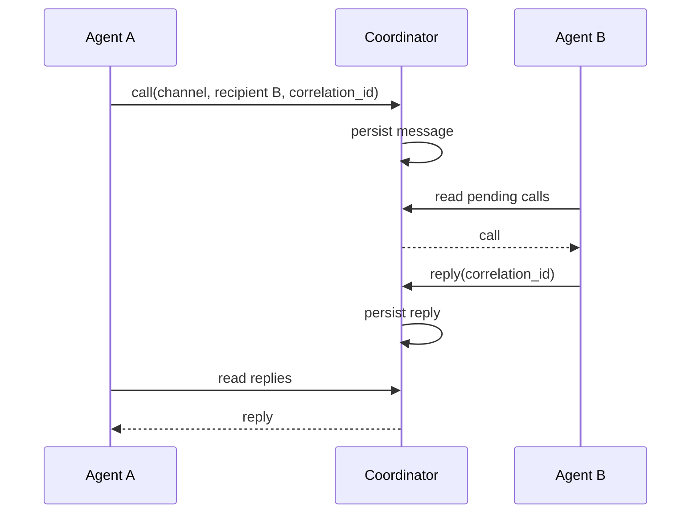
```mermaid
sequenceDiagram
    participant A as Agent A
    participant C as Coordinator
    participant B as Agent B

    A->>C: call(channel, recipient B, correlation_id)
    C->>C: persist message
    B->>C: read pending calls
    C-->>B: call
    B->>C: reply(correlation_id)
    C->>C: persist reply
    A->>C: read replies
    C-->>A: reply
```

---

# 14. Task Coordination Model

## 14.1 Task as Durable Responsibility

A task represents a durable coordination contract. It SHOULD contain enough information to answer:

- what work is requested;
- who created it;
- who owns it;
- what state it is in;
- what dependencies or references apply;
- what completion or abort means.

## 14.2 Task States

The exact state vocabulary MAY be refined by specification, but the architecture requires at least:

- created or open;
- assigned or accepted;
- in progress;
- completed;
- aborted or cancelled.

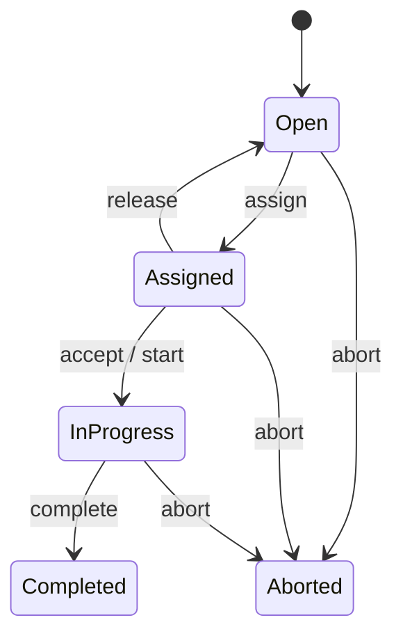
```mermaid
stateDiagram-v2
    [*] --> Open
    Open --> Assigned : assign
    Assigned --> InProgress : accept / start
    InProgress --> Completed : complete
    Open --> Aborted : abort
    Assigned --> Aborted : abort
    InProgress --> Aborted : abort
    Assigned --> Open : release
```

## 14.2.1 Session-Independent Task Authorization

Task creation, completion, and failure reporting are coordination operations and MUST NOT rely on implicit session discovery for authorization. Claiming a task MUST validate the provided claimant identity directly against the agent registry. A claimant MAY proceed only when its current lifecycle state is `active` or `attached`, subject to task-specific policy.

## 14.3 Ownership

Task ownership MUST be explicit.

A task MAY be unassigned, assigned to an agent, or assigned to a role depending on the lower-level contract. Conflicting owners MUST NOT exist unless the task explicitly supports multiple owners.

## 14.4 Human Authority

Human actors MAY create, reassign, abort, or approve tasks according to project policy.

Where completion requires human approval, an agent's completion signal MUST NOT be treated as final approval.

## 14.5 Task Acceptance

Assignment and acceptance SHOULD be distinct when the receiver may decline or when reliable ownership transfer matters.

## 14.6 Idempotency

Task creation and transition commands SHOULD support idempotent behavior where retries are expected.

## 14.7 Task Handoff

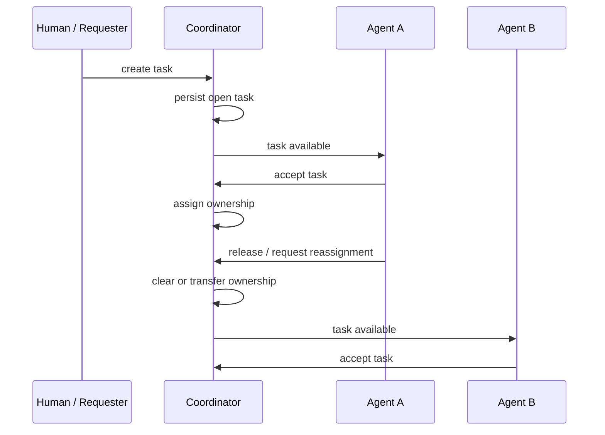
```mermaid
sequenceDiagram
    participant H as Human / Requester
    participant C as Coordinator
    participant A as Agent A
    participant B as Agent B

    H->>C: create task
    C->>C: persist open task
    C->>A: task available
    A->>C: accept task
    C->>C: assign ownership
    A->>C: release / request reassignment
    C->>C: clear or transfer ownership
    C->>B: task available
    B->>C: accept task
```

## 14.8 Task and Channel Relationship

A task MAY have an associated channel or message thread. The task record remains authoritative for task state; the channel remains authoritative for communication history.

---

# 15. Memory Architecture

## 15.1 Purpose

Memory preserves project knowledge across agent, provider, terminal, and session boundaries.

## 15.2 Memory Is Not Conversation History

Conversation history is optimized for replaying model context. Coordination memory is optimized for preserving durable facts, decisions, constraints, and operational knowledge.

The runtime MUST NOT treat all conversation text as authoritative memory.

## 15.3 Memory Categories

An implementation MAY support categories such as:

- project facts;
- architectural decisions;
- constraints;
- conventions;
- role guidance;
- current operational state;
- lessons learned;
- task summaries.

## 15.4 Scope

Memory MUST be scoped. The minimum required scope is project. Additional scopes MAY include agent, role, task, channel, or workspace.

## 15.5 Visibility

Memory visibility MUST be explicit enough to prevent unintended disclosure across projects or restricted participants.

## 15.6 Authority

A memory record SHOULD identify:

- author;
- creation time;
- scope;
- source or rationale;
- revision history or supersession relationship;
- authority level if applicable.

## 15.7 Mutation and Supersession

For architectural or decision records, append-and-supersede is RECOMMENDED over silent mutation.

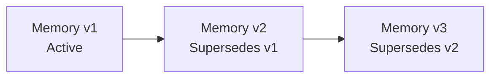
```mermaid
flowchart LR
    M1[Memory v1<br/>Active]
    M2[Memory v2<br/>Supersedes v1]
    M3[Memory v3<br/>Supersedes v2]

    M1 --> M2 --> M3
```

## 15.8 Retrieval

Memory retrieval MAY use:

- exact key lookup;
- scoped listing;
- full-text search;
- semantic search;
- recency and authority filtering.

The retrieval mechanism MUST NOT change the underlying authority semantics.

## 15.9 Memory Write Flow

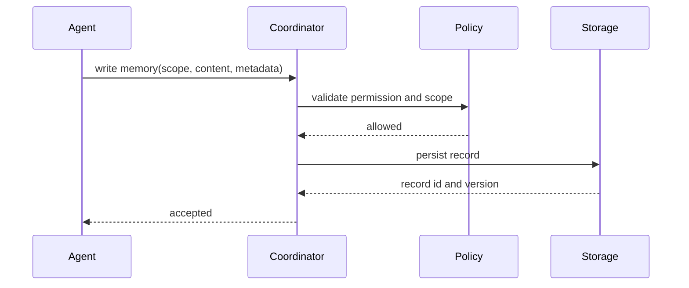
```mermaid
sequenceDiagram
    participant A as Agent
    participant C as Coordinator
    participant P as Policy
    participant S as Storage

    A->>C: write memory(scope, content, metadata)
    C->>P: validate permission and scope
    P-->>C: allowed
    C->>S: persist record
    S-->>C: record id and version
    C-->>A: accepted
```

---

# 16. Session, Terminal, and Workspace Model

## 16.1 Session

A session is a concrete execution occurrence. It may begin when an agent registers and end when it detaches, times out, or is superseded.

Sessions SHOULD have identifiers distinct from agent identities.

Session identifiers are useful execution occurrence identifiers, but they are not reliable terminal-window isolation boundaries. APIs that affect status, registration, channel unread reads, or unregistration MUST receive an explicit `target` rather than silently deriving the caller from ambient process state.

## 16.2 Terminal Context

A terminal context represents an exclusive local execution slot.

The runtime uses this concept to prevent multiple active agents from claiming the same terminal context simultaneously.

The reference 1.x implementation represents this boundary as `term_key` and expects clients or setup hooks to pass it as `target` where required. Missing or empty terminal targets MUST be rejected for registration and target-scoped reads.

## 16.3 Workspace

A workspace represents the project working area associated with an agent execution context. It MAY be a filesystem path, repository checkout, container volume, or logical worktree.

The workspace identifier SHOULD be stable enough to detect collisions.

## 16.4 Separation of Concerns

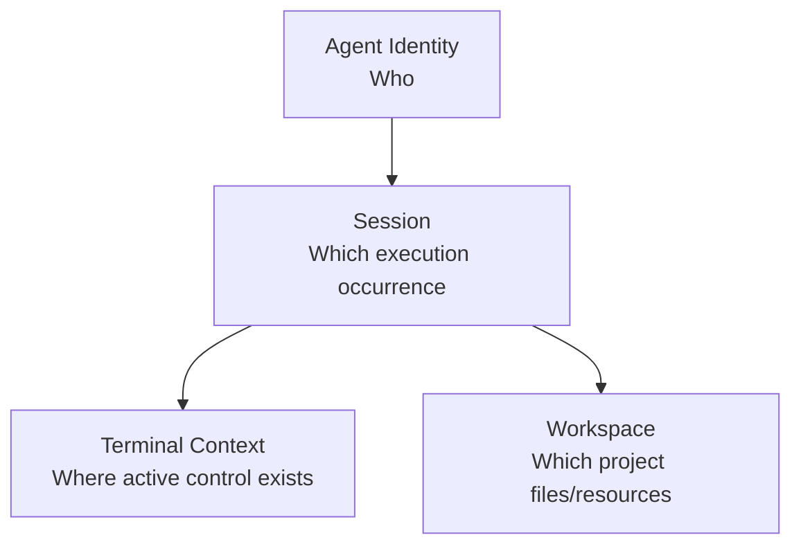
```mermaid
flowchart TD
    A[Agent Identity<br/>Who]
    S[Session<br/>Which execution occurrence]
    T[Terminal Context<br/>Where active control exists]
    W[Workspace<br/>Which project files/resources]

    A --> S
    S --> T
    S --> W
```

## 16.5 Shared Workspace Risk

Multiple agents operating in one physical workspace may overwrite or delete each other's uncommitted work. pic-agent-call can expose ownership and presence but cannot guarantee filesystem isolation.

Projects requiring strong workspace safety SHOULD use isolated worktrees, containers, or directories.

## 16.6 Resume and Recovery

An agent resuming after interruption SHOULD:

1. resolve its stable identity;
2. establish a new session;
3. inspect previous task ownership;
4. inspect channel messages since the last known position;
5. retrieve relevant project memory;
6. reacquire active ownership if permitted.

---

# 17. Persistence Architecture

## 17.1 Persistence Requirements

The storage layer MUST support:

- durable agent identities;
- lifecycle state;
- uniqueness of active ownership;
- sessions and heartbeat timestamps;
- channels and messages;
- tasks and transitions;
- memory records;
- project isolation;
- transactional enforcement of critical invariants.

## 17.2 SQLite in 1.x

SQLite is suitable for the 1.x reference architecture because it provides:

- low operational complexity;
- transactional consistency;
- local deployment;
- a single-file persistence model;
- sufficient performance for small and medium coordination workloads;
- straightforward backup and inspection.

SQLite is an implementation choice, not the definition of the architecture.

## 17.3 Provider Abstraction

The architecture evolves toward a storage-provider boundary.

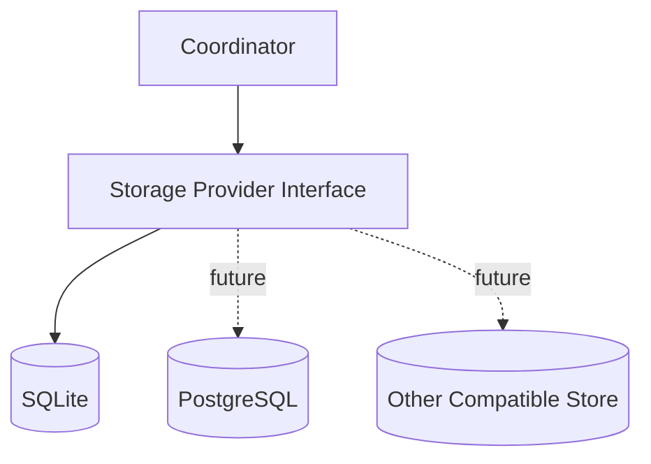
```mermaid
flowchart TB
    C[Coordinator]
    P[Storage Provider Interface]
    S1[(SQLite)]
    S2[(PostgreSQL)]
    S3[(Other Compatible Store)]

    C --> P
    P --> S1
    P -. future .-> S2
    P -. future .-> S3
```

## 17.4 Required Provider Semantics

A storage provider MUST preserve:

- atomic active-ownership acquisition;
- deterministic task transitions;
- durable message ordering;
- project isolation;
- idempotent retry behavior where specified;
- recovery after coordinator restart.

## 17.5 Migration

Schema migration MUST preserve architectural semantics. A migration MUST NOT create transient states that violate uniqueness or ownership invariants without explicit maintenance controls.

## 17.6 Backup and Restore

Backup procedures SHOULD preserve a consistent snapshot. Restore procedures MUST not silently merge incompatible active presence state. Presence SHOULD be revalidated after restore.

---

# 18. Consistency and Concurrency

## 18.1 Consistency Model

The runtime requires strong consistency for ownership and lifecycle invariants, while allowing eventual visibility for non-critical read propagation.

Strong consistency is REQUIRED for:

- active agent uniqueness;
- task ownership transfer;
- terminal-context acquisition;
- state-transition preconditions.

Eventual consistency MAY be acceptable for:

- read-only dashboards;
- search indexes;
- notification delivery;
- non-authoritative caches.

## 18.2 Concurrent Registration

Two concurrent attempts to become active in the same terminal context MUST result in at most one success.

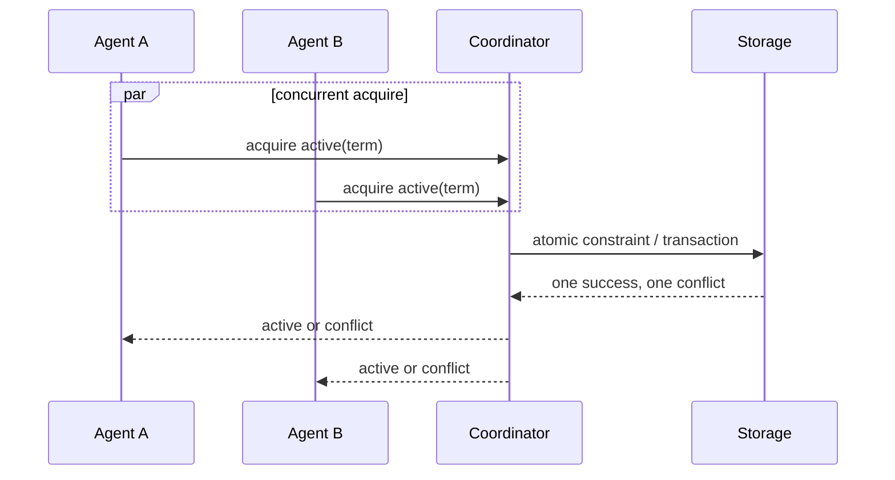
```mermaid
sequenceDiagram
    participant A as Agent A
    participant B as Agent B
    participant C as Coordinator
    participant S as Storage

    par concurrent acquire
        A->>C: acquire active(term)
        B->>C: acquire active(term)
    end
    C->>S: atomic constraint / transaction
    S-->>C: one success, one conflict
    C-->>A: active or conflict
    C-->>B: active or conflict
```

## 18.3 Optimistic Concurrency

Mutable records SHOULD support version checks when lost updates are possible.

## 18.4 Idempotency

Retryable write operations SHOULD accept idempotency keys or equivalent deduplication mechanisms.

## 18.5 Clocks

Wall-clock time MUST NOT be the sole source of ordering for concurrent operations. Monotonic sequence values or storage ordering SHOULD be used where correctness depends on order.

---

# 19. Failure Model and Recovery

## 19.1 Failure Assumptions

The architecture assumes that:

- clients may disconnect without cleanup;
- coordinator processes may restart;
- storage operations may fail;
- messages may be retried;
- network requests may be duplicated;
- clocks may differ;
- agents may return after long absence;
- human intervention may be required.

## 19.2 Agent Crash

When an active agent crashes:

1. heartbeat renewal stops;
2. the lease expires;
3. the coordinator marks the agent offline;
4. active ownership is released;
5. task ownership remains durable unless policy says otherwise;
6. another agent or human may recover or reassign the task.

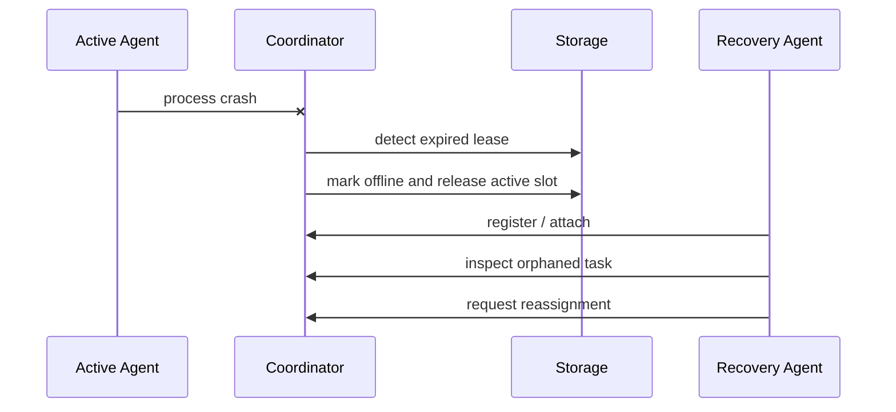
```mermaid
sequenceDiagram
    participant A as Active Agent
    participant C as Coordinator
    participant S as Storage
    participant R as Recovery Agent

    A-xC: process crash
    C->>S: detect expired lease
    C->>S: mark offline and release active slot
    R->>C: register / attach
    R->>C: inspect orphaned task
    R->>C: request reassignment
```

## 19.3 Coordinator Restart

The coordinator MUST reconstruct authoritative coordination state from storage.

Ephemeral connection state MAY be lost. Clients SHOULD reconnect and re-register. Stored active presence SHOULD be validated against lease freshness.

## 19.4 Storage Failure

If storage is unavailable, write operations MUST fail explicitly. The coordinator MUST NOT acknowledge durable state changes that were not persisted.

Read-only degraded operation MAY be supported if its limitations are explicit.

## 19.5 Duplicate Request

Duplicate commands MUST NOT produce duplicate identities, duplicate tasks, or repeated transitions when idempotency is promised.

## 19.6 Split-Brain Risk

In a single-storage deployment, the storage constraint is the final authority for exclusive ownership.

In future multi-coordinator deployments, a consensus-capable coordination mechanism or equivalent serialization boundary will be REQUIRED.

## 19.7 Orphaned Tasks

A task owned by an offline agent is not automatically invalid. The system SHOULD expose it as potentially orphaned and allow explicit recovery.

## 19.8 Recovery Principles

Recovery SHOULD prefer:

- durable inspection;
- explicit reassignment;
- auditable transitions;
- minimal automatic assumption.

---

# 20. Security and Trust Boundaries

## 20.1 Baseline Trust Model

A local single-user deployment may operate within a trusted boundary. This does not remove the need for project isolation and input validation.

## 20.2 Remote Deployment

Remote or multi-user deployment SHOULD provide:

- authenticated clients;
- encrypted transport;
- authorization by project and operation;
- protected credentials;
- audit history;
- rate limiting;
- secure backup.

## 20.3 Authorization

Authorization SHOULD distinguish:

- reading project state;
- writing memory;
- posting messages;
- creating tasks;
- accepting or reassigning tasks;
- promoting an agent to active;
- administrative operations;
- human-only decisions.

## 20.4 Input Safety

The coordinator MUST treat agent-provided content as untrusted input. It SHOULD validate size, type, scope, and encoding.

## 20.5 Prompt Injection Boundary

pic-agent-call transports and stores content that may later be consumed by agents. Stored content MUST NOT automatically be treated as trusted instruction.

Clients SHOULD distinguish:

- authoritative project policy;
- human decisions;
- ordinary agent messages;
- external untrusted content.

## 20.6 Secret Handling

Secrets SHOULD NOT be stored in general-purpose memory or channel messages. Integrations SHOULD reference external secret stores.

## 20.7 Auditability

Privileged actions SHOULD record actor, timestamp, target, previous state, and resulting state.

---

# 21. Observability

## 21.1 Goals

Operators must be able to answer:

- Which agents are active, attached, or offline?
- Which terminal contexts are occupied?
- Which tasks are open, assigned, orphaned, completed, or aborted?
- Which operations failed and why?
- Is storage healthy?
- Are heartbeats arriving?
- Are repeated conflicts occurring?

## 21.2 Logs

Logs SHOULD be structured and SHOULD include correlation identifiers.

Sensitive content SHOULD be redacted or omitted where possible.

## 21.3 Metrics

Recommended metrics include:

- registrations;
- active agents;
- attached agents;
- offline transitions;
- heartbeat latency and expiry;
- active-ownership conflicts;
- task counts by state;
- message write/read rates;
- memory operations;
- storage latency;
- operation failures by error class.

## 21.4 Health

Health reporting SHOULD distinguish:

- process liveness;
- request readiness;
- storage readiness;
- migration status;
- degraded operation.

## 21.5 Audit Events

Audit events SHOULD be durable for security-sensitive and ownership-sensitive transitions.

---

# 22. Deployment Architecture

## 22.1 Local Deployment

The baseline deployment is a single coordinator with local persistent storage.

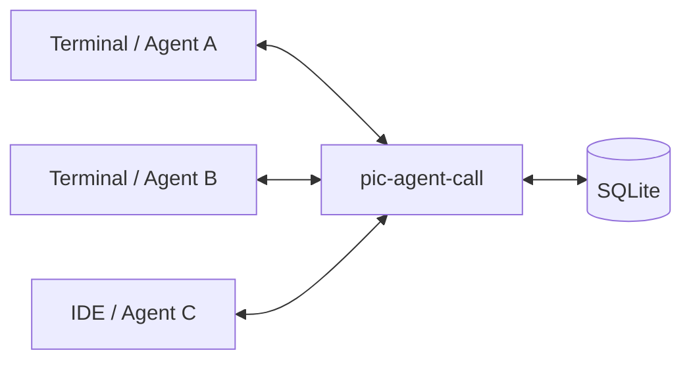
```mermaid
flowchart LR
    T1[Terminal / Agent A]
    T2[Terminal / Agent B]
    T3[IDE / Agent C]
    C[pic-agent-call]
    DB[(SQLite)]

    T1 <--> C
    T2 <--> C
    T3 <--> C
    C <--> DB
```

This topology minimizes operational overhead and is appropriate for individual or small-team workflows.

## 22.2 Container Deployment

The coordinator MAY run in a container. Persistent storage MUST be mounted outside the ephemeral container filesystem.

## 22.3 Kubernetes Deployment

A Kubernetes deployment MUST preserve singleton or serialized ownership semantics.

For SQLite-backed deployments:

- a single writable coordinator replica is RECOMMENDED;
- persistent volume semantics MUST be understood;
- rolling updates MUST avoid concurrent writers unless proven safe;
- readiness SHOULD depend on storage availability.

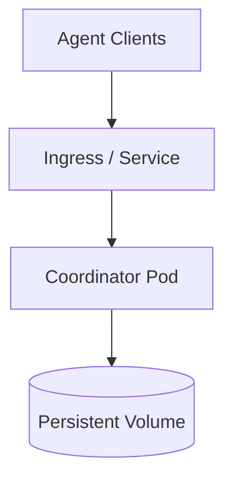
```mermaid
flowchart TB
    IN[Ingress / Service]
    POD[Coordinator Pod]
    PVC[(Persistent Volume)]
    CL[Agent Clients]

    CL --> IN
    IN --> POD
    POD --> PVC
```

## 22.4 High Availability

High availability is not achieved merely by running multiple stateless coordinator replicas. Shared serialization and storage semantics are required.

A future HA architecture may use:

- multiple coordinators;
- a shared transactional database;
- distributed lease management;
- event propagation;
- leader election where necessary.

## 22.5 Configuration

Configuration SHOULD be externalized and SHOULD cover:

- storage provider;
- timeout values;
- project defaults;
- authentication mode;
- observability;
- retention policy;
- transport bindings.

---

# 23. Scalability and Evolution

## 23.1 1.x Scope

Version 1.x prioritizes correctness, local operability, and clear coordination semantics over distributed scale.

## 23.2 Vertical Scalability

The baseline architecture scales through:

- efficient indexing;
- bounded queries;
- pagination;
- retention policies;
- connection pooling where applicable;
- compact message and task representations.

## 23.3 Horizontal Evolution

Horizontal scaling requires separation of:

- transport handling;
- coordination application services;
- durable state;
- event propagation;
- distributed ownership enforcement.

## 23.4 Storage Decoupling

The primary 2.x architectural direction is:

> Decouple coordination from storage.

This means the coordination domain remains stable while SQLite becomes one provider among multiple compatible providers.

## 23.5 Evolution Path

```mermaid
flowchart LR
    V1[1.x<br/>Single Coordinator<br/>SQLite]
    V2[2.x<br/>Storage Provider Boundary<br/>Multiple Stores]
    V3[Future<br/>Multiple Coordinators<br/>Distributed Coordination]

    V1 --> V2 --> V3
```

## 23.6 Compatibility

Evolution MUST preserve the meaning of:

- identity;
- active, attached, and offline;
- task ownership;
- project isolation;
- durable memory;
- channel history.

---

# 24. Architectural Trade-offs

## 24.1 Central Coordinator versus Peer-to-Peer

### Decision

Use a central coordinator.

### Rationale

A central coordinator provides:

- deterministic ownership;
- one authority for lifecycle state;
- simpler recovery;
- simpler auditability;
- lower client complexity.

### Trade-off

The coordinator becomes an operational dependency and potential availability bottleneck.

## 24.2 SQLite versus External Database

### Decision

Use SQLite as the 1.x reference persistence engine.

### Rationale

SQLite minimizes deployment complexity and supports transactional invariants.

### Trade-off

It limits native multi-node write scaling and requires care in containerized or networked storage environments.

## 24.3 Pull-Based Retrieval versus Mandatory Push

### Decision

Define durable query semantics first; treat push as an optimization.

### Rationale

Pull is easier to recover, test, and operate across heterogeneous agent clients.

### Trade-off

Polling may increase latency or request volume.

## 24.4 Explicit State versus Inference

### Decision

Represent identity, lifecycle, ownership, tasks, and memory explicitly.

### Rationale

Explicit state is inspectable, enforceable, and recoverable.

### Trade-off

Clients must perform additional coordination operations.

## 24.5 One Active Agent per Terminal Context

### Decision

Enforce one active agent per exclusive terminal context.

### Rationale

This prevents ambiguous primary ownership and reduces destructive concurrency.

### Trade-off

Some collaborative scenarios require multiple attached agents and deliberate handoff rather than simultaneous active control.

## 24.6 Human Governance versus Autonomous Consensus

### Decision

Preserve human authority over critical decisions.

### Rationale

Agent collaboration often operates on consequential project state. Autonomous consensus is not sufficiently reliable as a universal default.

### Trade-off

Human decision points may reduce full automation.

## 24.7 Durable Memory versus Full Transcript Storage

### Decision

Store curated coordination memory rather than treating all conversation as authoritative memory.

### Rationale

Curated memory is more stable, relevant, and governable.

### Trade-off

Agents or humans must decide what to preserve.

---

# 25. Conformance Rules

An implementation conforms to this architecture only if it satisfies all of the following:

1. Agent identity is distinct from session and connection.
2. Coordination state is project-scoped.
3. Active, attached, and offline semantics are preserved.
4. At most one active agent exists per exclusive terminal context.
5. Tasks have explicit durable state and ownership semantics.
6. Channels preserve durable communication history.
7. Shared memory survives individual model sessions.
8. Critical transitions are persisted before success is acknowledged.
9. Coordinator restart does not erase durable coordination state.
10. Storage replacement does not change domain semantics.
11. Human-governed operations cannot be silently overridden by agents.
12. Conflicting ownership transitions resolve deterministically.
13. Security boundaries prevent cross-project leakage.
14. Lower-level APIs and schemas remain consistent with this document.
15. Target-scoped operations require explicit `target` resolution and MUST NOT depend on ambiguous background session discovery.
16. Channel and task authorization validates the acting `agent_id` directly against `active` or `attached` presence.
17. Unregistration is an explicit presence transition and does not delete durable coordination history.

A transport or implementation MAY differ internally while remaining conformant.

---

# 26. Glossary

**Active Agent**  
The agent currently holding primary execution ownership for an exclusive terminal context.

**Agent**  
A persistent identity representing an independently executing AI participant.

**Agent Client**  
A program or integration that acts on behalf of an agent identity.

**Attached Agent**  
A present agent that does not hold the active slot for the relevant terminal context.

**Channel**  
A durable project-scoped communication stream.

**Coordinator**  
The central runtime component that enforces coordination semantics.

**Coordination State**  
Persistent state describing identity, presence, ownership, tasks, channels, and memory.

**Heartbeat**  
A periodic liveness signal that renews an agent session lease.

**Identity**  
The stable identifier of an agent across sessions and model-provider changes.

**Lease**  
A time-bounded claim used to determine whether presence or active ownership remains valid.

**Memory Record**  
A durable project knowledge record intended to survive individual agent sessions.

**Message**  
An immutable communication record within a channel.

**Offline Agent**  
An agent identity that is not currently considered present.

**Project**  
The primary isolation boundary for coordination state.

**Session**  
A concrete execution occurrence of an agent identity.

**Storage Provider**  
A persistence implementation that satisfies the required coordination semantics.

**Task**  
A durable unit of coordinated responsibility.

**Task Broker**  
The coordinator component responsible for task lifecycle and ownership.

**Terminal Context**  
An execution slot in which active ownership may be exclusive.

**Workspace**  
The filesystem or logical project area used by an agent session.

---

# 27. References

This whitepaper is the governing architectural document for pic-agent-call.

Normative supporting documents include:

- API Specification
- Database Schema Specification
- Error Code Specification
- Software Design Specification
- Project README

External architectural concepts referenced by this document include:

- requirement-level terminology based on RFC-style normative language;
- control-plane and data-plane separation;
- lease-based liveness;
- transactional consistency;
- layered architecture;
- provider abstraction;
- durable task coordination.

---

# Appendix A. Architectural Invariants

The following invariants summarize the non-negotiable core:

1. **Identity persists beyond connection.**
2. **Session is not identity.**
3. **Project scope is the isolation boundary.**
4. **Only one active agent may own an exclusive terminal context.**
5. **Attached agents may collaborate without claiming active ownership.**
6. **Offline status does not delete durable state.**
7. **Tasks represent explicit ownership.**
8. **Channels represent communication, not ownership.**
9. **Memory represents durable project knowledge, not raw model context.**
10. **Critical state changes are transactional.**
11. **Human authority is preserved.**
12. **Storage technology may change; coordination semantics may not.**

---

# Appendix B. Reference Coordination Flow

```mermaid
sequenceDiagram
    participant H as Human
    participant A as Agent A
    participant C as Coordinator
    participant B as Agent B
    participant S as Storage

    A->>C: register
    C->>S: persist identity and session
    C-->>A: attached

    A->>C: acquire active terminal ownership
    C->>S: atomic ownership transition
    C-->>A: active

    H->>C: create task
    C->>S: persist task
    B->>C: read available tasks
    C-->>B: task
    B->>C: accept task
    C->>S: persist ownership

    A->>C: write project memory
    C->>S: persist memory record

    B->>C: post completion message
    C->>S: persist message
    B->>C: complete task
    C->>S: transition task

    H->>C: inspect task and memory
    C->>S: query authoritative state
    C-->>H: current coordination view
```

---

# Appendix C. Architecture Review Checklist

A proposed change SHOULD be rejected or revised if it:

- binds agent identity to a transient session;
- allows multiple active agents in one exclusive terminal context;
- makes task ownership inferential rather than explicit;
- stores coordination state only in model context;
- bypasses project isolation;
- acknowledges writes before durable persistence;
- embeds storage-specific assumptions into the domain contract;
- removes human authority from privileged transitions;
- introduces non-deterministic conflict outcomes;
- makes recovery dependent on an uninterrupted client connection;
- treats message delivery as equivalent to task acceptance;
- conflates source repository truth with coordination truth.

---

**End of Document**
