# pic-agent-call 的架構

**狀態：** Release Candidate  
**文件類型：** Architecture Whitepaper  
**權威層級：** Architecture Source of Truth  
**語言：** 繁體中文  
**預定路徑：** `docs/architecture/architecture.zh-TW.md`

---

## 摘要

本文件定義 **pic-agent-call** 的架構。pic-agent-call 是一套用於協調獨立 AI Agent 的 Agent Coordination Runtime，適用於跨工具、跨終端機、跨 Session 與跨模型供應商的協作場景。

pic-agent-call 的存在，是因為現代 AI Agent 通常受到 Process、Session、供應商或執行介面的隔離。單一 Agent 可能能夠有效完成工作，但彼此缺乏共用的協調基礎。Identity 往往是暫時性的，Memory 被分散在不同 Session 中，Ownership 只能從自然語言推斷，Task 透過非結構化 Prompt 傳遞，發生中斷時則必須人工重建 Context。當多個 Agent 共同參與同一個 Project 時，這些限制會迅速放大。

pic-agent-call 引入一個協調層，提供持久化 Agent Identity、明確的 Lifecycle State、共享 Project Memory、Communication Channel，以及可持久化的 Task Coordination。Runtime 不取代 Agent、不控制 Agent 內部推理，也不強制採用單一開發方法。它定義的是一個共同的操作基礎，使彼此獨立執行的 Agent 能夠發現彼此、交換結構化工作、保留跨 Session 的連續性，並在 Human Governance 下進行協作。

本文件對架構具有規範性。API 定義、資料庫 Schema、Error Code 與實作規格，**必須**符合本文件所描述的架構契約。若低層文件與本 Whitepaper 發生衝突，除非本文件已正式修訂，否則**必須**以本文件為準。

本文件的核心架構定位如下：

> pic-agent-call 不只是 Messaging Server、Memory Server 或 MCP Utility。它是一套面向持久化、具 Identity 的 AI Agent Coordination Runtime。

---

## 文件狀態

本 Whitepaper 定義 pic-agent-call 1.x 的架構基線，並建立後續版本演進時必須遵守的限制。

本文件中的 **必須（MUST）**、**不得（MUST NOT）**、**應（SHOULD）**、**不應（SHOULD NOT）**、**可（MAY）** 與 **可選（OPTIONAL）**，均具有 RFC Style 的規範性意義。

除非某項實作選擇具有架構重要性，否則本文件刻意避免規範具體實作細節。

---

## 目錄

1. 導論  
2. 範圍與非目標  
3. 問題陳述  
4. 架構定位  
5. 架構哲學  
6. 設計原則  
7. 系統脈絡  
8. 架構分層  
9. 核心領域模型  
10. Agent Identity Model  
11. Agent Lifecycle 與 Presence  
12. Coordinator Architecture  
13. Channel Architecture  
14. Task Coordination Model  
15. Memory Architecture  
16. Session、Terminal 與 Workspace Model  
17. Persistence Architecture  
18. Consistency 與 Concurrency  
19. Failure Model 與 Recovery  
20. Security 與 Trust Boundary  
21. Observability  
22. Deployment Architecture  
23. Scalability 與 Evolution  
24. Architecture Trade-offs  
25. Conformance Rules  
26. Glossary  
27. References

---

# 1. 導論

AI Agent 正逐漸參與軟體交付、研究、營運、分析與其他長時間工作流程。實務上，這些 Agent 往往分別啟動於 CLI、IDE、Desktop Application、Web Client 或 Automation System。每一種執行環境都可能維護自己的 Session History、Local Context 與工具專屬狀態。

這種碎片化會形成協調問題。

某個 Agent 可能知道自己正在做什麼，卻不知道另一個 Agent 已做出什麼決策。Task 可能被交接，但沒有持久化 Ownership 記錄。Session 結束後，恢復工作所需的狀態可能遺失。Human Operator 必須在不同工具間人工搬運資訊。即使多個 Agent 共用同一個 Repository，Git 也只能保存已 Commit 的 Artifact；它無法描述目前有哪些 Agent 存在、誰正在負責什麼、Task 是否已交接、目前協調意圖為何，或有哪些 Shared Operational Memory。

pic-agent-call 透過一個不接管 Agent 執行的 Runtime 來解決上述問題。

Runtime 提供以下共用 Control Plane 能力：

- 持久化 Agent Identity；
- Registration 與 Presence；
- Active 與 Attached 的參與狀態；
- 透過 Channel 進行 Communication；
- Durable Task Assignment 與 Task State；
- Project-scoped Shared Memory；
- Session Continuity；
- Workspace 與 Terminal Association；
- Process 或 Connection 中斷後的 Recovery。

整體架構刻意與任何特定 LLM、Agent Framework、CLI Client 或 UI 解耦。

## 1.1 目的

本文件旨在定義：

- pic-agent-call 的架構責任；
- Coordination、Execution 與 Persistence 之間的邊界；
- 核心 Domain Concept 及其關係；
- Identity、Lifecycle、Memory、Channel 與 Task 的必要語意；
- Failure 與 Recovery Model；
- 實作在演進時必須遵守的限制。

## 1.2 目標讀者

本文件適用於：

- pic-agent-call 維護者；
- 相容 Client 或 Server 的實作者；
- 將 pic-agent-call 整合進 Agent Workflow 的 Architect；
- 審查設計變更的人員；
- 部署 Runtime 的 Operator；
- 撰寫 API、Schema 或 Implementation Specification 的 Contributor。

## 1.3 架構權威層級

文件階層如下：

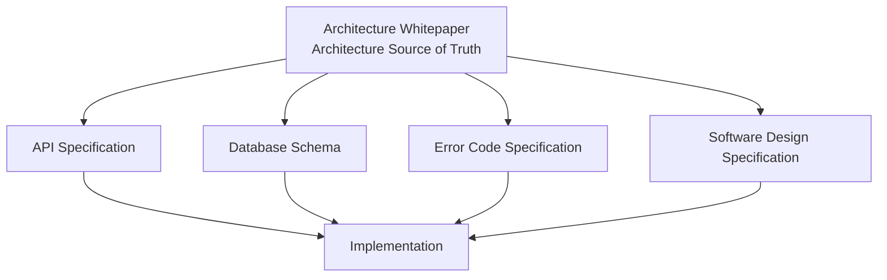
```mermaid
flowchart TD
    W[Architecture Whitepaper<br/>Architecture Source of Truth]
    A[API Specification]
    D[Database Schema]
    E[Error Code Specification]
    S[Software Design Specification]
    I[Implementation]

    W --> A
    W --> D
    W --> E
    W --> S
    A --> I
    D --> I
    E --> I
    S --> I
```

低層文件**可以**細化架構，但**不得**與本文件矛盾。

---

# 2. 範圍與非目標

## 2.1 範圍內

pic-agent-call 定義一套 Agent Coordination 的架構基礎，包含：

- Agent Identity Registration；
- Presence 與 Lifecycle State；
- 與 Terminal、Workspace、Project 或 Execution Context 的關聯；
- 結構化的 Inter-Agent Communication；
- Task Creation、Assignment、Progress、Completion 與 Abort 語意；
- Shared Memory 與 Durable Coordination State；
- Connection 或 Process 中斷後的 Recovery；
- 重要狀態轉移中的 Human Governance。

## 2.2 範圍外

pic-agent-call 不定義：

- Agent 如何推理；
- Prompt 如何建構；
- Source Code 如何生成；
- Model Inference 如何執行；
- Git Branch 或 Commit 如何管理；
- 特定 Development Methodology 如何強制；
- Autonomous Consensus 如何形成；
- Agent 如何被評分、排序或獎勵；
- 任意分散式交易如何實作。

## 2.3 非目標

Runtime 不以成為以下系統為目標：

- General-purpose Message Broker；
- Git 的替代品；
- Project Management Platform 的替代品；
- Distributed Workflow Engine；
- Agent Framework；
- LLM Gateway；
- Vector Database；
- Fully Autonomous Multi-Agent Society。

它**可以**與上述系統整合，但**必須**維持窄而明確的 Coordination Boundary。

---

# 3. 問題陳述

## 3.1 Session Isolation

多數 Agent 運作於彼此隔離的 Session。Session 通常包含 Conversation History、Temporary State 與工具專屬 Metadata。當 Session 結束後，其 Operational Context 可能無法再取得，或需要高成本重建。

因此，Coordination Architecture **必須**區分：

- Ephemeral Execution Context；
- Persistent Identity；
- Durable Project State；
- Recoverable Task Ownership。

## 3.2 Platform Fragmentation

不同 Agent 可能執行於：

- 獨立 Terminal Window；
- 不同 CLI Product；
- IDE Extension；
- Browser Session；
- Remote Environment；
- 不同 User Account；
- 不同 LLM Provider。

綁定單一平台的 Collaboration Model，無法協調完整系統。

## 3.3 Identity Ambiguity

沒有 Persistent Identity，Runtime 無法回答：

- 哪一個 Agent 擁有這個 Task？
- 中斷後回來的是不是同一個 Agent？
- 哪一個 Agent 是此 Terminal 的 Active Agent？
- 第二次 Registration 是合法 Attachment，還是 Duplicate Active Owner？
- 哪些 Memory 或 Message 對哪些 Agent 可見？

## 3.4 Implicit Ownership

若 Ownership 只存在於自然語言對話中，它將變得模糊且無法驗證。多個 Agent 可能同時處理同一責任，導致衝突或重工。

因此，Ownership **必須**被表示成明確的 Coordination State。

## 3.5 Context Discontinuity

LLM Context Window 不是 Durable Memory System。即使 Provider 支援 Session History，這些 History 通常也只屬於特定 Provider 或 Client。Project Continuity 需要獨立於單一 Model Session 的 Memory。

## 3.6 Human Coordination Burden

沒有 Shared Runtime 時，Human Operator 會變成人工 Routing Layer。Operator 必須搬運決策、同步 Task State、重複 Constraints，並手動解決衝突。

pic-agent-call 降低這項負擔，同時保留 Human Authority。

---

# 4. 架構定位

pic-agent-call 位於 Human Governance、Agent Execution Environment 與 Persistent Project State 之間的 Coordination Layer。

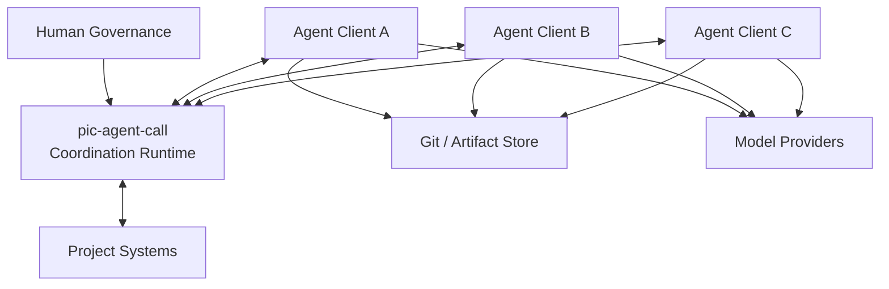
```mermaid
flowchart TB
    H[Human Governance]
    C[pic-agent-call<br/>Coordination Runtime]
    A1[Agent Client A]
    A2[Agent Client B]
    A3[Agent Client C]
    G[Git / Artifact Store]
    P[Project Systems]
    M[Model Providers]

    H --> C
    A1 <--> C
    A2 <--> C
    A3 <--> C
    A1 --> M
    A2 --> M
    A3 --> M
    A1 --> G
    A2 --> G
    A3 --> G
    C <--> P
```

Runtime 負責協調 Agent，但不執行 Agent 的內部工作。

## 4.1 Control Plane，而非 Execution Plane

pic-agent-call 是一套 Control-plane Service。

它記錄並治理：

- 誰目前存在；
- 誰目前為 Active；
- 誰擁有 Task；
- 哪些 Coordination Message 已存在；
- 哪些 Shared Memory 具有 Authority；
- 哪些 Lifecycle Transition 曾發生。

它不執行 Agent 的 Domain Work。

## 4.2 Coordination Runtime

使用 **Runtime** 一詞，是因為 pic-agent-call 會隨時間維護 Active Operational State。它不只是 Static Registry 或 Document Store，而是持續調節 Identity、Presence、Ownership 與 Collaboration Semantics。

## 4.3 Protocol Independence

架構與 Transport 解耦。實作**可以**提供 MCP、HTTP、Local IPC 或其他介面，只要所有 Architecture Semantics 維持一致。

---

# 5. 架構哲學

## 5.1 Coordination 優先於 Communication

Communication 是資訊的傳輸；Coordination 則是 Participant、Ownership、State 與 Timing 的對齊。

單一 Message 本身不能建立：

- Authority；
- Responsibility；
- Durable Acceptance；
- Completion；
- Recoverability。

因此，Channel 是必要條件，但不是充分條件。Task、Identity 與 Lifecycle State 才共同構成 Coordination Model。

## 5.2 Identity 優先於 Connection

Network Connection 是暫時的，Identity 是持久的。

架構**不得**將 Connection 等同於 Agent。Agent 可以 Disconnect 後再返回。多個 Session 可以在受控語意下附著至同一個 Logical Identity。Identity **必須**能跨越 Transport Loss。

## 5.3 Persistence 優先於 Context

Context 是 Model-local 且短暫的；Coordination Memory 是 Project-scoped 且持久的。

Runtime **必須**將 Model Context 視為 Execution Concern，將 Persistent Memory 視為 Coordination Concern。

## 5.4 Explicit Ownership 優先於 Implicit State

只要 Responsibility 會影響 Coordination，就**必須**被明確表示。系統**應**優先使用 Durable Assignment 與 State Transition，而不是從 Conversation 推斷 Ownership。

## 5.5 Human Governance 優先於 Autonomous Consensus

Critical Decision 預設保留於 Human Authority，除非 Project 明確授權。

Runtime **不得**建立可以推翻 Human Decision 的 Autonomous Consensus Mechanism。Higher-level Workflow **可以**要求 Human Approval、Abort 或 Conflict Resolution。

## 5.6 Loose Coupling 優先於 Shared Process

Agent **應**能在不同 Process、Model Provider、Account 或 Execution Tool 中協作。

## 5.7 Recovery 優先於 Perfect Continuity

Failure 是預期事件。架構優先採用 Durable Recovery Semantics，而非假設 Connection 永不中斷。

---

# 6. 設計原則

## 6.1 Identity First

每一項 Coordinated Action **必須**可歸因於 Agent Identity、Human Actor 或 System Actor。

## 6.2 Project Scope

Coordination State **必須**被限制在 Project 或等價 Logical Boundary 中。跨 Project 資料外洩**不得**發生。

## 6.3 每個 Terminal Context 僅允許一個 Active Ownership

在 Terminal 或其他 Exclusive Execution Context 中，Runtime **必須**保證最多只能有一個 Active Agent。

其他 Agent **可以**維持 Attached，但**不得**同時主張相同 Active Role。

## 6.4 Durable Tasks

Task State **應**能跨越 Agent Restart 與 Coordinator Restart。

## 6.5 Shared Memory 必須明確

Shared Memory **必須**被明確寫入與讀取。Runtime **不得**假設 Agent 的 Private Model Context 已被共享。

## 6.6 Small Surface Area

Runtime **應**只暴露 Coordination 所需的 Primitive。Domain-specific Workflow Policy **應**保留於 Core 之外，除非它具有普遍必要性。

## 6.7 Backward Compatibility

Minor-version 演進**應**保留 Identity、State、Task、Memory 與 Channel 的語意。

## 6.8 Storage Replaceability

Persistence Semantics 屬於架構；Physical Storage Engine 不屬於架構定義。

架構**必須**允許 Storage Implementation 演進，而不改變 Coordination Model。

## 6.9 Observable State

Lifecycle 與 Task Transition **應**可被檢視。Hidden State **應**降到最低。

## 6.10 Deterministic Conflict Handling

衝突 Transition **必須**產生可預測結果，而不是 Undefined Behavior。

---

# 7. 系統脈絡

## 7.1 Actor

系統識別以下 Actor Category：

- **Human Operator**：治理 Workflow，並可執行 Privileged Decision。
- **Agent Client**：代表 Agent Identity 執行 Agent Behavior 並呼叫 Coordination Operation。
- **Coordinator**：強制執行 Architecture Rule 並協調 State Transition。
- **Storage Provider**：持久化 Coordination State。
- **External Project System**：可選的 Repository、Issue Tracker、Artifact Store 或 Automation Service。

## 7.2 Context Diagram

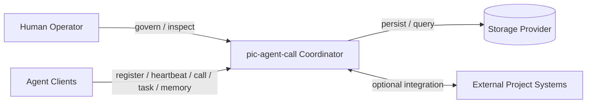
```mermaid
flowchart LR
    U[Human Operator]
    AC[Agent Clients]
    PC[pic-agent-call Coordinator]
    SP[(Storage Provider)]
    ES[External Project Systems]

    U -->|govern / inspect| PC
    AC -->|register / heartbeat / call / task / memory| PC
    PC -->|persist / query| SP
    PC <-->|optional integration| ES
```

## 7.3 System Boundary

Coordinator 只對 Coordination State 具有 Authority。

它**不得**宣稱對以下事項具有權威：

- Source Repository Truth；
- External Issue Tracker Truth；
- Model-internal State；
- 除 Registration 與 Heartbeat 可觀測資訊以外的 OS Process State；
- 未被表示為 Coordination Record 的 Business-domain Decision。

---

# 8. 架構分層

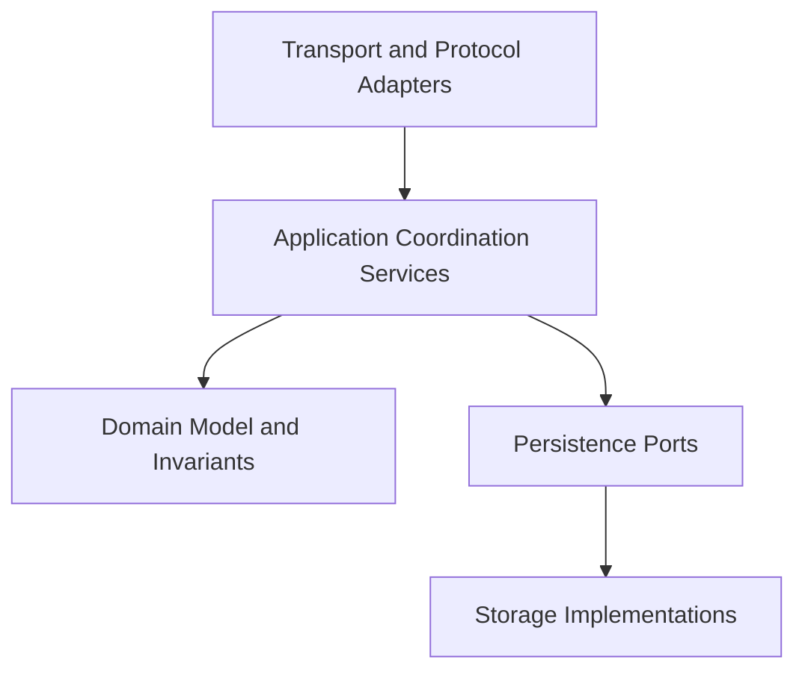
```mermaid
flowchart TB
    T[Transport and Protocol Adapters]
    A[Application Coordination Services]
    D[Domain Model and Invariants]
    P[Persistence Ports]
    I[Storage Implementations]

    T --> A
    A --> D
    A --> P
    P --> I
```

## 8.1 Transport Layer

Transport Layer 將 External Operation 轉換為 Application Command 與 Query。它**不得**包含 Core Lifecycle 或 Ownership Rule。

## 8.2 Application Layer

Application Layer 協調以下 Use Case：

- Register Agent；
- Renew Heartbeat；
- Promote 或 Demote Agent；
- 發布 Channel Message；
- 建立或 Assign Task；
- 讀寫 Memory；
- Recover State。

## 8.3 Domain Layer

Domain Layer 定義 Invariant，包括：

- 合法 Lifecycle State；
- 合法 State Transition；
- Active Ownership 唯一性；
- Task Ownership Rule；
- Project Isolation；
- Memory Visibility。

## 8.4 Persistence Ports

Persistence Port 定義 Storage 必須提供的 Capability，但不將 Domain Model 綁定至單一 Database。

## 8.5 Storage Implementation

Storage Implementation **可以**使用 SQLite、PostgreSQL、其他 Database 或相容 Persistent System。

---

# 9. 核心領域模型

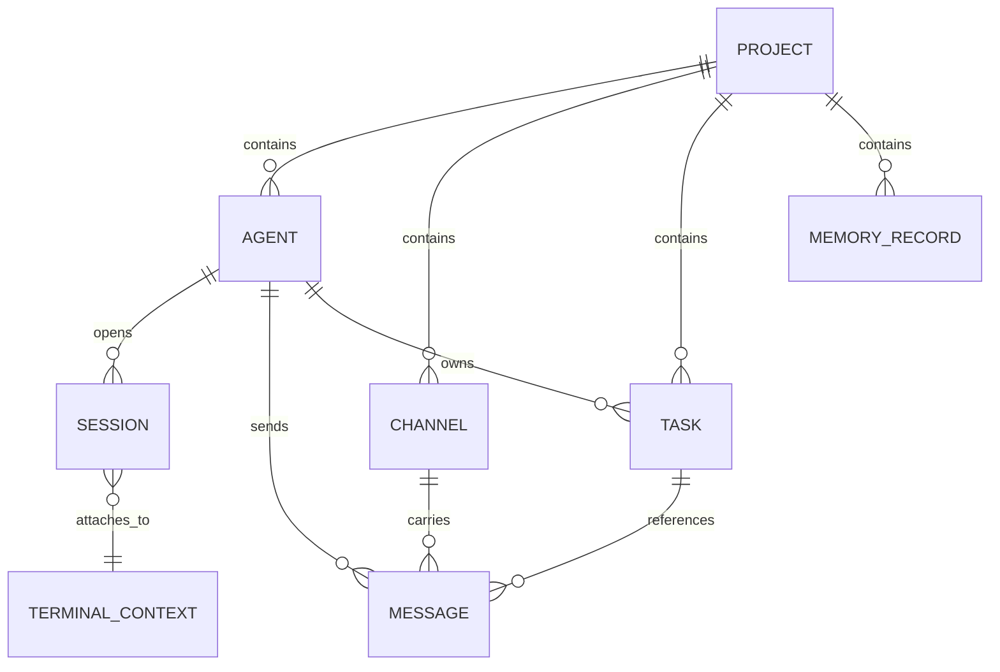
```mermaid
erDiagram
    PROJECT ||--o{ AGENT : contains
    PROJECT ||--o{ CHANNEL : contains
    PROJECT ||--o{ TASK : contains
    PROJECT ||--o{ MEMORY_RECORD : contains
    AGENT ||--o{ SESSION : opens
    AGENT ||--o{ MESSAGE : sends
    AGENT ||--o{ TASK : owns
    CHANNEL ||--o{ MESSAGE : carries
    TASK ||--o{ MESSAGE : references
    SESSION }o--|| TERMINAL_CONTEXT : attaches_to
```

## 9.1 Project

Project 是 Coordination State 的主要 Isolation Boundary。

Project **必須**具有 Stable Identifier。Agent、Channel、Task 與 Memory Record **必須**且只能屬於一個 Project，除非未來 Extension 明確定義更高層 Scope。

## 9.2 Agent

Agent 是一個持久化 Coordination Identity，代表獨立執行的 AI Participant。

Agent 不等同於：

- Model；
- Terminal Process；
- Chat Session；
- User Account；
- Network Connection。

## 9.3 Session

Session 代表 Agent 的某一次實際 Execution Occurrence。相較於 Agent Identity，Session 是短暫的。

## 9.4 Terminal Context

Terminal Context 識別可能需要 Exclusive Active Ownership 的 Execution Surface。它可以對應 Terminal Window、IDE Context、Process Group 或其他 Implementation-defined Execution Slot。

## 9.5 Channel

Channel 是 Project-scoped Communication Stream。

## 9.6 Message

Message 一旦被接受，即為 Immutable Communication Record。修正內容**應**以新 Message 表示，而非修改歷史紀錄。

## 9.7 Task

Task 是持久化的 Coordinated Responsibility Unit。

## 9.8 Memory Record

Memory Record 是一筆需跨越單一 Model Session 存續的 Durable Project Knowledge。

---

# 10. Agent Identity Model

## 10.1 Identity Property

Agent Identity **必須**：

- 在其 Scope 內唯一；
- 可跨 Reconnect 保持穩定；
- 不依賴 Model Provider；
- 不依賴 Session Identifier；
- 可在 Audit History 中被追溯。

## 10.2 Identity 與 Role

Identity 回答的是「誰」。

Role 回答的是「目前負責什麼」。

Role **可以**改變而不改變 Identity。例如，同一 Identity 可以在某個 Project 中擔任 Architect，在另一個 Project 中擔任 Reviewer。

## 10.3 Identity 與 Display Name

Display Name 是人類可讀 Label，且**可以**改變。它**不得**被當作 Unique Identifier。

## 10.4 Registration

Registration 建立或重新附著 Agent Identity 至 Coordinator。

在 v1.2.2 Coordination Contract 中，Registration **必須**包含明確的 `target`。`target` 用來識別 Caller 的定位邊界，並由 Coordinator 進行多態解析。支援的解析優先序為：

1. `agent_id`；
2. `term_key`；
3. `session_id`。

對 Terminal-based Client 而言，`term_key` 是優先使用的 Isolation Key。它代表實體或邏輯 Terminal Window，用來避免不同視窗因模糊的 fallback discovery 被誤判為同一個 Session。

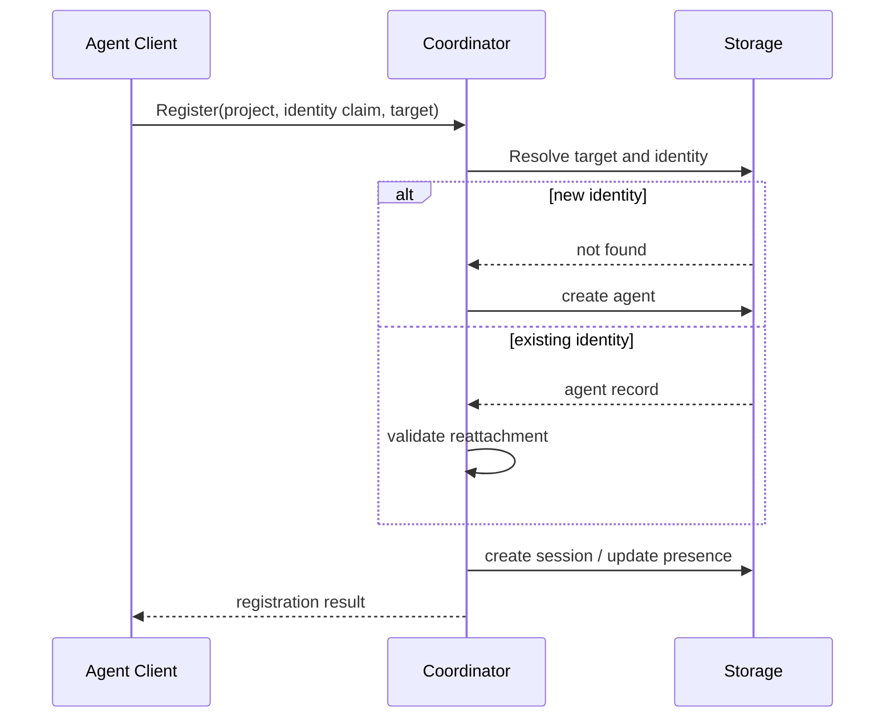
```mermaid
sequenceDiagram
    participant C as Agent Client
    participant R as Coordinator
    participant S as Storage

    C->>R: Register(project, identity claim, target)
    R->>S: Resolve target and identity
    alt new identity
        S-->>R: not found
        R->>S: create agent
    else existing identity
        S-->>R: agent record
        R->>R: validate reattachment
    end
    R->>S: create session / update presence
    R-->>C: registration result
```

Registration **必須**拒絕空 `target`。Forced Registration 的清理範圍**必須**限制在相同解析後的 Terminal Boundary 中，且**不得**只因 Session Identifier 碰撞，就將另一個 Terminal Window 中不相關的 Role 標記為 Offline。

## 10.4.1 Unregistration

Coordinator **必須**支援明確的 Unregistration。Unregister Command 接收必填 `target`，並使用相同多態規則解析：

- 若 `target` 命中 Agent Identity，將該 Identity 標記為 `offline`；
- 若 `target` 命中 Terminal Key，將該 Terminal Context 下所有 Active 或 Attached Identity 標記為 `offline`；
- 若 `target` 命中 Session Identifier，將該 Session 下所有 Active 或 Attached Identity 標記為 `offline`。

Unregistration 只改變 Presence。它**不得**刪除 Identity、Task History、Channel History 或 Memory Record。

## 10.5 Duplicate Identity

Duplicate Registration **必須**依據以下資訊判斷：

- Project；
- Stable Identity；
- Current Lifecycle State；
- Terminal Context；
- Existing Active Ownership；
- Heartbeat Freshness。

系統**不得**僅因新 Session 出現，就盲目建立第二個 Identity。

## 10.6 Identity Claim

Client 如何證明 Identity，取決於 Transport 與 Deployment。在 Trusted Local Deployment 中，Identity Claim **可以**是 Implicit；在 Remote 或 Multi-user Deployment 中，Authentication **應**將 Client 與其 Claim 的 Identity 綁定。

---

# 11. Agent Lifecycle 與 Presence

## 11.1 Lifecycle State

Baseline Lifecycle State 包含：

- **active**：Agent 目前擁有某個 Terminal Context 的 Primary Execution Role；
- **attached**：Agent 已連線或已註冊，但不持有 Primary Active Ownership；
- **offline**：Agent 目前不被視為存在。

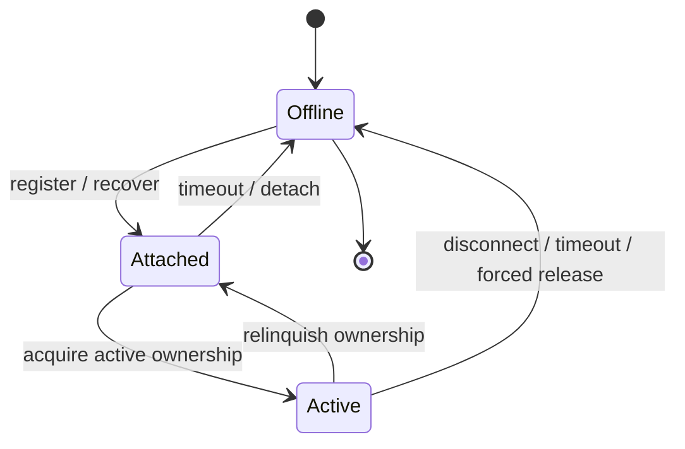
```mermaid
stateDiagram-v2
    [*] --> Offline
    Offline --> Attached : register / recover
    Attached --> Active : acquire active ownership
    Active --> Attached : relinquish ownership
    Attached --> Offline : timeout / detach
    Active --> Offline : disconnect / timeout / forced release
    Offline --> [*]
```

## 11.2 Active

Active Agent 是某個 Exclusive Terminal Context 的 Primary Participant。

Coordinator **必須**在對應 Terminal Key 或等價 Boundary 中，強制 Active Ownership 唯一性。

若實作暴露 `term_key`，Storage **必須**保證每個非空 Terminal Key 最多只有一個 `active` Identity。同一 Terminal Context 中的其他 Identity **可以**是 `attached`。

## 11.3 Attached

Attached Agent 目前存在，並且可以：

- 接收或檢視 Coordination State；
- 參與 Channel；
- 在權限允許時接受 Task；
- 準備取得 Active Ownership。

Attached 不代表完全不活動，而是該 Identity 不擁有 Exclusive Active Slot。

## 11.4 Offline

Offline 代表 Agent 不在目前的 Presence View 中。Offline **不得**刪除 Identity、History、Memory 或 Task。

## 11.5 Heartbeat 與 Lease

Presence 透過 Heartbeat 或等價 Lease Renewal 維持。

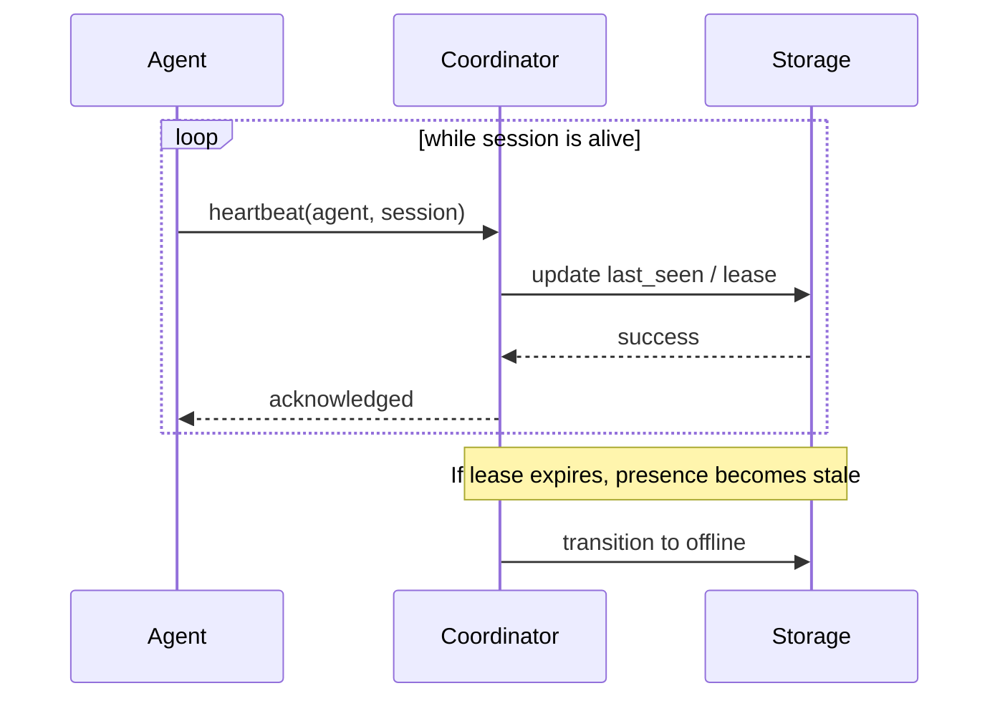
```mermaid
sequenceDiagram
    participant A as Agent
    participant C as Coordinator
    participant S as Storage

    loop while session is alive
        A->>C: heartbeat(agent, session)
        C->>S: update last_seen / lease
        S-->>C: success
        C-->>A: acknowledged
    end

    Note over C,S: If lease expires, presence becomes stale
    C->>S: transition to offline
```

## 11.6 Timeout

Timeout 是 Failure Detection Mechanism，不代表 Agent Process 已確定終止。Coordinator **應**將 Timeout 視為 Liveness Loss，並依設定 Policy 釋放 Active Ownership。

## 11.7 Promotion 與 Demotion

Promotion 至 Active 時，對 Active Ownership Uniqueness Invariant 的修改**必須**是 Atomic。

若 Client 仍保持連線，Demotion **應**保留 Session 為 Attached。

---

# 12. Coordinator Architecture

Coordinator 是 Coordination Semantics 的中央 Enforcement Point。

## 12.1 責任

Coordinator **必須**：

- 驗證 Project Scope；
- 解析 Agent Identity；
- 強制 Lifecycle Transition；
- 強制 Active Ownership 唯一性；
- 路由 Channel Operation；
- 管理 Task State Transition；
- 調節 Memory Access；
- 持久化 Coordination State；
- 暴露 Deterministic Error；
- 支援 Restart 後 Recovery。

## 12.2 非責任

Coordinator **不得**：

- 執行 LLM Inference；
- 判定 Agent Work Quality；
- 修改 Project Source Code；
- 在沒有明確 Integration 的情況下，從 Repository Change 推斷 Task Completion；
- 取代 Human Approval Semantics；
- 管理任意 External Workflow。

## 12.3 內部元件

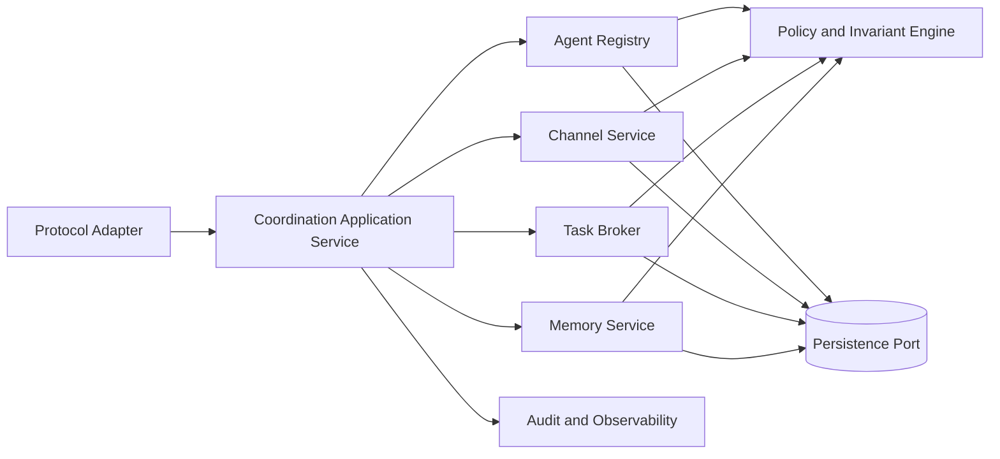
```mermaid
flowchart LR
    API[Protocol Adapter]
    APP[Coordination Application Service]
    REG[Agent Registry]
    CH[Channel Service]
    TB[Task Broker]
    MEM[Memory Service]
    POL[Policy and Invariant Engine]
    OBS[Audit and Observability]
    STORE[(Persistence Port)]

    API --> APP
    APP --> REG
    APP --> CH
    APP --> TB
    APP --> MEM
    REG --> POL
    CH --> POL
    TB --> POL
    MEM --> POL
    REG --> STORE
    CH --> STORE
    TB --> STORE
    MEM --> STORE
    APP --> OBS
```

## 12.4 Agent Registry

Agent Registry 管理：

- Identity；
- Session；
- Presence；
- Terminal Association；
- Active Ownership；
- Lifecycle History。

## 12.5 Channel Service

Channel Service 負責接受、儲存與讀取 Project-scoped Message。

## 12.6 Task Broker

Task Broker 管理 Durable Responsibility Unit 及其 State Transition。

## 12.7 Memory Service

Memory Service 儲存必須跨越 Agent 與 Session Boundary 的 Project Knowledge。

## 12.8 Policy and Invariant Engine

Policy **可以**透過 Code、Constraint、Transaction 或其組合實作。無論 Access Path 為何，Invariant **必須**被一致執行。

---

# 13. Channel Architecture

## 13.1 目的

Channel 提供 Project Participant 之間持久、結構化的 Communication。

Channel 不等同於 Task Queue。它承載 Communication，但本身不建立 Task Ownership。

## 13.2 Message Property

Message **應**包含：

- Immutable Identifier；
- Project Identifier；
- Channel Identifier；
- Sender Identity；
- Timestamp；
- Content；
- Optional Recipient 或 Audience；
- Optional Task Reference；
- Optional Correlation Identifier；
- Optional Message Type。

## 13.3 Delivery Semantics

Baseline Architecture 假設 Message 被 Durable Storage 保存，並透過 Query-based Retrieval 取得。

Delivery **可以**透過以下方式實作：

- Polling；
- Request/response Read；
- Notification；
- Event Stream；
- Push Transport。

Transport 變更**不得**改變 Message History Semantics。

## 13.4 Ordering

Message **應**具有穩定的 Project-local 或 Channel-local Ordering Key。當 Concurrent Write 存在時，Wall-clock Timestamp 本身**不應**被視為足夠的 Ordering Basis。

## 13.5 Immutability

已接受的 Message **應**為 Immutable。若支援 Deletion，則**應**屬於例外操作，且必須可稽核。

## 13.6 Direct 與 Shared Communication

Channel **可以**表示：

- Project-wide Communication；
- Role-specific Communication；
- Direct Agent-to-Agent Communication；
- Task-specific Discussion；
- System Event。

## 13.6.1 Target-scoped Read 與 Mailbox

Channel 未讀查詢**必須**以明確 `target` 為 Scope。Coordinator 先將 Target 解析為 Caller 的 Active 或 Attached Identity，才可回傳 Message。

若 Read Request 指定具體 `receiver`，Coordinator **必須**確認該 Receiver 屬於由 Target 解析出的 Identity 或 Role Mailbox。否則 Request **必須**以 Authorization Error 失敗。

1.x Channel Model 支援兩種 Shared Mailbox：

- `any`：單筆未讀 Message，可由第一個 Authorized Active 或 Attached Agent Claim；
- `all`：Broadcast Request，會為目前 Active Recipient 各自實體化為獨立未讀 Message，並在規格要求時排除 Sender。

Channel Claim 與 Acknowledgement Authorization **必須**直接依據傳入的 `agent_id` 查驗目前 Presence State。合法 Claimant 是狀態為 `active` 或 `attached` 的 Identity；Coordinator **不得**依賴背景 Session Discovery 做此判定。

## 13.7 Call 與 Reply

Call 是要求回應或動作的 Message。Reply 透過 Correlation Identifier 參照原始 Call。

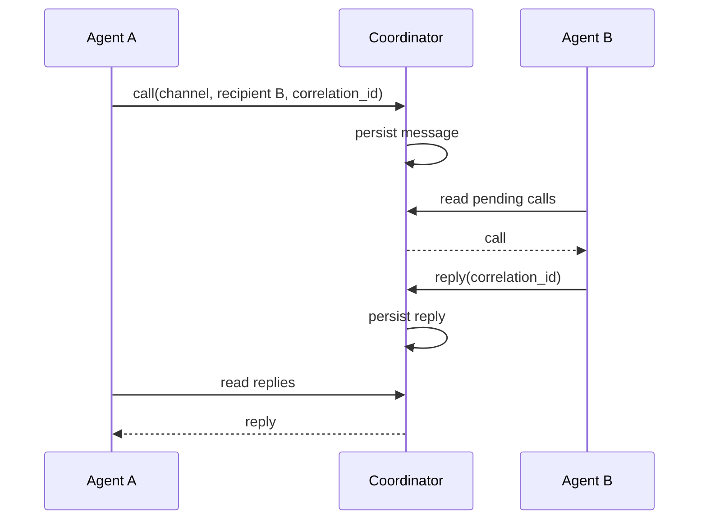
```mermaid
sequenceDiagram
    participant A as Agent A
    participant C as Coordinator
    participant B as Agent B

    A->>C: call(channel, recipient B, correlation_id)
    C->>C: persist message
    B->>C: read pending calls
    C-->>B: call
    B->>C: reply(correlation_id)
    C->>C: persist reply
    A->>C: read replies
    C-->>A: reply
```

---

# 14. Task Coordination Model

## 14.1 Task 作為 Durable Responsibility

Task 表示一項持久化的 Coordination Contract。它**應**能回答：

- 請求什麼工作；
- 誰建立；
- 誰擁有；
- 目前狀態；
- 有哪些 Dependency 或 Reference；
- Completion 或 Abort 代表什麼。

## 14.2 Task State

確切 State Vocabulary **可以**由低層 Specification 細化，但架構至少需要：

- created 或 open；
- assigned 或 accepted；
- in progress；
- completed；
- aborted 或 cancelled。

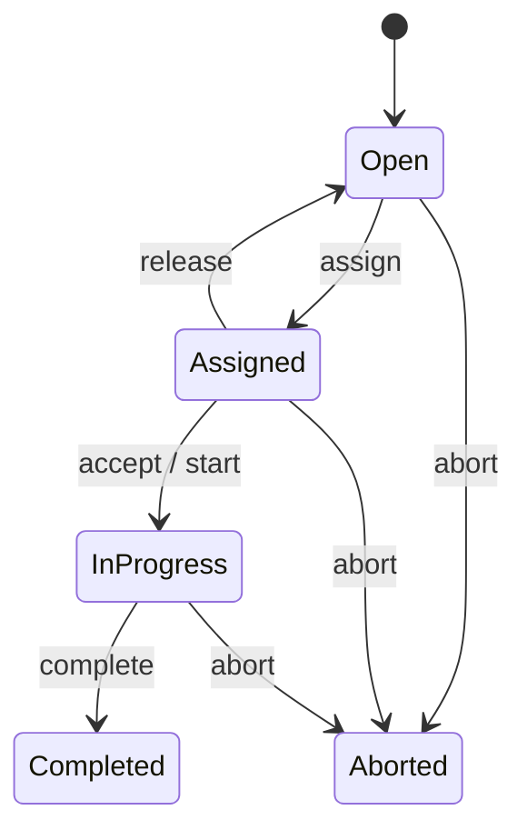
```mermaid
stateDiagram-v2
    [*] --> Open
    Open --> Assigned : assign
    Assigned --> InProgress : accept / start
    InProgress --> Completed : complete
    Open --> Aborted : abort
    Assigned --> Aborted : abort
    InProgress --> Aborted : abort
    Assigned --> Open : release
```

## 14.2.1 Session-independent Task Authorization

Task Creation、Completion 與 Failure Reporting 是 Coordination Operation，**不得**依賴隱式 Session Discovery 進行授權。Claim Task **必須**直接以傳入的 Claimant Identity 查詢 Agent Registry。只有當該 Claimant 目前 Lifecycle State 為 `active` 或 `attached`，且符合 Task-specific Policy 時，才可繼續處理。

## 14.3 Ownership

Task Ownership **必須**明確。

依低層 Contract，Task **可以**是 Unassigned、Assigned to Agent 或 Assigned to Role。除非 Task 明確支援 Multiple Owner，否則不得同時存在衝突 Owner。

## 14.4 Human Authority

Human Actor **可以**依 Project Policy 建立、Reassign、Abort 或 Approve Task。

若 Completion 需要 Human Approval，Agent 的 Completion Signal **不得**被視為 Final Approval。

## 14.5 Task Acceptance

當 Receiver 可以 Decline，或 Ownership Transfer 需要可靠性時，Assignment 與 Acceptance **應**被區分。

## 14.6 Idempotency

Task Creation 與 Transition Command 在可能發生 Retry 的情況下，**應**支援 Idempotent Behavior。

## 14.7 Task Handoff

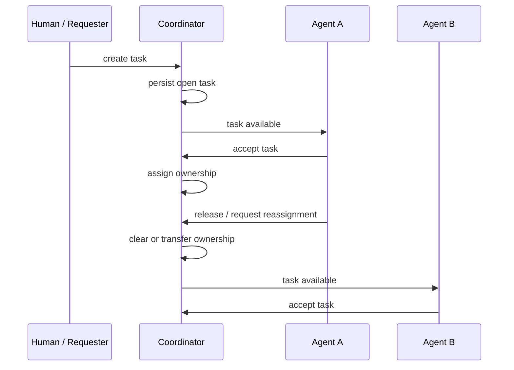
```mermaid
sequenceDiagram
    participant H as Human / Requester
    participant C as Coordinator
    participant A as Agent A
    participant B as Agent B

    H->>C: create task
    C->>C: persist open task
    C->>A: task available
    A->>C: accept task
    C->>C: assign ownership
    A->>C: release / request reassignment
    C->>C: clear or transfer ownership
    C->>B: task available
    B->>C: accept task
```

## 14.8 Task 與 Channel 關係

Task **可以**具有關聯 Channel 或 Message Thread。Task Record 對 Task State 具有 Authority；Channel 對 Communication History 具有 Authority。

---

# 15. Memory Architecture

## 15.1 目的

Memory 保存跨 Agent、Provider、Terminal 與 Session Boundary 的 Project Knowledge。

## 15.2 Memory 不等於 Conversation History

Conversation History 用於重播 Model Context；Coordination Memory 用於保存 Durable Fact、Decision、Constraint 與 Operational Knowledge。

Runtime **不得**將所有 Conversation Text 都視為 Authoritative Memory。

## 15.3 Memory Category

實作**可以**支援以下 Category：

- Project Fact；
- Architecture Decision；
- Constraint；
- Convention；
- Role Guidance；
- Current Operational State；
- Lessons Learned；
- Task Summary。

## 15.4 Scope

Memory **必須**有明確 Scope。最低要求為 Project Scope。其他 Scope **可以**包含 Agent、Role、Task、Channel 或 Workspace。

## 15.5 Visibility

Memory Visibility **必須**足夠明確，以避免跨 Project 或 Restricted Participant 的非預期揭露。

## 15.6 Authority

Memory Record **應**識別：

- Author；
- Creation Time；
- Scope；
- Source 或 Rationale；
- Revision History 或 Supersession Relationship；
- 適用時的 Authority Level。

## 15.7 Mutation 與 Supersession

對 Architecture 或 Decision Record，建議採 Append-and-supersede，而非 Silent Mutation。

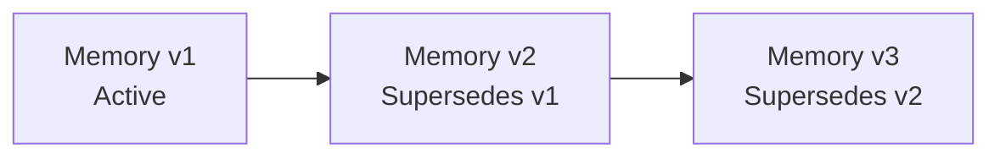
```mermaid
flowchart LR
    M1[Memory v1<br/>Active]
    M2[Memory v2<br/>Supersedes v1]
    M3[Memory v3<br/>Supersedes v2]

    M1 --> M2 --> M3
```

## 15.8 Retrieval

Memory Retrieval **可以**使用：

- Exact Key Lookup；
- Scoped Listing；
- Full-text Search；
- Semantic Search；
- Recency 與 Authority Filtering。

Retrieval Mechanism **不得**改變底層 Authority Semantics。

## 15.9 Memory Write Flow

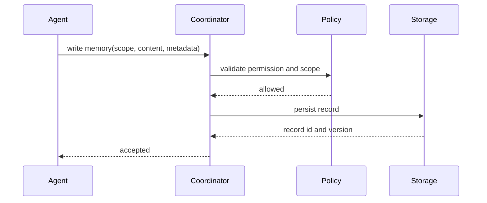
```mermaid
sequenceDiagram
    participant A as Agent
    participant C as Coordinator
    participant P as Policy
    participant S as Storage

    A->>C: write memory(scope, content, metadata)
    C->>P: validate permission and scope
    P-->>C: allowed
    C->>S: persist record
    S-->>C: record id and version
    C-->>A: accepted
```

---

# 16. Session、Terminal 與 Workspace Model

## 16.1 Session

Session 是一次具體的 Execution Occurrence。它可以在 Agent Register 時開始，並在 Detach、Timeout 或被 Supersede 時結束。

Session **應**具有不同於 Agent Identity 的 Identifier。

Session Identifier 是有用的 Execution Occurrence Identifier，但不是可靠的 Terminal-window Isolation Boundary。會影響 Status、Registration、Channel Unread Read 或 Unregistration 的 API，**必須**接收明確 `target`，而不是從 Ambient Process State 靜默推導 Caller。

## 16.2 Terminal Context

Terminal Context 表示一個 Exclusive Local Execution Slot。

Runtime 使用這個概念，避免多個 Active Agent 同時主張同一個 Terminal Context。

1.x Reference Implementation 以 `term_key` 表示此 Boundary，並要求 Client 或 Setup Hook 在需要時以 `target` 傳入。Registration 與 Target-scoped Read **必須**拒絕缺失或空白的 Terminal Target。

## 16.3 Workspace

Workspace 表示 Agent Execution Context 所使用的 Project Working Area。它**可以**是 Filesystem Path、Repository Checkout、Container Volume 或 Logical Worktree。

Workspace Identifier **應**足夠穩定，以偵測 Collision。

## 16.4 Concern Separation

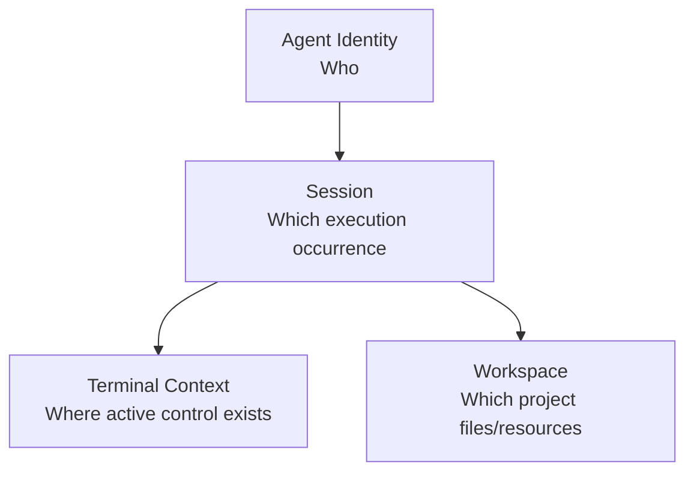
```mermaid
flowchart TD
    A[Agent Identity<br/>Who]
    S[Session<br/>Which execution occurrence]
    T[Terminal Context<br/>Where active control exists]
    W[Workspace<br/>Which project files/resources]

    A --> S
    S --> T
    S --> W
```

## 16.5 Shared Workspace Risk

多個 Agent 在同一 Physical Workspace 中工作，可能覆寫或刪除彼此的 Uncommitted Work。pic-agent-call 可以呈現 Ownership 與 Presence，但不能保證 Filesystem Isolation。

需要高強度 Workspace Safety 的 Project **應**使用獨立 Worktree、Container 或 Directory。

## 16.6 Resume 與 Recovery

Agent 在中斷後 Resume 時，**應**：

1. 解析 Stable Identity；
2. 建立新 Session；
3. 檢查先前 Task Ownership；
4. 檢查上次 Known Position 後的 Channel Message；
5. 取得相關 Project Memory；
6. 在允許時重新取得 Active Ownership。

---

# 17. Persistence Architecture

## 17.1 Persistence Requirement

Storage Layer **必須**支援：

- Durable Agent Identity；
- Lifecycle State；
- Active Ownership Uniqueness；
- Session 與 Heartbeat Timestamp；
- Channel 與 Message；
- Task 與 Transition；
- Memory Record；
- Project Isolation；
- Critical Invariant 的 Transactional Enforcement。

## 17.2 1.x 中的 SQLite

SQLite 適合作為 1.x Reference Architecture，原因包括：

- Low Operational Complexity；
- Transactional Consistency；
- Local Deployment；
- Single-file Persistence Model；
- 對中小型 Coordination Workload 具足夠效能；
- 易於 Backup 與 Inspection。

SQLite 是 Implementation Choice，不是 Architecture Definition。

## 17.3 Provider Abstraction

架構將朝 Storage Provider Boundary 演進。

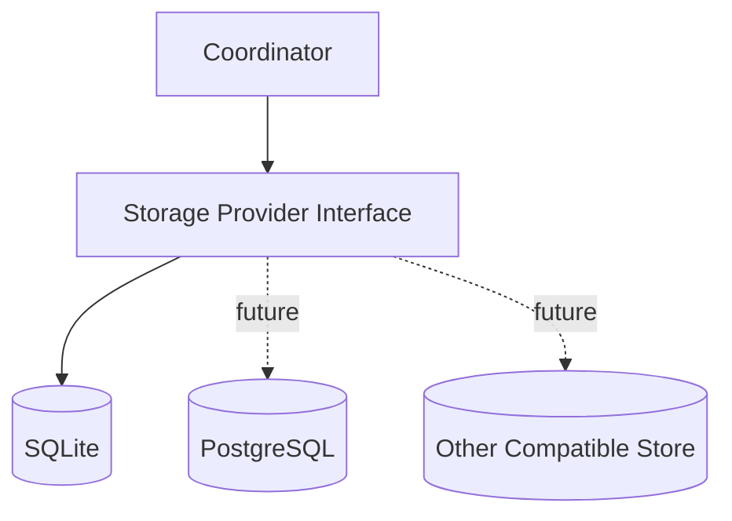
```mermaid
flowchart TB
    C[Coordinator]
    P[Storage Provider Interface]
    S1[(SQLite)]
    S2[(PostgreSQL)]
    S3[(Other Compatible Store)]

    C --> P
    P --> S1
    P -. future .-> S2
    P -. future .-> S3
```

## 17.4 Required Provider Semantics

Storage Provider **必須**保留：

- Atomic Active-ownership Acquisition；
- Deterministic Task Transition；
- Durable Message Ordering；
- Project Isolation；
- Specification 要求時的 Idempotent Retry Behavior；
- Coordinator Restart 後 Recovery。

## 17.5 Migration

Schema Migration **必須**保留 Architecture Semantics。除非透過明確 Maintenance Control，Migration **不得**建立暫時性違反 Uniqueness 或 Ownership Invariant 的狀態。

## 17.6 Backup 與 Restore

Backup Procedure **應**保存 Consistent Snapshot。Restore Procedure **不得**靜默合併不相容的 Active Presence State。Restore 後**應**重新驗證 Presence。

---

# 18. Consistency 與 Concurrency

## 18.1 Consistency Model

Runtime 對 Ownership 與 Lifecycle Invariant 要求 Strong Consistency，對非關鍵 Read Propagation 則可接受 Eventual Visibility。

以下項目**必須**具 Strong Consistency：

- Active Agent Uniqueness；
- Task Ownership Transfer；
- Terminal-context Acquisition；
- State-transition Precondition。

以下項目**可以**接受 Eventual Consistency：

- Read-only Dashboard；
- Search Index；
- Notification Delivery；
- Non-authoritative Cache。

## 18.2 Concurrent Registration

兩個對同一 Terminal Context 的 Concurrent Active Acquisition，最多只能有一個成功。

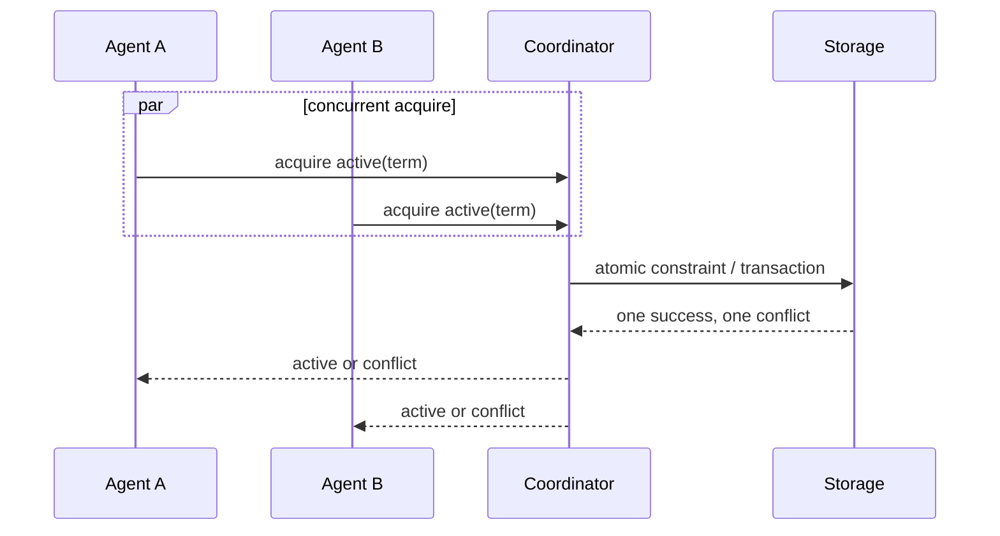
```mermaid
sequenceDiagram
    participant A as Agent A
    participant B as Agent B
    participant C as Coordinator
    participant S as Storage

    par concurrent acquire
        A->>C: acquire active(term)
        B->>C: acquire active(term)
    end
    C->>S: atomic constraint / transaction
    S-->>C: one success, one conflict
    C-->>A: active or conflict
    C-->>B: active or conflict
```

## 18.3 Optimistic Concurrency

當 Mutable Record 可能發生 Lost Update 時，**應**支援 Version Check。

## 18.4 Idempotency

可重試的 Write Operation **應**接受 Idempotency Key 或等價 Deduplication Mechanism。

## 18.5 Clock

當 Correctness 依賴 Ordering 時，Wall-clock Time **不得**成為唯一 Ordering Source。應使用 Monotonic Sequence Value 或 Storage Ordering。

---

# 19. Failure Model 與 Recovery

## 19.1 Failure Assumption

架構假設：

- Client 可能未清理即 Disconnect；
- Coordinator Process 可能 Restart；
- Storage Operation 可能 Fail；
- Message 可能被 Retry；
- Network Request 可能 Duplicate；
- Clock 可能不一致；
- Agent 可能在長時間後返回；
- 可能需要 Human Intervention。

## 19.2 Agent Crash

當 Active Agent Crash：

1. Heartbeat Renewal 停止；
2. Lease Expire；
3. Coordinator 將 Agent 標記為 Offline；
4. Active Ownership 被釋放；
5. Task Ownership 仍然持久化，除非 Policy 另有規定；
6. 另一 Agent 或 Human 可 Recover 或 Reassign Task。

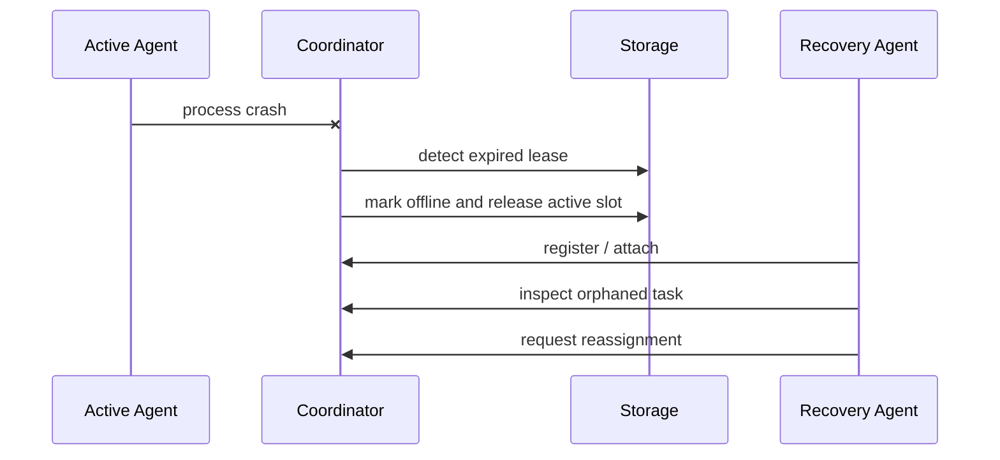
```mermaid
sequenceDiagram
    participant A as Active Agent
    participant C as Coordinator
    participant S as Storage
    participant R as Recovery Agent

    A-xC: process crash
    C->>S: detect expired lease
    C->>S: mark offline and release active slot
    R->>C: register / attach
    R->>C: inspect orphaned task
    R->>C: request reassignment
```

## 19.3 Coordinator Restart

Coordinator **必須**從 Storage 重建 Authoritative Coordination State。

Ephemeral Connection State **可以**遺失。Client **應**重新連線並 Register。Stored Active Presence **應**依 Lease Freshness 重新驗證。

## 19.4 Storage Failure

若 Storage 不可用，Write Operation **必須**明確失敗。Coordinator **不得**對未成功持久化的 Durable State Change 回覆成功。

若限制明確，可支援 Read-only Degraded Operation。

## 19.5 Duplicate Request

當系統承諾 Idempotency 時，Duplicate Command **不得**產生 Duplicate Identity、Duplicate Task 或重複 Transition。

## 19.6 Split-brain Risk

在 Single-storage Deployment 中，Storage Constraint 是 Exclusive Ownership 的最終 Authority。

未來 Multi-coordinator Deployment 將需要 Consensus-capable Coordination Mechanism 或等價 Serialization Boundary。

## 19.7 Orphaned Task

由 Offline Agent 擁有的 Task 不會自動失效。系統**應**將其暴露為 Potentially Orphaned，並允許 Explicit Recovery。

## 19.8 Recovery Principle

Recovery **應**優先採用：

- Durable Inspection；
- Explicit Reassignment；
- Auditable Transition；
- Minimal Automatic Assumption。

---

# 20. Security 與 Trust Boundary

## 20.1 Baseline Trust Model

Local Single-user Deployment 可以運作於 Trusted Boundary 中，但仍需 Project Isolation 與 Input Validation。

## 20.2 Remote Deployment

Remote 或 Multi-user Deployment **應**提供：

- Authenticated Client；
- Encrypted Transport；
- 依 Project 與 Operation 進行 Authorization；
- Protected Credential；
- Audit History；
- Rate Limiting；
- Secure Backup。

## 20.3 Authorization

Authorization **應**區分：

- 讀取 Project State；
- 寫入 Memory；
- 發布 Message；
- 建立 Task；
- Accept 或 Reassign Task；
- Promote Agent 為 Active；
- Administrative Operation；
- Human-only Decision。

## 20.4 Input Safety

Coordinator **必須**將 Agent-provided Content 視為 Untrusted Input，並**應**驗證 Size、Type、Scope 與 Encoding。

## 20.5 Prompt Injection Boundary

pic-agent-call 會傳輸並儲存之後可能被 Agent 消費的內容。Stored Content **不得**被自動視為 Trusted Instruction。

Client **應**區分：

- Authoritative Project Policy；
- Human Decision；
- Ordinary Agent Message；
- External Untrusted Content。

## 20.6 Secret Handling

Secret **不應**被儲存在 General-purpose Memory 或 Channel Message。Integration **應**參照 External Secret Store。

## 20.7 Auditability

Privileged Action **應**記錄 Actor、Timestamp、Target、Previous State 與 Resulting State。

---

# 21. Observability

## 21.1 目標

Operator 必須能回答：

- 哪些 Agent 是 Active、Attached 或 Offline？
- 哪些 Terminal Context 被占用？
- 哪些 Task 是 Open、Assigned、Orphaned、Completed 或 Aborted？
- 哪些 Operation 失敗，原因為何？
- Storage 是否健康？
- Heartbeat 是否持續到達？
- 是否頻繁出現 Ownership Conflict？

## 21.2 Log

Log **應**為 Structured，並**應**包含 Correlation Identifier。

Sensitive Content **應**盡可能 Redact 或省略。

## 21.3 Metric

建議 Metric 包含：

- Registration Count；
- Active Agent Count；
- Attached Agent Count；
- Offline Transition Count；
- Heartbeat Latency 與 Expiry；
- Active-ownership Conflict；
- 依 State 分類的 Task Count；
- Message Write/read Rate；
- Memory Operation；
- Storage Latency；
- 依 Error Class 分類的 Operation Failure。

## 21.4 Health

Health Reporting **應**區分：

- Process Liveness；
- Request Readiness；
- Storage Readiness；
- Migration Status；
- Degraded Operation。

## 21.5 Audit Event

Security-sensitive 與 Ownership-sensitive Transition 的 Audit Event **應**持久化。

---

# 22. Deployment Architecture

## 22.1 Local Deployment

Baseline Deployment 是單一 Coordinator 搭配 Local Persistent Storage。

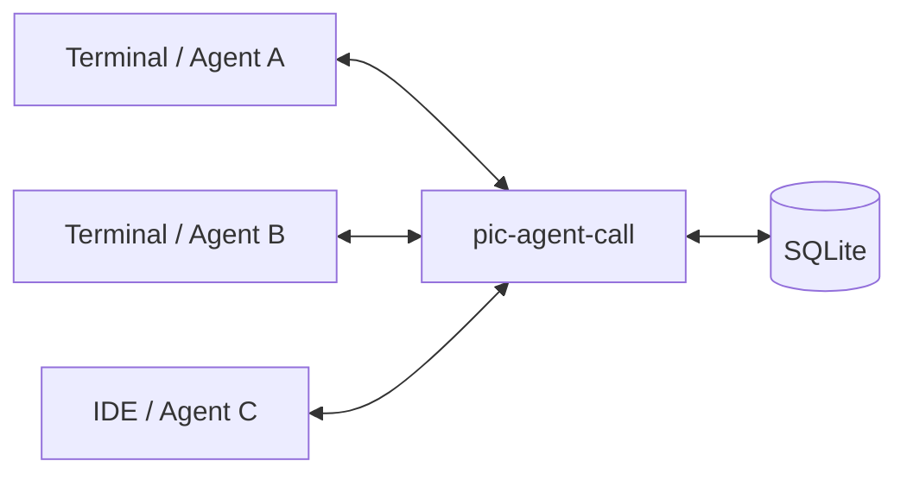
```mermaid
flowchart LR
    T1[Terminal / Agent A]
    T2[Terminal / Agent B]
    T3[IDE / Agent C]
    C[pic-agent-call]
    DB[(SQLite)]

    T1 <--> C
    T2 <--> C
    T3 <--> C
    C <--> DB
```

這種 Topology 可降低 Operational Overhead，適合 Individual 或 Small-team Workflow。

## 22.2 Container Deployment

Coordinator **可以**執行於 Container。Persistent Storage **必須**掛載於 Ephemeral Container Filesystem 之外。

## 22.3 Kubernetes Deployment

Kubernetes Deployment **必須**保留 Singleton 或 Serialized Ownership Semantics。

對 SQLite-backed Deployment：

- 建議使用單一 Writable Coordinator Replica；
- **必須**理解 Persistent Volume Semantics；
- Rolling Update **必須**避免 Concurrent Writer，除非已證明安全；
- Readiness **應**依賴 Storage Availability。

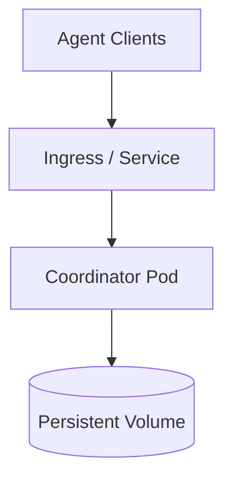
```mermaid
flowchart TB
    IN[Ingress / Service]
    POD[Coordinator Pod]
    PVC[(Persistent Volume)]
    CL[Agent Clients]

    CL --> IN
    IN --> POD
    POD --> PVC
```

## 22.4 High Availability

僅部署多個 Stateless Coordinator Replica，並不等於 High Availability。仍需要 Shared Serialization 與 Storage Semantics。

未來 HA Architecture 可以使用：

- Multiple Coordinator；
- Shared Transactional Database；
- Distributed Lease Management；
- Event Propagation；
- 必要時的 Leader Election。

## 22.5 Configuration

Configuration **應**外部化，並涵蓋：

- Storage Provider；
- Timeout Value；
- Project Default；
- Authentication Mode；
- Observability；
- Retention Policy；
- Transport Binding。

---

# 23. Scalability 與 Evolution

## 23.1 1.x Scope

1.x 優先考量 Correctness、Local Operability 與 Clear Coordination Semantics，而非 Distributed Scale。

## 23.2 Vertical Scalability

Baseline Architecture 透過以下方式擴展：

- Efficient Indexing；
- Bounded Query；
- Pagination；
- Retention Policy；
- 適用時的 Connection Pooling；
- Compact Message 與 Task Representation。

## 23.3 Horizontal Evolution

Horizontal Scaling 需要分離：

- Transport Handling；
- Coordination Application Service；
- Durable State；
- Event Propagation；
- Distributed Ownership Enforcement。

## 23.4 Storage Decoupling

2.x 的主要 Architecture Direction 是：

> Decouple coordination from storage.

也就是保持 Coordination Domain 穩定，讓 SQLite 成為多個相容 Provider 之一。

## 23.5 Evolution Path

```mermaid
flowchart LR
    V1[1.x<br/>Single Coordinator<br/>SQLite]
    V2[2.x<br/>Storage Provider Boundary<br/>Multiple Stores]
    V3[Future<br/>Multiple Coordinators<br/>Distributed Coordination]

    V1 --> V2 --> V3
```

## 23.6 Compatibility

演進**必須**保留以下語意：

- Identity；
- Active、Attached、Offline；
- Task Ownership；
- Project Isolation；
- Durable Memory；
- Channel History。

---

# 24. Architecture Trade-offs

## 24.1 Central Coordinator 與 Peer-to-peer

### 決策

採用 Central Coordinator。

### 理由

Central Coordinator 提供：

- Deterministic Ownership；
- 單一 Lifecycle Authority；
- 較簡單的 Recovery；
- 較簡單的 Auditability；
- 較低的 Client Complexity。

### 代價

Coordinator 成為 Operational Dependency 與潛在 Availability Bottleneck。

## 24.2 SQLite 與 External Database

### 決策

以 SQLite 作為 1.x Reference Persistence Engine。

### 理由

SQLite 可降低 Deployment Complexity，並支援 Transactional Invariant。

### 代價

它限制 Native Multi-node Write Scaling，且在 Containerized 或 Networked Storage Environment 中需要額外注意。

## 24.3 Pull-based Retrieval 與 Mandatory Push

### 決策

優先定義 Durable Query Semantics，將 Push 視為 Optimization。

### 理由

Pull 較容易跨 Heterogeneous Agent Client 進行 Recovery、Test 與 Operation。

### 代價

Polling 可能增加 Latency 或 Request Volume。

## 24.4 Explicit State 與 Inference

### 決策

明確表示 Identity、Lifecycle、Ownership、Task 與 Memory。

### 理由

Explicit State 可被 Inspection、Enforcement 與 Recovery。

### 代價

Client 必須執行更多 Coordination Operation。

## 24.5 每個 Terminal Context 一個 Active Agent

### 決策

在 Exclusive Terminal Context 中強制單一 Active Agent。

### 理由

避免 Primary Ownership 模糊，並降低 Destructive Concurrency。

### 代價

某些 Collaboration Scenario 需要透過多個 Attached Agent 與 Deliberate Handoff，而非 Simultaneous Active Control。

## 24.6 Human Governance 與 Autonomous Consensus

### 決策

保留 Human 對 Critical Decision 的 Authority。

### 理由

Agent Collaboration 經常影響重大 Project State。Autonomous Consensus 不適合作為 Universal Default。

### 代價

Human Decision Point 可能降低 Full Automation。

## 24.7 Durable Memory 與 Full Transcript Storage

### 決策

儲存 Curated Coordination Memory，而非將所有 Conversation 視為 Authoritative Memory。

### 理由

Curated Memory 更穩定、更相關，也更可治理。

### 代價

Agent 或 Human 必須決定哪些資訊值得保存。

---

# 25. Conformance Rules

實作只有在符合以下所有條件時，才符合本架構：

1. Agent Identity 與 Session、Connection 分離。
2. Coordination State 以 Project 為 Scope。
3. 保留 Active、Attached、Offline 語意。
4. 每個 Exclusive Terminal Context 最多只能有一個 Active Agent。
5. Task 具有明確且持久化的 State 與 Ownership Semantics。
6. Channel 保存 Durable Communication History。
7. Shared Memory 可跨越單一 Model Session。
8. Critical Transition 必須持久化成功後才能回覆成功。
9. Coordinator Restart 不會刪除 Durable Coordination State。
10. Storage Replacement 不會改變 Domain Semantics。
11. Human-governed Operation 不得被 Agent 靜默覆寫。
12. Ownership Conflict 必須 Deterministically Resolve。
13. Security Boundary 防止 Cross-project Leakage。
14. Lower-level API 與 Schema 與本文件一致。
15. Target-scoped Operation 必須使用明確 `target` 解析，且不得依賴模糊的背景 Session Discovery。
16. Channel 與 Task Authorization 必須直接以 Acting `agent_id` 查驗 `active` 或 `attached` Presence。
17. Unregistration 是明確 Presence Transition，不會刪除 Durable Coordination History。

Transport 或 Internal Implementation 可以不同，但仍可保持 Conformance。

---

# 26. Glossary

**Active Agent**  
目前擁有某個 Exclusive Terminal Context 的 Primary Execution Ownership 的 Agent。

**Agent**  
代表獨立執行 AI Participant 的 Persistent Identity。

**Agent Client**  
代表某個 Agent Identity 執行操作的 Program 或 Integration。

**Attached Agent**  
目前存在，但不持有對應 Terminal Context Active Slot 的 Agent。

**Channel**  
Project-scoped 的 Durable Communication Stream。

**Coordinator**  
強制執行 Coordination Semantics 的 Central Runtime Component。

**Coordination State**  
描述 Identity、Presence、Ownership、Task、Channel 與 Memory 的 Persistent State。

**Heartbeat**  
定期送出的 Liveness Signal，用來更新 Agent Session Lease。

**Identity**  
可跨 Session 與 Model-provider 變更維持穩定的 Agent Identifier。

**Lease**  
具有時間限制的 Claim，用來判斷 Presence 或 Active Ownership 是否仍有效。

**Memory Record**  
需跨越單一 Agent Session 存續的 Durable Project Knowledge Record。

**Message**  
Channel 中的 Immutable Communication Record。

**Offline Agent**  
目前不被視為存在的 Agent Identity。

**Project**  
Coordination State 的主要 Isolation Boundary。

**Session**  
Agent Identity 的某一次具體 Execution Occurrence。

**Storage Provider**  
滿足必要 Coordination Semantics 的 Persistence Implementation。

**Task**  
一項 Durable Coordinated Responsibility Unit。

**Task Broker**  
負責 Task Lifecycle 與 Ownership 的 Coordinator Component。

**Terminal Context**  
Active Ownership 可能需要排他的 Execution Slot。

**Workspace**  
Agent Session 使用的 Filesystem 或 Logical Project Area。

---

# 27. References

本 Whitepaper 是 pic-agent-call 的 Governing Architectural Document。

Normative Supporting Document 包含：

- API Specification
- Database Schema Specification
- Error Code Specification
- Software Design Specification
- Project README

本文件參考的 External Architecture Concept 包括：

- RFC-style Normative Language；
- Control-plane 與 Data-plane Separation；
- Lease-based Liveness；
- Transactional Consistency；
- Layered Architecture；
- Provider Abstraction；
- Durable Task Coordination。

---

# 附錄 A：Architecture Invariants

以下 Invariant 為不可妥協的核心：

1. **Identity 的生命週期長於 Connection。**
2. **Session 不等於 Identity。**
3. **Project Scope 是 Isolation Boundary。**
4. **每個 Exclusive Terminal Context 只能有一個 Active Agent。**
5. **Attached Agent 可以協作，但不主張 Active Ownership。**
6. **Offline Status 不會刪除 Durable State。**
7. **Task 表示 Explicit Ownership。**
8. **Channel 表示 Communication，而非 Ownership。**
9. **Memory 表示 Durable Project Knowledge，而非 Raw Model Context。**
10. **Critical State Change 必須具 Transactionality。**
11. **Human Authority 必須被保留。**
12. **Storage Technology 可以改變，Coordination Semantics 不可改變。**

---

# 附錄 B：Reference Coordination Flow

```mermaid
sequenceDiagram
    participant H as Human
    participant A as Agent A
    participant C as Coordinator
    participant B as Agent B
    participant S as Storage

    A->>C: register
    C->>S: persist identity and session
    C-->>A: attached

    A->>C: acquire active terminal ownership
    C->>S: atomic ownership transition
    C-->>A: active

    H->>C: create task
    C->>S: persist task
    B->>C: read available tasks
    C-->>B: task
    B->>C: accept task
    C->>S: persist ownership

    A->>C: write project memory
    C->>S: persist memory record

    B->>C: post completion message
    C->>S: persist message
    B->>C: complete task
    C->>S: transition task

    H->>C: inspect task and memory
    C->>S: query authoritative state
    C-->>H: current coordination view
```

---

# 附錄 C：Architecture Review Checklist

若 Proposed Change 具有以下任一情況，則**應**被拒絕或修訂：

- 將 Agent Identity 綁定至 Transient Session；
- 允許同一 Exclusive Terminal Context 存在多個 Active Agent；
- 將 Task Ownership 改為推斷式，而非 Explicit；
- 只將 Coordination State 儲存在 Model Context；
- 繞過 Project Isolation；
- 在 Durable Persistence 前回覆 Write Success；
- 將 Storage-specific Assumption 寫入 Domain Contract；
- 從 Privileged Transition 中移除 Human Authority；
- 產生 Non-deterministic Conflict Outcome；
- 讓 Recovery 依賴 Uninterrupted Client Connection；
- 將 Message Delivery 視為 Task Acceptance；
- 混淆 Source Repository Truth 與 Coordination Truth。

---

**文件結束**
