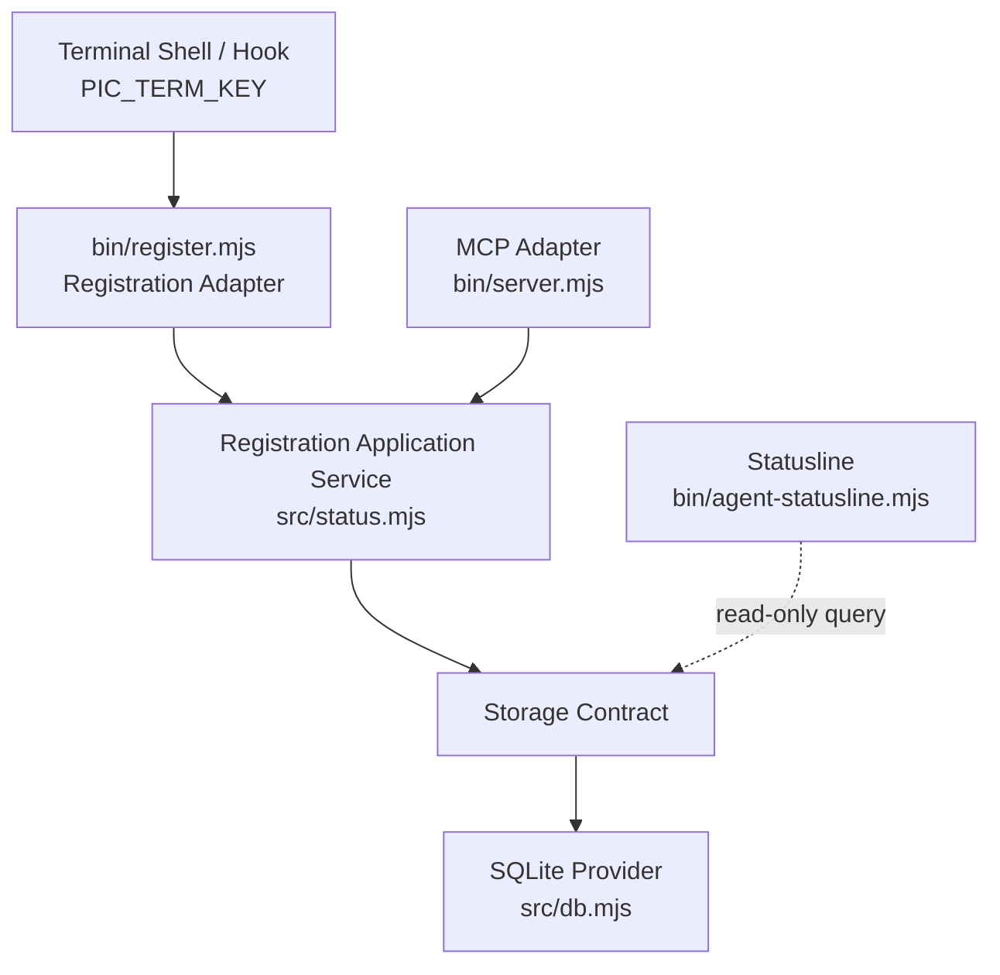
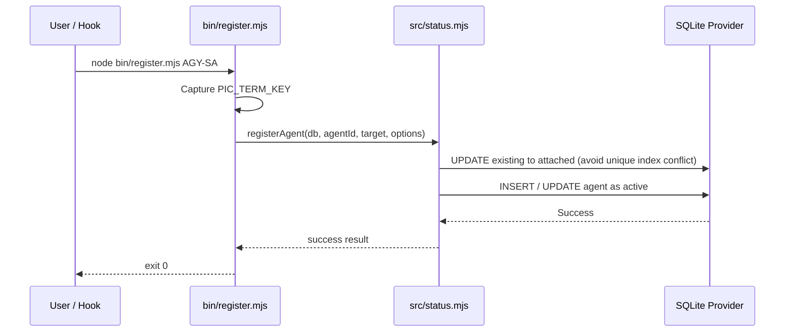

# Architecture Reference: Option D — Foreground Launcher with Shared Registration Service

**Project:** `pic-agent-call`  
**Document Type:** Architecture Reference / SA Input  
**Status:** Approved & Integrated (v1.2.2)  
**Purpose:** Provide a concrete architectural direction for terminal-aware agent registration without relying on LLM environment discovery, session mapping side channels, or direct SQLite access.

---

## 1. Problem Statement

`pic-agent-call` must support multiple terminal windows, multiple AI roles, and concurrent registrations without cross-window identity contamination.

Each terminal window owns a unique environment variable:

```text
PIC_TERM_KEY
```

The current process topology creates an identity-resolution problem:

- The long-running MCP Server cannot observe environment variables exported after it started.
- The cloud LLM cannot read the local shell environment.
- A shared session-to-terminal mapping file introduces another state source and race conditions.
- A standalone CLI that writes directly to SQLite would bypass the future Storage Contract and duplicate coordination logic.

The architecture therefore requires a trusted foreground component that:

1. Executes inside the originating terminal environment.
2. Reads the correct `PIC_TERM_KEY`.
3. Initiates registration without exposing the key to the LLM.
4. Uses the same coordination and storage path as the rest of the system.
5. Preserves future storage-provider replaceability.

---

## 2. Decision Summary

Adopt **Option D Lite v2: Foreground Registration Adapter + Shared Registration Application Service + Storage Contract**.

```text
Terminal Shell / Hook
    ↓
bin/register.mjs (Registration Adapter)
    ↓
Shared Registration Application Service (src/status.mjs::registerAgent)
    ↓
Storage Contract
    ↓
SQLite Provider
```

In v1.2.2, the full launcher (`pic-agent start` process wrapping) is deferred. A lightweight foreground adapter CLI `bin/register.mjs` is introduced to capture terminal-local context and execute the shared service, entirely bypassing direct database connection.

---

## 3. Architectural Principles

### 3.1 Terminal identity must be captured locally

`PIC_TERM_KEY` MUST be read by a process spawned from the originating terminal (e.g. `bin/register.mjs`).

Foreground shell child processes may inherit it naturally. However, background, remote, or LLM/IDE runners MUST NOT be assumed to inherit the terminal key unless verified for that platform. The LLM MUST NOT be responsible for passing terminal keys through generated tool-call arguments.

### 3.2 Registration is an application use case

Registration MUST be implemented as a shared application service (`registerAgent`).

The MCP adapter, CLI adapter, Hook adapter, and future IPC adapter MUST NOT independently implement registration rules.

### 3.3 Storage access must remain provider-independent

Foreground processes MUST NOT write directly to SQLite tables.

All registration mutations MUST pass through:

```text
Registration Application Service
    ↓
Storage Contract
    ↓
Storage Provider
```

### 3.4 SQLite is an implementation, not the contract

SQLite-specific behavior such as:

- `BEGIN IMMEDIATE`
- WAL mode
- Busy timeout
- Partial unique indexes
- SQL conflict clauses
- Migration scripts

MUST remain inside the SQLite Provider.

### 3.5 Identity concepts must remain distinct

The architecture MUST distinguish:

| Identity | Meaning |
|---|---|
| `term_key` | Local terminal or window identity (NOT NULL) |
| `agent_id` | Unique role identifier (e.g., `AGY-SA`, `CC-PG1`) |
| `role` | Logical responsibility |
| `session_id` | Optional platform-specific conversation/session identifier |

`session_id` MUST NOT be treated as equivalent to terminal identity.

---

## 4. Target Architecture (Option D Lite v2)



---

## 5. Recommended User Flow

Instead of background registration, the user or hook invokes the lightweight registration adapter in the active foreground terminal:

```powershell
node bin/register.mjs AGY-SA --force
```

The adapter performs:

1. Read `PIC_TERM_KEY` from the current shell; fallback to `WT_SESSION` if missing.
2. Parse command arguments (`agent_id`, `--force`, `--role`, `--timeout`).
3. Dynamically import and execute the shared `registerAgent()` service.
4. Exit 0 on success; output normalized errors and exit 1 on failure.

---

## 6. Component Responsibilities

## 6.1 Registration Adapter (`bin/register.mjs`)

The adapter MUST:

- Read `PIC_TERM_KEY` from its immediate environment.
- Parse `agent_id` and parameters.
- Call the shared Registration Application Service.
- Present actionable errors to the user.

The adapter MUST NOT:

- Execute SQL or open SQLite databases directly.
- Store a session-to-terminal JSON mapping.

---

## 6.2 Registration Application Service (`src/status.mjs`)

The Registration Application Service owns:

- Registration policy
- Role validation
- Active/Attached status transitions (Three-State Model)
- Uniqueness constraints (at most one active agent per terminal key)
- Forced takeover mechanics
- Concurrency retries via `withRetry`

---

## 7. Registration Lifecycle



---

## 8. Concurrency Requirements

The architecture MUST guarantee that concurrent registrations cannot violate approved invariants:

1. Two concurrent registrations for the same terminal scope MUST produce a deterministic result.
2. A replacement registration MUST NOT leave multiple active agents (enforced via partial unique index `idx_agents_term_active`).
3. Active-agent takeover MUST reset existing active roles to `attached` within the transaction before setting the target role active to prevent index violation.
4. Storage failures and busy timeouts MUST be handled gracefully with `withRetry` exponential backoff.
