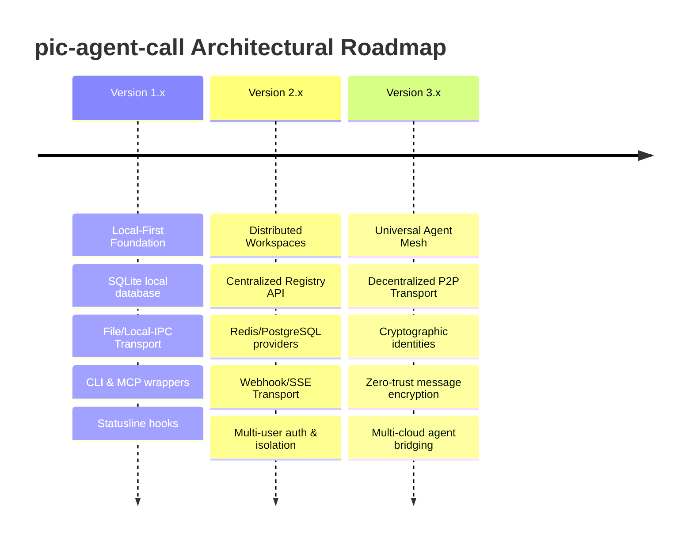

# Project Documentation & Positioning Proposal: pic-agent-call

This document defines the core identity, positioning, conceptual architecture, and long-term vision of the **pic-agent-call** project. It serves as the foundational design specification and standard reference for maintainers, contributors, and integrations.

---

## 1. Elevator Pitch

### One Sentence
An AI-native, lightweight asynchronous communication and registry layer that enables cross-session and cross-platform agent collaboration.

### One Paragraph
`pic-agent-call` is a lightweight, platform-independent, and AI-native communication and registry protocol designed to bridge the isolation barrier between AI agent sessions. By decoupling agent coordination from specific runtimes, frameworks, and LLM providers, it enables heterogeneous agents operating on different terminals, hosts, or environments to discover each other, manage execution states, and collaborate asynchronously using a unified, transport-agnostic interface.

### 30-Second Introduction
Modern AI agents operate in isolated silos, constrained by individual session lifecycles, execution environments, and local filesystem contexts. `pic-agent-call` solves this by introducing a decentralized registry and persistent mailbox architecture. Agents can register their presence, discover other active roles within a project, and send structured messages across sessions without requiring complex orchestrator frameworks, web API servers, or persistent daemon processes. It provides the minimal yet essential fabric needed for multi-agent workflows to emerge organically and asynchronously.

---

## 2. Product Positioning

### What is pic-agent-call?
`pic-agent-call` is a lightweight, local-first agent registry and message-passing daemon designed for AI-to-AI (A2A) coordination. It functions as a minimal communication bus that runs alongside agent processes, providing directory services (who is online, what are their roles) and mailbox queueing (delivering asynchronous tasks and handoffs).

### Why does it exist?
Multi-agent engineering currently forces developers into monolithic runtimes (e.g., AutoGen, CrewAI) where all agents must run within the same application process, language runtime (typically Python), or cloud platform. In reality, developers want to use different specialized CLI tools (such as Claude Code or Google Antigravity), custom scripts, and distinct API endpoints in parallel. `pic-agent-call` exists to connect these disjointed tools through a shared, lightweight project-level communication layer.

### Which problem does it solve?
- **Agent Isolation**: Solves the "terminal barrier" where an agent running in terminal A cannot coordinate with or delegate to an agent running in terminal B.
- **Identity Routing**: Maps ephemeral process IDs or session IDs to logical, stable roles (e.g., `pic-PG` for Programmer, `pic-QA` for Tester) so messages reach the correct capability.
- **Asynchronous Handoffs**: Prevents token waste and blocked processes by allowing agents to dump tasks into a peer's mailbox and terminate, allowing the peer to pick it up when invoked.
- **State Observer Conflict**: Synchronizes concurrent workspace modifications by providing a shared session registry and conflict resolution mechanism.

### Which problems does it intentionally NOT solve?
- **Agent Reasoning**: It does not implement LLM invocation loops, system prompts, or agent reasoning patterns.
- **Workflow Orchestration**: It does not define Directed Acyclic Graphs (DAGs), state machines, or task dependencies.
- **Source Control**: It does not manage file diffs, git operations, or codebase versioning.
- **Memory Store**: It does not act as a vector database or semantic knowledge retriever.

---

## 3. Vision

The long-term vision of `pic-agent-call` is to establish the **Universal Agent Mesh**—a transport-agnostic protocol that turns isolated AI agents into a collaborative web of intelligence. 

By defining simple registry and messaging contracts, the project envisions a future where any AI tool, IDE extension, shell agent, or cloud microservice can discover peers in the local project workspace or across network boundaries, exchange capability contracts, and execute complex workflows cooperatively. The protocol will remain storage-independent and network-topology-neutral, facilitating the rise of zero-trust, local-first agent swarms that scale from a single developer's laptop to enterprise-wide hybrid-cloud networks.

---

## 4. Core Philosophy

### Single Responsibility
The system does one thing and does it reliably: facilitating identity registration and message routing between agents. It never encroaches on how agents reason, execute code, or manage their inner thoughts.

### AI Native
Optimized for consumption by language models rather than standard web clients. Inputs and outputs are structured (JSON schemas), payloads support markdown native contexts, and the client library provides statusline indicators suitable for CLI-based agents.

### Communication First
Collaboration is modeled as a stream of asynchronous messages. By prioritizing non-blocking message queues over rigid remote procedure calls (RPC), agents are free to poll, claim, and act on messages based on their own execution loops.

### Platform Independent
The API and data models make no assumptions about the operating system, shell, programming language, or cloud environment. A Python script on Windows can communicate with a TypeScript CLI on Linux.

### Human Observable
AI collaboration must not be a black box. All registrations, message paths, and payloads are stored transparently in standard local files or accessible databases, allowing human engineers to audit, replay, and debug inter-agent communications.

### Extensible
The codebase is decoupled through clear SPIs (Service Provider Interfaces). The initial SQLite storage and local file transport can be swapped out for Redis, PostgreSQL, or REST-based providers without changing the core agent-facing APIs.

### Minimal Assumptions
It assumes no particular framework, execution loop, or LLM backend. If a piece of code can read/write data or invoke a CLI/MCP tool, it can participate in the mesh.

---

## 5. Core Concepts

```
┌──────────────────────────────────────────────────────────────┐
│                        PROJECT                               │
│                                                              │
│  ┌──────────────┐                  ┌──────────────┐          │
│  │   Agent A    │                  │   Agent B    │          │
│  │ (Role: PJM)  │                  │ (Role: PG)   │          │
│  └──────┬───────┘                  └──────┬───────┘          │
│         │                                 ▲                  │
│         │ Send(Message)                   │ Poll/Claim       │
│         ▼                                 │                  │
│ ┌─────────────────────────────────────────┴────────────────┐ │
│ │                      TRANSPORT                           │ │
│ ├──────────────────────────────────────────────────────────┤ │
│ │                      REGISTRY                            │ │
│ ├──────────────────────────────────────────────────────────┤ │
│ │                       STORAGE                            │ │
│ └──────────────────────────────────────────────────────────┘ │
└──────────────────────────────────────────────────────────────┘
```

- **Agent**: A logical actor participating in the project. Defined by a persistent identifier (`agent_id`) and associated with one or more functional capabilities (`roles`).
- **Session**: A specific runtime instance of an Agent (e.g., a process execution, an interactive terminal session). Sessions hold leases in the Registry and expire if inactive.
- **Project**: The logical namespace boundary of collaboration. Agents and messages cannot cross Project boundaries unless explicitly authorized. Typically mapped to a repository root.
- **Message**: The fundamental unit of data exchange. Contains metadata (`id`, `sender_id`, `recipient_role`, `timestamp`, `status`) and a structured `payload` containing task details or markdown content.
- **Communication**: The abstract process of exchanging messages between agents, encompassing both synchronous request-response and asynchronous pub-sub patterns.
- **Context**: The shared operational metadata associated with a communication flow (e.g., active task IDs, handoff states, execution tokens).
- **Registry**: The directory service holding the mapping of active `Sessions` to `Agent IDs` and `Roles`. Provides discovery capabilities.
- **Storage**: The state persistence interface. It holds message mailboxes, registration states, and audit trails.
- **Provider**: The architectural boundary wrapper that implements concrete storage engines (SQLite, Postgres) or transport protocols (Filesystem, WebSockets).
- **Transport**: The message delivery engine that physicalizes the communication interface, transporting message payloads across session boundaries.

---

## 6. Architecture Overview

`pic-agent-call` adopts a clean, layered architecture designed to decouple the agent's mental model from physical deployment details.

```
┌───────────────────────────────────────────────────────────┐
│                    Agent Client Layer                     │
│        (CLI Interface / MCP Server / Client SDK)           │
├───────────────────────────────────────────────────────────┤
│                 Core Coordination Layer                   │
│      (Agent Registry, Message Routing, Lock Manager)       │
├───────────────────────────────────────────────────────────┤
│            Service Provider Interface (SPI)               │
│     (Abstract Database / Abstract Message Transport)      │
├───────────────────────────────────────────────────────────┤
│                   Infrastructure Layer                    │
│      (SQLite Engine, Local IPC, Redis, Remote HTTP)       │
└───────────────────────────────────────────────────────────┘
```

### Agent Client Layer
Exposes the communication protocol to AI agents. It handles agent registration, message querying, and statusline rendering. This layer is exposed via CLI, an MCP (Model Context Protocol) server, or language-specific client libraries.

### Core Coordination Layer
Executes business logic independent of storage and transport. It manages session lease lifecycles, translates role-based routing into concrete agent endpoints, validates message payloads, and manages multi-agent concurrency locks.

### Service Provider Interface (SPI)
Defines the abstract contracts for storage persistence and network transport. By programing to this interface, the core coordination logic remains entirely isolated from database schemas or network protocol details.

### Infrastructure Layer
Implements the concrete services defined by the SPI. It manages direct database drivers, network sockets, local filesystem locks, and cloud service APIs.

---

## 7. Key Capabilities

### Agent Discovery
Allows agents to dynamically broadcast their roles (e.g., `SA`, `PG`, `QA`) and scan for other active capabilities in the project space. Agents can verify which colleagues are currently online before attempting delegation.

### Session Coordination
Handles multiple terminals and execution paths accessing the same workspace. It safely resolves identity ownership, handles terminal session overrides (e.g., force registration), and prevents split-brain scenarios when multiple LLM loops run concurrently.

### Cross-Platform Communication
Enables different execution runtimes to talk to each other. An agent implemented in Python running in a terminal can seamlessly enqueue a message to a Node.js-based agent running as a daemon or an IDE extension.

### Persistent Messaging
Messages are stored in a durable queue. If a recipient agent is offline or busy, the message remains safely in its mailbox. This supports intermittent agent execution without losing trace of tasks.

### Project Isolation
Guarantees security and context isolation by scoping all registrations and messages to the project workspace. Agents in `Project_A` cannot accidentally query or send messages to agents in `Project_B`.

### Async Collaboration
Supports a pull-based asynchronous handoff pattern. An agent can finish its sub-task, log a handoff package into the mailbox, and exit. The parent agent or next pipeline stage is subsequently triggered and processes the message at its convenience.

---

## 8. Non-Goals

To maintain a clean, maintainable architecture, `pic-agent-call` explicitly excludes the following functionalities from its scope:

- **Workflow Orchestration**: Will not manage workflow execution graphs, step dependencies, or retry policies. The execution ordering is driven entirely by the agents themselves through message claims.
- **Task Scheduling**: Will not include a scheduler (like cron) to spin up agents or run commands at specific times.
- **AI Reasoning & Prompting**: Will not package prompts, model configuration, or direct LLM integration. It treats the agent client as a black-box processor.
- **Source Control**: Will not handle repository state tracking, file versioning, merging, or branching. It leaves workspace versioning to Git.
- **Semantic Memory Database**: Will not provide vector search, embeddings, or persistent knowledge graphs. It maintains a operational messaging database, not a semantic memory store.

---

## 9. Comparison

| Technology | Scope | Collaboration Pattern | Relationship to `pic-agent-call` |
| :--- | :--- | :--- | :--- |
| **Model Context Protocol (MCP)** | Host-to-Tool / Host-to-Resource | Synchronous request-response client-server | Complementary. `pic-agent-call` can be exposed as an MCP server, allowing agents to utilize A2A tools. |
| **claude-mem** | Knowledge Persistence | Semantic long-term memory retrieval | Complementary. `claude-mem` holds semantic data; `pic-agent-call` routes active runtime events. |
| **Git** | Code Versioning | Asynchronous file-based code integration | Orthogonal. Git tracks historical codebase states; `pic-agent-call` tracks active runtime communications. |
| **Monolithic A2A (CrewAI, AutoGen)** | Code Orchestration | Framework-controlled runtime loop | Monolithic A2A manages the entire agent execution. `pic-agent-call` acts as a minimal communication protocol connecting independent runtimes. |
| **Shared Filesystem** | File Sharing | Raw file read/write (prone to concurrency races) | Infrastructure detail. `pic-agent-call` can use a shared filesystem as a *transport layer*, but adds message queuing and registry schemas. |

---

## 10. Roadmap



### Version 1.x: Local-First Foundation
Establish the core concepts on a single local host.
- Single-node multi-session coordination.
- Local SQLite database provider for storage.
- File-based/local IPC transport mechanisms.
- Clean integration with shell statuslines (e.g., Windows Terminal / WT_SESSION).
- Basic CLI and MCP client wrappers.

### Version 2.x: Distributed Workspaces
Extend coordination across network and machine boundaries.
- Introduction of a lightweight Centralized Registry API server.
- Redis and PostgreSQL providers for shared storage backends.
- Real-time notification transport using Webhook triggers and Server-Sent Events (SSE).
- Multi-user agent management with basic namespace isolation.

### Version 3.x: Universal Agent Mesh
Achieve decentralized, zero-trust global coordination.
- Peer-to-peer (P2P) message transport option without centralized servers.
- Cryptographically signed agent identities.
- Zero-trust end-to-end encryption for message payloads.
- Universal agent bridges allowing local CLI agents to collaborate securely with cloud-native serverless agents.

---

## 11. Why pic-agent-call?

*An extract from the README.md target audience value proposition.*

### Why should you use `pic-agent-call`?

If you are building multi-agent systems, you have likely encountered the **Framework Lock-in** and the **Terminal Silo** problems. 

1. **Framework Lock-in**: To make Agent A talk to Agent B, you are forced to write them in the same codebase using the same library (e.g., Python using a specific agent framework). If you want to use a TypeScript CLI tool (like Claude Code) alongside a specialized Python scripting framework, coordination becomes a nightmare of custom APIs and file-watching hacks.
2. **Terminal Silo**: Agents running in different terminal tabs or shell processes are completely blind to each other. They cannot coordinate on WBS files, hand off tasks, or verify if another agent is currently modifying the codebase.

`pic-agent-call` solves this by introducing a **shared, lightweight, local-first communication layer**. 

- **Keep Your Stack**: Write your agents in Python, Node.js, bash, or go. As long as they can call a CLI command or access an MCP server, they can collaborate.
- **Cross-Session Coordination**: Run a Gemini-based System Analyst in Terminal 1, and launch a Claude-based Programmer in Terminal 2. They will automatically discover each other, manage file locks, and exchange message handoffs.
- **Asynchronous Mailboxes**: Avoid keeping expensive LLM tokens waiting in synchronous loops. Let Agent A drop a task payload into Agent B's mailbox and exit. Agent B will process it next time it runs, and reply to Agent A's mailbox.
- **Zero Configuration Setup**: Out of the box, it runs on a local SQLite database inside your repository, requiring no server setup, no container daemons, and zero infrastructure overhead.
