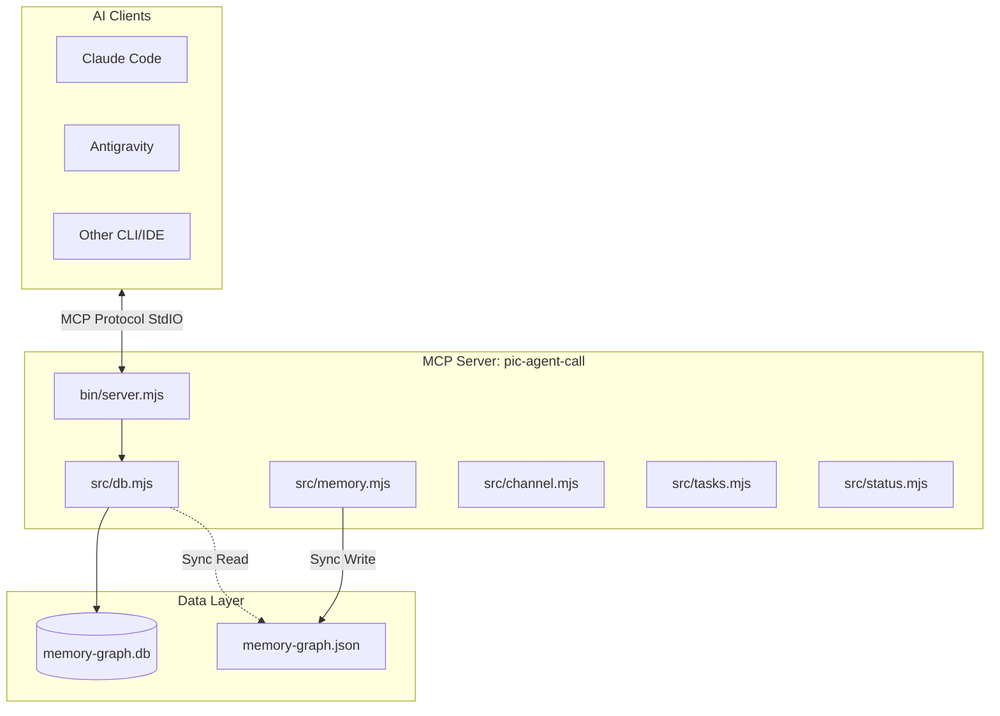

# pic-agent-call 專案分析報告

本報告針對 [`pic-agent-call`](file:///c:/Workspace/Personal/vance/pic-agent-call) 專案進行深入分析，評估其工作內容、核心目的、架構風險，並針對性能、API 設計及安全性提出具體建議。

---

## 1. 專案目的與核心定位

`pic-agent-call` 是一個基於 **MCP (Model Context Protocol)** 規範的跨 AI 協作伺服器。其核心目的是**打破不同 AI 客户端（如 Claude Code, Gemini CLI, Copilot 等）之間的孤島狀態**，在同一個開發工作區中提供：
- **共享大腦 (Memory)**：維護一致的知識圖譜，避免各 AI 工具重複探索專案。
- **協作頻道 (Channel)**：允許不同 AI 視窗之間相互發送訊息、呼叫與協調。
- **任務分派 (Task-Broker)**：以冪等且具備排他鎖的方式分發/認領工作，實現生產線式的 AI 協作（例如：SA 規劃任務 $\rightarrow$ PG 認領並執行 $\rightarrow$ DevOps 部署）。
- **身份管理 (Agent Identity)**：識別各個 terminal 視窗的 AI 角色與狀態。

---

## 2. 專案工作內容與結構

專案以 Node.js (>= 22.0.0) 開發，利用 Node 內建的同步 SQLite 模組 (`node:sqlite`) 作為統一的數據中介。



- **[bin/server.mjs](file:///c:/Workspace/Personal/vance/pic-agent-call/bin/server.mjs)**: 伺服器啟動點，定義了 20 個 MCP 外部工具，將 JSON-RPC 請求映射至業務邏輯。
- **[src/db.mjs](file:///c:/Workspace/Personal/vance/pic-agent-call/src/db.mjs)**: 資料庫連線、PRAGMA 配置（啟用 WAL 與 busy_timeout）、資料表結構定義與升級移轉，以及將 SQLite 同步寫入外部 JSON 備份的邏輯。
- **[src/memory.mjs](file:///c:/Workspace/Personal/vance/pic-agent-call/src/memory.mjs)**: 知識圖譜增刪查改。支援自訂 API 與官方 Memory Server 相容 API。
- **[src/channel.mjs](file:///c:/Workspace/Personal/vance/pic-agent-call/src/channel.mjs)**: 通訊訊息狀態機（UNREAD, IN_PROGRESS, READ, ORPHANED）。
- **[src/tasks.mjs](file:///c:/Workspace/Personal/vance/pic-agent-call/src/tasks.mjs)**: 任務生命週期管理，包含以 `feature + payload` SHA256 計算的冪等檢查。
- **[src/status.mjs](file:///c:/Workspace/Personal/vance/pic-agent-call/src/status.mjs)**: 環境變數 session 檢測、Agent 登記排他鎖、孤兒訊息轉換機制。

---

## 3. 潛在風險分析

### Risk A: 併發寫入鎖定 (SQLite Database Locked) 🔴
* **問題成因**：
  在 [`src/db.mjs`](file:///c:/Workspace/Personal/vance/pic-agent-call/src/db.mjs) 中定義了 `withRetry` 函數來應對 `SQLITE_BUSY` 鎖定，但該重試機制**未被普遍應用**。
  - `createEntities`、`addObservations`、`createRelations` 等寫入操作均未使用 `withRetry`。
  - `tasks` 模組的所有寫入（`createTask`、`claimTask`、`completeTask` 等）及 `channel` 模組均未使用 `withRetry`。
* **影響**：
  當多個 AI 客戶端併發呼叫工具或背景 statusline 指令定期查詢/更新 DB 時，極易拋出 `SQLITE_BUSY` 或 `database is locked` 錯誤，導致工具執行失敗。

### Risk B: JSON 備份同步 (JSON Graph Sync) 的效能與競態條件 🔴
* **問題成因**：
  每次寫入記憶（`addObservation`、`createEntities`、`addObservations` 等）都會觸發 [`syncDbToJson`](file:///c:/Workspace/Personal/vance/pic-agent-call/src/db.mjs#L156-L181)：
  1. 將整個 `entities` 與 `observations` 表完整讀入記憶體。
  2. 序列化為 JSONLines 格式。
  3. 寫入臨時文件，再以 `fs.renameSync` 覆蓋原 `memory-graph.json`。
* **影響**：
  - **效能崩潰**：記憶體/觀察值數量達數千筆時，每次微小寫入都會引發大體積的 Disk I/O，阻塞 Node.js 事件循環（因為 `DatabaseSync` 和 `writeFileSync` 均為同步操作）。
  - **競態覆蓋**：如果兩個 Session 同時寫入，後寫入的進程讀取到的 DB 狀態可能未包含前一個進程最新寫入但尚未 commit 的部分，導致 JSON 與 DB 狀態不一致，或臨時文件 rename 時產生衝突。

### Risk C: Session ID 動態偵測的碰撞與磁碟 I/O 開銷 🟡
* **問題成因**：
  [`detectActiveAgyConversationId`](file:///c:/Workspace/Personal/vance/pic-agent-call/src/status.mjs#L6-L28) 藉由讀取 `~/.gemini/antigravity-cli/brain` 目錄下所有對話資料夾的 `mtime`，來找出最新活躍的會話 ID。
* **影響**：
  - **I/O 開銷**：每次 MCP 工具調用或 statusline 調用都可能觸發目錄掃描，當歷史對話數量極多時，磁碟掃描將變得非常緩慢。
  - **身份碰撞**：如果使用者同時打開兩個終端機執行 Antigravity 進行不同的任務，由於兩者都未設定環境變數，動態偵測都會解析出「最新被修改」的同一個對話 ID，導致兩個獨立視窗的 Agent 身份混淆。

### Risk D: 缺乏身份認證與安全性控制 🟡
* **問題成因**：
  - 所有寫入操作中的 `last_written_by` 僅以當前進程的 PID 和 USER 決定，極易被偽造。
  - `channel_send` 的 `sender` 參數可由呼叫者自由帶入，沒有與當前 Session 綁定的 Agent 身份進行比對檢驗。
* **影響**：
  - 任何本地運行的惡意指令或未經授權的 MCP 客戶端，皆可偽造 `sender` 向其他 AI Session 發送虛假訊息，甚至冒充 `SYSTEM` 更改任務狀態。

---

## 4. 優化與改進建議

### 性能與併發優化建議 🚀

1. **全面落實交易重試與寫入鎖**
   將所有包含寫入（`INSERT` / `UPDATE` / `DELETE`）的操作或事務，統一包裹在 `withRetry` 內，確保 SQLite Busy 狀態下能平滑避讓。
   ```javascript
   // 範例：重構 claimTask
   export async function claimTask(db, task_id, agent_id) {
       return await withRetry(() => {
           db.exec('BEGIN IMMEDIATE');
           // ... 執行 claim 邏輯
           db.exec('COMMIT');
       });
   }
   ```

2. **異步化與非阻塞 I/O**
   - 目前使用的 `node:sqlite` 為**同步阻塞**設計。建議改用 `better-sqlite3`（雖然也是同步，但效能更佳）或遷移至非同步的 SQLite 驅動，避免資料庫查詢阻塞 MCP 伺服器的 StdIO 事件循環。
   - 將 `syncDbToJson` 改為**非同步、防抖 (Debounced) 或背景排程**寫入，而非每次寫入資料庫時都同步重寫整個 JSON 檔。也可以考慮僅在專案載入/卸載時進行導入與導出，或拿掉強制的實時 JSON 同步。

3. **優化 Session ID 取得方式**
   避免在 statusline 頻繁調用時掃描硬碟。建議：
   - 啟動 Antigravity 終端機或 Claude Code 時，由啟動腳本將當前的會話 ID 寫入環境變數（例如 `ANTIGRAVITY_CONVERSATION_ID`）。
   - 或者，在 MCP 啟動時僅偵測一次並快取，而非每次呼叫 `resolveSessionId` 都重新執行目錄掃描。

---

### API 設計建議 ⚙️

1. **強化 Channel 安全性 (驗證 Sender)**
   修改 `channel_send` 的設計，**移除 `sender` 參數**，改由伺服器端根據當前請求的 `sessionId` 自動解析出對應註冊的 `agent_id` 作為 `sender`。若該會話尚未註冊身分，則拒絕發送，防止身分冒用。

2. **主動式任務逾時監控 (Task Heartbeat)**
   目前 claimed 任務逾時釋放是依賴 `list_pending_tasks` 被呼叫時順便進行的**被動清理**。
   - **建議**：引進一個輕量級的監控機制，或在 `claim_task` 時讓 AI 客戶端更新一個 `heartbeat`。若 AI 崩潰或被使用者強制中斷（Ctrl+C），背景能更精準地釋放被鎖定的任務。

3. **增加任務負載與結果的動態限制**
   目前 `payload` 與 `result` 被限制在 64KB。
   - **建議**：這限制對於複雜的程式碼 diff 或長篇分析報告來說偏小。建議將其提升至 512KB 或 1MB，並在 SQLite 中對大文本欄位使用壓縮，或者大文件僅儲存本地路徑。

4. **提供 Schema 聲明與 TypeScript 支援**
   - 新增 `index.d.ts` 定義資料庫模型與 API 方法的出入參結構。
   - 這能讓協同開發的開發者在擴充功能時，獲得良好的 IDE 自動補全支援。

---

## 5. 結論與評級

| 評估維度 | 當前評級 | 核心說明 |
| :--- | :---: | :--- |
| **功能完整性** | **優良 (A-)** | 四大模組（Memory/Channel/Task/Identity）設計思維清晰，切中跨 AI 協作的痛點。 |
| **併發安全性** | **中等 (C+)** | 缺乏一致的鎖重試機制，在多視窗密集通訊與任務認領時易發生鎖庫崩潰。 |
| **效能表現** | **中等 (B-)** | JSON 實時全量同步與對話目錄動態掃描會帶來顯著的同步磁碟 I/O 開銷。 |
| **安全性保護** | **待加強 (D)** | 通訊協議無身分驗證，容易被本地其他進程偽造 Sender 進行偽冒攻擊。 |

> [!TIP]
> **優先改進順序建議**：
> 1. 將所有 DB 寫入操作納入 `withRetry` 以避免鎖庫（降低崩潰率）。
> 2. 改進 `channel_send` 自動綁定 sender 身份（提升安全性）。
> 3. 將 JSON 同步改為防抖異步寫入或手動導出（提升響應速度）。
